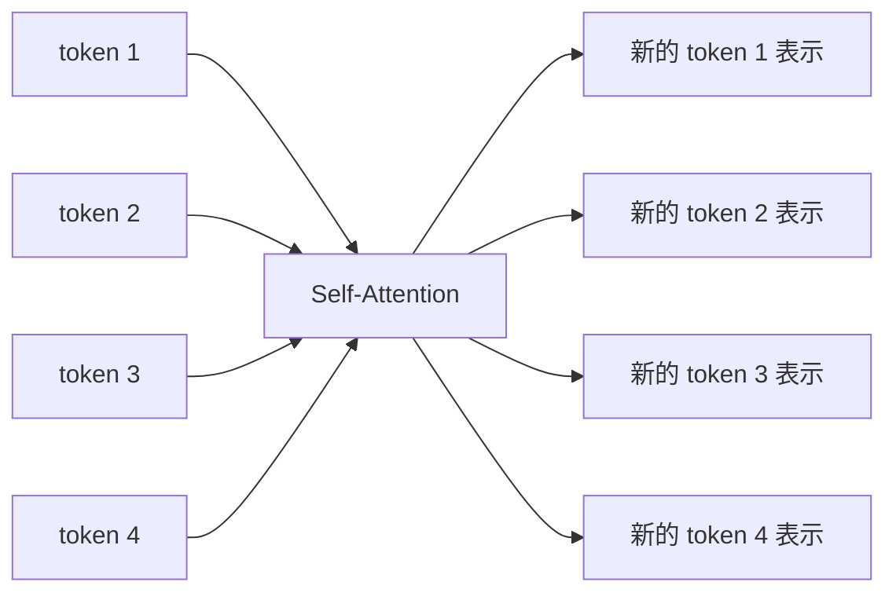
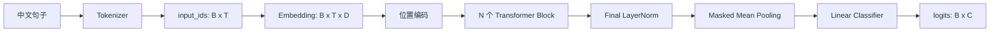
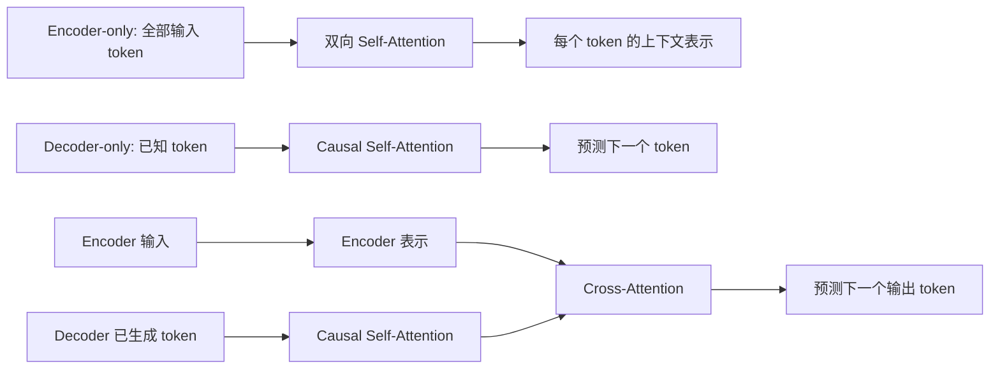

---
tags:
  - 机器学习
  - 深度学习
  - Transformer
  - Attention
aliases:
  - 注意力机制
  - Transformer注意力
---

# Chapter 8：注意力机制与 Transformer

> [!summary] 核心主线
> Attention 让每个 Query token 根据当前任务，动态决定应该从哪些 Key token 读取多少 Value 信息。Transformer 再通过多头机制、位置编码、残差连接、LayerNorm 和 FFN，把 Attention 组织成可堆叠的网络模块。

> [!info] 笔记分工
> 本文侧重 Attention 的数学原理、形状和 mask；我们的分类器代码、训练流程与工程 trick 见 [[Task1-Transformer分类器实现与工程技巧]]。

## 1. 为什么需要注意力机制

传统 RNN/LSTM 按时间顺序处理 token：

$$
h_t=\operatorname{LSTMCell}(x_t,h_{t-1},c_{t-1})
$$

虽然 LSTM 用记忆状态 $c_t$ 缓解了长期依赖问题，但仍有两个主要限制：

1. token 必须依次计算，难以充分并行。
2. 远距离信息必须经过很多中间状态传递，路径较长。

Self-Attention 让任意两个 token 直接建立联系，信息传递路径缩短为一步：



## 2. 输入张量的形状

文本经过 tokenizer 后先得到 token ID，再通过 `nn.Embedding` 得到稠密向量：

$$
X\in\mathbb R^{B\times T\times D}
$$

| 符号 | 含义 |
|---|---|
| $B$ | batch 中的句子数量 |
| $T$ | 每个 batch 中 padding 后的 token 数量 |
| $D$ | 每个 token 的特征维度，即 `d_model` |

例如：

```python
X = torch.randn(2, 5, 8)
```

表示：

- batch 中有 2 句话；
- 每句话统一为 5 个 token；
- 每个 token 用 8 维向量表示。

训练时输入通常是一批句子，因此有 batch 维度。推断时即使只输入一句话，也会保留 $B=1$：

$$
X\in\mathbb R^{1\times T\times D}
$$

## 3. Q、K、V 是怎么得到的

输入 $X$ 分别经过三个可学习线性变换：

$$
Q=XW_Q,
\qquad
K=XW_K,
\qquad
V=XW_V
$$

如果希望它们仍保持 $D$ 维，则：

$$
W_Q,W_K,W_V\in\mathbb R^{D\times D}
$$

于是：

$$
Q,K,V\in\mathbb R^{B\times T\times D}
$$

PyTorch：

```python
self.Wq = nn.Linear(d_model, d_model)
self.Wk = nn.Linear(d_model, d_model)
self.Wv = nn.Linear(d_model, d_model)

Q = self.Wq(X)
K = self.Wk(X)
V = self.Wv(X)
```

Q、K、V 的维度不是数学上必须与 $X$ 相同，而是常见的工程设计。只要最后能正确完成矩阵乘法即可。

直觉上：

- Query：当前 token 想寻找什么信息。
- Key：当前 token 可以用什么特征被其他 token 匹配。
- Value：匹配成功后，真正传递出去的信息。

初始的 Embedding、$W_Q$、$W_K$、$W_V$ 都可以是随机的。相关性不是初始化时保证的，而是分类损失经过反向传播逐渐学习出来的。

## 4. Scaled Dot-Product Attention

### 4.1 完整公式

$$
\operatorname{Attention}(Q,K,V)
=
\operatorname{softmax}\left(
\frac{QK^\top}{\sqrt{d_k}}+M
\right)V
$$

其中：

- $QK^\top$：Query 与所有 Key 的相似度。
- $d_k$：每个 Key/Query 的特征维度。
- $M$：mask，被屏蔽的位置填入极小值。
- softmax：将相似度变成每行和为 1 的注意力权重。
- 乘 $V$：按权重汇总 Value 信息。

### 4.2 形状推导

单头情况下：

$$
Q\in\mathbb R^{B\times T_q\times d_k}
$$

$$
K\in\mathbb R^{B\times T_k\times d_k}
$$

所以：

$$
QK^\top
\in
\mathbb R^{B\times T_q\times T_k}
$$

矩阵中的元素：

$$
s_{ij}=q_i^\top k_j
$$

表示第 $i$ 个 Query token 对第 $j$ 个 Key token 的匹配分数。

### 4.3 为什么除以 $\sqrt{d_k}$

假设 Query 和 Key 各分量近似独立、均值为 0、方差为 1：

$$
q^\top k=\sum_{r=1}^{d_k}q_rk_r
$$

近似有：

$$
\operatorname{Var}(q^\top k)\approx d_k
$$

因此其标准差约为：

$$
\sqrt{d_k}
$$

除以 $\sqrt{d_k}$ 后：

$$
\operatorname{Var}\left(
\frac{q^\top k}{\sqrt{d_k}}
\right)\approx1
$$

这样可以避免 $d_k$ 较大时 logits 过大，使 softmax 过早饱和、梯度接近 0。

这里并不是说 Q、K 被显式做了单位归一化。均值约 0、方差尺度适中主要来自合理初始化、LayerNorm 和训练过程，是用于解释缩放因子的近似假设。

### 4.4 PyTorch 实现

```python
def scaled_dot_product_attention(Q, K, V, mask=None):
    dk = Q.shape[-1]
    scores = Q @ K.transpose(-1, -2) / math.sqrt(dk)

    if mask is not None:
        scores = scores.masked_fill(
            mask,
            torch.finfo(scores.dtype).min,
        )

    weights = torch.softmax(scores, dim=-1)
    return weights @ V
```

softmax 必须在最后一个维度 $T_k$ 上计算，因为每个 Query 要在所有 Key 之间分配注意力。

## 5. Mask 机制

多头 scores 的统一形状是：

$$
S\in\mathbb R^{B\times H\times T_q\times T_k}
$$

| 符号 | 含义 |
|---|---|
| $B$ | batch size |
| $H$ | head 数量 |
| $T_q$ | Query token 数量 |
| $T_k$ | Key/Value token 数量 |

mask 不一定一开始就是完整的 $B\times H\times T_q\times T_k$，只要能广播到该形状即可。

### 5.1 Padding mask

两句话长度不同：

```text
句子 1: [我, 喜, 欢, 它]
句子 2: [很, 好, PAD, PAD]
```

有效位置 mask：

```python
valid_mask = torch.tensor([
    [True, True, True, True],
    [True, True, False, False],
])  # [B, T]
```

注意力函数约定 `True = 屏蔽`，因此：

```python
padding_mask = ~valid_mask[:, None, None, :]
# [B, 1, 1, T_k]
```

它广播为：

$$
[B,1,1,T_k]
\longrightarrow
[B,H,T_q,T_k]
$$

广播到 Query 维度时，本质上是把同一行 Key 屏蔽规则复制 $T_q$ 次。原因是：无论哪个 Query 发起注意力，都不能读取 PAD Key。

### 5.2 Causal mask

自回归生成中，第 $i$ 个 token 不能看到未来 token：

$$
M=
\begin{bmatrix}
0&-\infty&-\infty&-\infty\\
0&0&-\infty&-\infty\\
0&0&0&-\infty\\
0&0&0&0
\end{bmatrix}
$$

布尔形式：

```python
causal_mask = torch.triu(
    torch.ones(T, T, dtype=torch.bool),
    diagonal=1,
)
```

对普通的 decoder-only LLM，自注意力通常使用 causal mask；Encoder 分类模型通常不使用 causal mask，因为每个 token 可以同时查看前后文。

### 5.3 为什么先 masked_fill 再 softmax

如果被屏蔽分数变为 $-\infty$：

$$
\exp(-\infty)=0
$$

所以经过 softmax 后该位置权重严格为 0。mask 并不是直接参与乘法，而是先修改 scores，再由 softmax 把它转成零概率。

### 5.4 Padding Query 行什么时候丢弃

Padding mask 主要禁止读取 PAD Key，但 PAD Query 对应的行可能仍会产生输出。Transformer 通常通过后续步骤消除它们的影响：

- masked mean pooling 不把 PAD token 纳入平均。
- token-level loss 使用 `ignore_index` 忽略 PAD 标签。
- 下一层继续禁止其他 token 读取 PAD Key。

## 6. 多头注意力

### 6.1 为什么分成多个 head

单个 head 只有一种匹配空间。多个 head 可以学习不同关系，例如：

- 相邻 token；
- 转折关系；
- 情感词；
- 主谓关系；
- 标点或特殊 token。

设：

$$
D=H\cdot d_k
$$

例如：

$$
D=64,\qquad H=4,\qquad d_k=16
$$

### 6.2 拆分形状

从：

$$
[B,T,D]
$$

变为：

$$
[B,T,H,d_k]
$$

再交换 token 与 head 维度：

$$
[B,H,T,d_k]
$$

PyTorch：

```python
Q = self.Wq(X)
Q = Q.reshape(B, T, H, dk).transpose(1, 2)
```

把 head 放在 $T$ 前面，是为了让矩阵乘法始终作用在最后两个维度：

$$
[T_q,d_k]\times[d_k,T_k]
\rightarrow[T_q,T_k]
$$

如果保持 `[B, T, H, dk]` 直接相乘，最后两个维度会被解释成 `[H, dk]`，token 维不会形成期望的两两注意力矩阵。

### 6.3 合并多头

每个 head 输出：

$$
[B,H,T,d_k]
$$

先交换回去：

$$
[B,T,H,d_k]
$$

再拼接：

$$
[B,T,D]
$$

```python
context = context.transpose(1, 2).contiguous()
context = context.reshape(B, T, D)
output = self.Wo(context)
```

`contiguous()` 将 transpose 后的非连续视图重新整理成连续内存，便于后续 `view` 或某些底层算子使用。

### 6.4 为什么还需要 $W_O$

多头只是把不同 head 的结果拼接起来。输出投影：

$$
\operatorname{MHA}(X)
=
\operatorname{Concat}(head_1,\ldots,head_H)W_O
$$

允许模型重新混合各个 head 的信息，并把输出映射回统一的 $D$ 维特征空间，方便残差相加。

## 7. 位置编码

Self-Attention 本身只根据内容匹配，不知道 token 的先后顺序，因此需要加入位置信息。

### 7.1 正余弦位置编码

$$
PE(pos,2i)
=
\sin\left(
\frac{pos}{10000^{2i/D}}
\right)
$$

$$
PE(pos,2i+1)
=
\cos\left(
\frac{pos}{10000^{2i/D}}
\right)
$$

- $pos$：token 的行号，即序列位置。
- $2i$、$2i+1$：特征向量中的偶数列和奇数列。
- $i$：特征列号按二元组分组后的编号。

位置编码通常在进入第一个 Transformer Block 之前加入：

$$
X_0=\operatorname{Embedding}(input\_ids)+PE
$$

`max_len` 用于提前生成足够长的位置编码表，并注册为 buffer：

```python
self.register_buffer("pe", pe)
```

buffer 会随模型迁移设备和保存 checkpoint，但不会被优化器更新。

### 7.2 RoPE

现代 decoder-only LLM 更常使用旋转位置编码 RoPE。它不是把位置向量直接加到 $X$，而是根据位置旋转 Q、K 的二维特征对，使注意力分数自然包含相对位置信息。

正余弦绝对位置编码适合学习 Transformer 基本结构；RoPE 是现代 LLM 中更常见的后续扩展。

## 8. LayerNorm、残差连接与 FFN

本项目使用 Pre-LN Transformer Encoder Block：

$$
Z
=
X+
\operatorname{Dropout}
\left(
\operatorname{MHA}(\operatorname{LN}(X),M)
\right)
$$

$$
Y
=
Z+
\operatorname{Dropout}
\left(
\operatorname{FFN}(\operatorname{LN}(Z))
\right)
$$

其中：

$$
\operatorname{FFN}(x)
=
W_2\,\operatorname{GELU}(W_1x+b_1)+b_2
$$

### 8.1 LayerNorm

LayerNorm 对每个 token 自己的 $D$ 个特征归一化：

$$
\hat x
=
\frac{x-\mu}{\sqrt{\sigma^2+\epsilon}}
$$

它不依赖 batch 统计量，因此适合变长文本、小 batch 和自回归推断。它的目标是稳定各层输入尺度，而不是把数据变成高斯分布。

### 8.2 残差连接

“残差”表示网络学习相对于原输入的增量：

$$
Y=X+F(X)
$$

如果当前子层暂时没有学到有用变换，令 $F(X)\approx0$，信息仍可沿恒等路径继续传播。残差连接也为梯度提供更短路径，帮助训练深层网络。

### 8.3 Dropout

训练时随机屏蔽部分子层输出，降低不同神经元之间的过度依赖；`model.eval()` 时自动关闭。注意力可视化必须在 eval 模式采集，否则热图变化会混入 Dropout 随机性。

## 9. 完整 Encoder 分类器

数据流：



### 9.1 Masked mean pooling

设最后一层 token 表示为 $H\in\mathbb R^{B\times T\times D}$，有效位置为 $m_t\in\{0,1\}$：

$$
h_{pool}
=
\frac{\sum_{t=1}^{T}m_th_t}
{\max(1,\sum_{t=1}^{T}m_t)}
$$

```python
mask = attention_mask.unsqueeze(-1).float()
pooled = (mask * hidden).sum(dim=1) / mask.sum(dim=1).clamp_min(1)
```

`clamp_min(1)` 防止极端情况下分母为 0。

### 9.2 分类头

$$
logits=h_{pool}W_c+b_c
$$

二分类时输出形状为：

$$
[B,2]
$$

这两个数是两个类别的 logits。训练使用 `CrossEntropyLoss`；需要概率时再执行 softmax。

## 10. 注意力如何从随机参数中学出来

模型预测错误后，分类损失对最终 logits 求梯度。梯度依次经过：

$$
\text{classifier}
\rightarrow
\text{pooling}
\rightarrow
\text{Transformer blocks}
\rightarrow
W_Q,W_K,W_V,Embedding
$$

注意力权重：

$$
A_{ij}
=
\frac{\exp(q_i^\top k_j/\sqrt{d_k})}
{\sum_r\exp(q_i^\top k_r/\sqrt{d_k})}
$$

如果读取 token $j$ 的信息有助于降低损失，反向传播就会调整 $q_i$、$k_j$ 和对应投影参数，使相关匹配分数在后续训练中更合适。没有人直接指定“它必须关注书”；这是所有可能路径共同竞争后，由目标函数筛选出的结果。

## 11. 训练过程中的注意力演化

本项目固定探针句：

> 这家酒店位置很好，但是房间太脏，服务也很差。

固定 Query token 为“差”，每个 epoch 在 `model.eval()` 和 `torch.no_grad()` 下采集最后一层注意力。

对第 $e$ 个训练阶段，取“差”对应的 Query 行：

$$
A^{(e)}_{\text{差},:}
\in\mathbb R^{T}
$$

将初始化和各 epoch 纵向堆叠：

$$
E=
\begin{bmatrix}
A^{(0)}_{\text{差},:}\\
A^{(1)}_{\text{差},:}\\
\vdots\\
A^{(N)}_{\text{差},:}
\end{bmatrix}
\in\mathbb R^{(N+1)\times T}
$$

演化热图含义：

- 横轴：被关注的 Key token。
- 纵轴：初始化及训练 epoch。
- 每一格：Query token“差”对某个 Key token 的注意力权重。
- 每一行之和为 1。

### 11.1 本次完整训练观察

完整数据训练 4 个 epoch 后，不同 head 出现明显分工：

| Head | 观察到的变化 |
|---|---|
| Head 1 | “差”迅速集中关注自身，权重约从 `0.95` 上升到接近 `1.0` |
| Head 2 | 注意力在“店”“服”“太”“差”等 token 之间重新分配 |
| Head 3 | 不同阶段偏向“酒”“太”“[CLS]”等位置 |
| Head 4 | 逐渐偏向“家”“好”“位置/店”等上下文 |

这说明不同 head 不一定都会学习直观的“情感词对情感词”关系。有些 head 会学习自关注、位置、局部结构或数据集中的统计模式。

正式产物：

- [单 head 演化热图](https://github.com/xiezhx9/llm-beginner/blob/master/task-1-transformer/artifacts/attention_evolution_run/attention_evolution.png)
- [全部 head 对比](https://github.com/xiezhx9/llm-beginner/blob/master/task-1-transformer/artifacts/attention_evolution_run/attention_evolution_all_heads.png)
- [注意力演化 GIF](https://github.com/xiezhx9/llm-beginner/blob/master/task-1-transformer/artifacts/attention_evolution_run/attention_evolution.gif)
- [原始注意力 JSON](https://github.com/xiezhx9/llm-beginner/blob/master/task-1-transformer/artifacts/attention_evolution_run/attention_evolution.json)

## 12. 如何正确阅读注意力热图

完整热图形状为：

$$
[T_q,T_k]
$$

- 纵轴：Query token，即“谁正在寻找信息”。
- 横轴：Key token，即“它正在关注谁”。
- 第 $(i,j)$ 个元素：第 $i$ 个 Query 对第 $j$ 个 Key 的注意力。

阅读时应该固定一行横向观察。例如：

> 当模型处理“差”时，它主要从哪些 token 读取信息？

不能简单寻找全图最亮的格子，因为每一行分别经过 softmax，含义是每个 Query 自己的分配比例。

> [!warning] 注意力不是严格的特征归因
> 注意力高表示信息读取权重大，但不保证该 token 对最终分类结果的因果贡献最大。解释分类原因时，还可以结合遮挡实验、输入梯度、Integrated Gradients 等方法。

## 13. 现代 Transformer 的主要优化

2017 年的原始 Transformer 奠定了基本结构，但现代 LLM 并不是简单地把原始模型放大。Chapter8 后半部分选择了五组重要改造，它们分别作用于**训练稳定性、位置表示、整体架构、参数容量和长上下文效率**。

### 13.1 先看全局：每种优化解决什么问题

| 改造 | 主要解决的问题 | 核心做法 | 主要收益 | 代价或注意点 |
|---|---|---|---|---|
| Pre-LN | 深层网络难训练、梯度路径不稳定 | 子层之前先 Norm，子层输出再加回残差流 | 更容易训练深层模型，对超参数更稳健 | 最终通常还要加一次 Norm；不等于完全不需要 warmup |
| RoPE | Self-Attention 本身不知道顺序，绝对 PE 对相对距离表达不直接 | 按位置旋转 Q、K 的二维特征对 | 自然编码相对位置、零可训练参数、适合生成模型 | 远超训练长度时仍需位置插值、NTK scaling 或 YaRN 等方法 |
| Decoder-only | 多种任务使用不同结构和目标，扩展复杂 | 统一使用因果自注意力和 next-token prediction | 结构、数据和训练目标统一，适合规模化与上下文学习 | 自回归生成必须逐 token 解码；不能读取未来 token |
| MoE | Dense FFN 增大容量时，每个 token 的计算也同步增加 | 路由器让每个 token 只激活 Top-k 个专家 | 总参数量可以很大，但单 token 只使用少量参数 | 需要负载均衡、容量控制和专家并行通信 |
| 稀疏注意力 | 标准注意力随序列长度产生 $O(T^2)$ 计算与连接 | 只保留局部、扩张或压缩后的部分连接 | 可从算法层面减少长序列计算 | 可能丢失被屏蔽的远距离依赖 |
| FlashAttention | 标准实现频繁读写显存，并保存完整 scores/weights | 分块计算、在线 Softmax，尽量使用片上 SRAM | 数学结果不变，显著减少显存占用和内存读写 | 不会消除注意力本身 $O(T^2)$ 的理论计算量；依赖后端与硬件支持 |

> [!important] 这些优化不是互相替代的
> 一个现代 decoder-only 模型可以同时使用 Pre-Norm、RoPE、MoE、滑动窗口和 FlashAttention。它们修改的是 Transformer 的不同部位。

### 13.2 Pre-LN 与 Post-LN

设子层为 $F$，它可以是 MHA，也可以是 FFN。

**Post-LN：先做残差加法，再归一化。**

$$
Y=\operatorname{LN}\left(X+F(X)\right)
$$

**Pre-LN：先归一化，再进入子层，主残差流保持直接相加。**

$$
Y=X+F\left(\operatorname{LN}(X)\right)
$$

二者最重要的差别不是输出形状，而是梯度传播路径：

- Post-LN 的主路径也必须经过 LayerNorm，深层堆叠时通常更依赖初始化、学习率 warmup 等训练技巧。
- Pre-LN 中存在从后层到前层更直接的恒等残差路径，梯度更容易跨越很多 Block。
- Pre-LN 模型通常会在所有 Block 之后再执行一次 Final LayerNorm。

```python
class PreLNSublayer(nn.Module):
    def __init__(self, d_model: int):
        super().__init__()
        self.norm = nn.LayerNorm(d_model)
        self.sublayer = nn.Linear(d_model, d_model)

    def forward(self, x: torch.Tensor) -> torch.Tensor:
        return x + self.sublayer(self.norm(x))
```

本项目实现的完整 Pre-LN Block 是：

$$
U=X+\operatorname{Dropout}\left(\operatorname{MHA}(\operatorname{LN}(X))\right)
$$

$$
Y=U+\operatorname{Dropout}\left(\operatorname{FFN}(\operatorname{LN}(U))\right)
$$

### 13.3 旋转位置编码 RoPE

正余弦绝对位置编码是把 $PE$ 加到输入 $X$；RoPE 则通常不修改 $X$，而是在注意力内部旋转 Q、K。

将特征两两分组为 $(x_{2i},x_{2i+1})$。位置 $m$ 在第 $i$ 组使用的旋转角度为：

$$
\phi_{m,i}=m\theta_i,
\qquad
\theta_i=10000^{-2i/d}
$$

对应的二维旋转为：

$$
\begin{pmatrix}
x'_{2i}\\
x'_{2i+1}
\end{pmatrix}
=
\begin{pmatrix}
\cos\phi_{m,i} & -\sin\phi_{m,i}\\
\sin\phi_{m,i} & \cos\phi_{m,i}
\end{pmatrix}
\begin{pmatrix}
x_{2i}\\
x_{2i+1}
\end{pmatrix}
$$

旋转矩阵是正交矩阵，所以不会改变向量长度：

$$
\|R_mx\|_2=\|x\|_2
$$

更关键的是 Query 位于 $m$、Key 位于 $n$ 时：

$$
(R_mq)^T(R_nk)=q^TR_m^TR_nk=q^TR_{n-m}k
$$

因此注意力点积自然包含相对位置 $n-m$。RoPE 通常只应用于 Q、K，因为它的任务是改变“谁与谁匹配”的分数；V 承载被读取的内容，一般不需要旋转。

Notebook 使用复数实现旋转，核心对应关系是：

```python
# [..., T, d] -> [..., T, d/2]，相邻两维组成一个复数
x_complex = torch.view_as_complex(
    x.float().reshape(*x.shape[:-1], -1, 2)
)

# e^(i * position * theta)，复数乘法等价于二维旋转
x_rotated = torch.view_as_real(x_complex * freqs).flatten(-2)
```

这里要求 head dimension $d$ 是偶数，并且 Q、K 必须使用同一组频率。

### 13.4 三种 Transformer 架构范式

| 架构 | Block 中的注意力 | 典型训练目标 | 典型模型 | 常见任务 |
|---|---|---|---|---|
| Encoder-only | 双向 Self-Attention | Masked Language Modeling 等 | BERT、RoBERTa | 分类、抽取、检索、表示学习 |
| Decoder-only | Causal Self-Attention | Next-token Prediction | GPT、Llama、Qwen | 续写、对话、代码生成、推理 |
| Encoder-Decoder | Encoder 双向注意力；Decoder 因果注意力和 Cross-Attention | 条件序列生成 | 原始 Transformer、T5、BART | 翻译、摘要、序列到序列 |

三者的数据流可以简化成：



Decoder-only 成为生成式 LLM 主流，主要因为：

1. **结构统一**：只需重复一种 Block，没有独立 Encoder 和 Cross-Attention。
2. **目标统一**：任何文本都可以转化为“根据前文预测下一个 token”，不强制要求成对的输入输出语料。
3. **使用统一**：任务说明、示例和待处理内容都能放进同一个上下文，通过 in-context learning 完成不同任务。
4. **推理可缓存**：历史 token 的 K、V 不会在后续生成中改变，可以使用 KV cache，避免每一步重复计算全部历史投影。

> [!note] “Decoder-only” 不等于保留原始 Transformer Decoder 的全部结构
> 它通常只有带 causal mask 的 Self-Attention，不存在用于读取另一个 Encoder 输出的 Cross-Attention。

### 13.5 混合专家 MoE

Dense Transformer 中，每个 token 都经过同一个 FFN。为了增大模型容量，若直接扩大 FFN，参数量和每个 token 的计算量会一起上涨。

MoE 用 $E$ 个专家 FFN 替换一个 Dense FFN，并增加一个路由器：

$$
g(x)=\operatorname{softmax}(W_gx)
$$

路由器只保留权重最大的 $k$ 个专家，设其集合为 $S(x)=\operatorname{TopK}(g(x))$，再在被选中的专家之间重新归一化：

$$
\tilde g_e(x)
=
\frac{e^{z_e}}
{\sum_{j\in S(x)}e^{z_j}},
\qquad e\in S(x)
$$

最终输出是：

$$
\operatorname{MoE}(x)
=
\sum_{e\in S(x)}\tilde g_e(x)E_e(x)
$$

以 8 个专家、Top-2 路由为例：模型保存 8 组专家参数，但每个 token 只运行其中 2 个。这样可以显著增加**总参数容量**，同时让**激活参数量和单 token 计算量**远小于把 8 个专家全部运行一遍。

```python
logits = gate(x)                              # [B, T, E]
top_logits, expert_idx = torch.topk(logits, k, dim=-1)
route_weight = F.softmax(top_logits, dim=-1) # [B, T, k]

# 对每个专家收集选中它的 token，执行专家 FFN 后按 route_weight 加权汇总
```

真实 MoE 的难点不在公式本身，而在工程约束：

- **负载均衡**：路由器可能把大多数 token 都发给少数专家，需要 auxiliary loss 鼓励均匀使用。
- **专家容量**：单个专家一次能处理的 token 数有限，溢出 token 需要丢弃、重路由或增加容量。
- **专家并行**：专家分布在不同设备上时，需要 all-to-all 通信，通信可能抵消节省的计算。
- **训练稳定性**：路由决策离散且会变化，需要监控专家使用率和路由概率。

### 13.6 长上下文：稀疏注意力与 FlashAttention

标准注意力的分数矩阵为 `[B,H,T,T]`。忽略 batch 和 head 后：

$$
\text{计算量约为 }O(T^2d_k),
\qquad
\text{注意力矩阵空间约为 }O(T^2)
$$

序列长度从 $T$ 变为 $2T$ 时，注意力分数的数量约变成 4 倍。Chapter8 从算法和系统两个层面介绍解决思路。

#### 13.6.1 稀疏注意力：减少允许连接的 token 对

- **Sliding Window Attention**：每个 Query 只看附近 $w$ 个位置，局部连接量约为 $O(Tw)$。
- **Dilated Attention**：按照一定间隔采样远处位置，用较少连接扩大感受野。
- **压缩注意力**：把远距离历史压缩成少量摘要 token，再与近期细粒度 token 一起参与注意力。

Notebook 中双向滑动窗口 mask 的核心代码是：

```python
def sliding_window_mask(length: int, window: int) -> torch.Tensor:
    i = torch.arange(length)[:, None]
    j = torch.arange(length)[None, :]
    return (i - j).abs() <= window  # [T, T]，True 表示可见
```

这个 mask 允许同时看左侧和右侧，适合双向 Encoder 演示。Decoder-only 还必须禁止未来位置：

```python
def causal_sliding_window_mask(length: int, window: int) -> torch.Tensor:
    query = torch.arange(length)[:, None]
    key = torch.arange(length)[None, :]
    return (key <= query) & ((query - key) <= window)
```

稀疏注意力真正改变了注意力图的连接模式，因此可能减少计算，也可能损失被屏蔽的远距离信息。

#### 13.6.2 FlashAttention：数学不变，执行方式改变

普通实现往往会：

1. 计算并写回完整 $QK^T$。
2. 从显存读出 scores，计算并写回 Softmax 权重。
3. 再读出权重，与 V 相乘。

长序列下，瓶颈不只是浮点计算，还包括 GPU 高带宽显存 HBM 与片上 SRAM 之间的数据搬运。FlashAttention 将 Q、K、V 分块，在片上完成局部点积，并用**在线 Softmax**逐块维护每行的最大值、归一化分母和加权输出，无须把完整 $T\times T$ 注意力矩阵保存到 HBM。

因此 FlashAttention：

- 与标准注意力具有相同的数学语义，不是近似注意力。
- 仍然执行数量级为 $O(T^2)$ 的 token 配对计算。
- 主要通过减少中间矩阵存储和 HBM 读写获得更低显存占用与更高速度。

PyTorch 2.x 推荐使用统一的 SDPA 接口：

```python
import torch.nn.functional as F

dropout_p = self.dropout_p if self.training else 0.0
context = F.scaled_dot_product_attention(
    q, k, v,                         # [B, H, T, dk]
    attn_mask=attention_mask,
    dropout_p=dropout_p,
    is_causal=False,
)
```

在受支持的设备、dtype 和形状上，PyTorch 会选择 FlashAttention 等优化内核，否则自动回退到其他实现。

> [!warning] SDPA 的两个易错点
> 1. SDPA 的布尔 `attn_mask` 中 `True` 表示**允许参与注意力**，要留意它与某些 PyTorch mask API 的语义相反。
> 2. `scaled_dot_product_attention` 会按传入的 `dropout_p` 执行 Dropout；评估时应显式传入 `0.0`，不能只依赖 `model.eval()`。

### 13.7 这些改造如何组合

一个简化的现代 decoder-only Block 可以写成：

$$
Q,K,V=\operatorname{Project}(\operatorname{Norm}(X))
$$

$$
Q'=\operatorname{RoPE}(Q),
\qquad
K'=\operatorname{RoPE}(K)
$$

$$
U=X+\operatorname{CausalAttention}_{\text{Flash/Window}}(Q',K',V)
$$

$$
Y=U+\operatorname{MoE}(\operatorname{Norm}(U))
$$

这里可以看出：

- Pre-Norm 决定 Norm 与残差流的位置。
- RoPE 修改 Q、K 的位置表示。
- Causal mask 决定 decoder-only 的可见范围。
- Sliding Window 决定是否减少远距离连接。
- FlashAttention 优化同一注意力公式的执行过程。
- MoE 替换 Block 中原本的 Dense FFN。

Chapter8 介绍的是现代 Transformer 的代表性改造，并非完整清单。继续学习现代 LLM 时还会遇到 RMSNorm、SwiGLU、MQA/GQA、KV cache 量化等技术。

> [!question] 引导性自测
> 1. FlashAttention 为什么能降低显存，却没有把理论计算复杂度从 $O(T^2)$ 降下来？
> 2. MoE 为什么可以同时拥有更多总参数和较少的单 token 激活参数？
> 3. RoPE 为什么通常旋转 Q、K，而不旋转 V？
> 4. Notebook 的双向滑动窗口 mask 为什么不能直接用于 decoder-only 生成？
> 5. Pre-LN 已经让每个子层先归一化，为什么模型末尾通常还需要 Final Norm？

## 14. 常见误区

### 误区 1：Q、K 必须先做 norm，才能假设方差约为 1

不需要显式单位归一化。缩放推导使用的是理想化方差假设，实际尺度由初始化、LayerNorm 和训练共同控制。

### 误区 2：padding mask 会删除 PAD Query 行

Padding mask 通常只禁止读取 PAD Key。PAD Query 行的影响由 pooling、loss mask 和后续层共同消除。

### 误区 3：causal mask 永远是普通下三角矩阵

自注意力且 $T_q=T_k$ 时通常表现为下三角；交叉注意力、KV cache 或局部窗口注意力中，$T_q$ 与 $T_k$ 可能不同，形状和可见区域也会变化。

### 误区 4：多头计算后直接 reshape 就一定正确

必须先把 `[B,H,T,dk]` 交换回 `[B,T,H,dk]`，再合并 $H$ 和 $d_k$。否则 token 和 head 的内存顺序会混在一起。

### 误区 5：最终热图越集中，模型一定越好

注意力集中只说明分布更尖锐。它可能捕捉到有效关键词，也可能退化成只看自身、标点或数据偏差，必须结合验证指标和多个 head 判断。

## 15. 形状速查表

| 阶段 | 形状 |
|---|---|
| `input_ids` | `[B, T]` |
| Embedding 输出 $X$ | `[B, T, D]` |
| 线性投影后的 Q/K/V | `[B, T, D]` |
| 拆分 head | `[B, H, T, dk]` |
| Attention scores | `[B, H, Tq, Tk]` |
| Padding mask | `[B, 1, 1, Tk]` |
| Causal mask | `[Tq, Tk]` 或可广播形式 |
| 每个 head 的 context | `[B, H, Tq, dk]` |
| 合并 head | `[B, Tq, D]` |
| Masked pooling | `[B, D]` |
| 分类 logits | `[B, C]` |

## 16. 引导性自测

1. 为什么 softmax 要沿 $T_k$ 维计算，而不是沿 $T_q$ 维？
	1. 按照约定来吧，毕竟此处注意力表示query应该对key所分配的注意力

> [!answer] 参考答案
> 不只是形式上的约定。对固定的 batch、head 和 Query 位置 $i$，我们需要把它与全部 Key 的分数归一化：
> $$
> \alpha_{ij}=\frac{e^{s_{ij}}}{\sum_{r=1}^{T_k}e^{s_{ir}}},
> \qquad \sum_{j=1}^{T_k}\alpha_{ij}=1
> $$
> 因此 softmax 必须沿 $T_k$，得到“这个 Query 应该从各个 Key 读取多少信息”的概率分布。若沿 $T_q$，归一化的会是“同一个 Key 被各个 Query 分配多少权重”，语义就变了。

2. 如果 $B=2,H=4,T=5,d_k=16$，scores 的形状是什么？
	1. 多头注意力计算完毕后[2,4,5,5]

> [!answer] 参考答案
> 在自注意力中 $T_q=T_k=5$，所以 scores 的形状是 `[2, 4, 5, 5]`，四个维度依次为 `[B,H,T_q,T_k]`。你的形状是正确的，但它是注意力分数或权重的形状；加权求和后的每头 context 是 `[2,4,5,16]`，合并四个 head 后才是 `[2,5,64]`。

3. `[B,T]` 的 padding mask 为什么要变成 `[B,1,1,T]`？
	1. 因为softmax前的scores 形状是，[B H T T]

> [!answer] 参考答案
> scores 的形状是 `[B,H,T_q,T_k]`，而原始 mask `[B,T_k]` 只描述每个样本中哪些 Key 有效。扩展成 `[B,1,1,T_k]` 后，两个大小为 1 的维度会分别广播到所有 head 和所有 Query 行，使同一个样本的 Key mask 可以作用于 `[H,T_q,T_k]` 的全部分数，无须真的复制数据。

4. 为什么 mask 要在 softmax 之前填极小值，而不能在 softmax 后简单乘 0？
	1. softmax之前填入极小值表示不给对应项分配注意力，softmax之后乘0会干扰正常的注意力分配

> [!answer] 参考答案
> 你的理解正确。softmax 前将无效位置填成 $-\infty$（实际常用有限类型的最小值），该位置经过指数运算后权重约为 0，而有效位置会重新归一化到总和为 1。若先 softmax 再乘 0，无效位置已经占用了部分概率，有效位置的权重和会小于 1；除非额外再做一次归一化，否则结果不同。

5. 如果不执行 `transpose(1, 2)`，`[B,T,H,dk]` 会在哪两个维度上做矩阵乘法？
	1. 语义倾向于每个token的每种特征子空间

> [!answer] 参考答案
> 这里需要纠正。PyTorch 的 `matmul` 始终使用最后两个维度做矩阵乘法。如果直接计算 `Q @ K.transpose(-2, -1)`，形状会从 `[B,T,H,dk] @ [B,T,dk,H]` 得到 `[B,T,H,H]`：`B,T` 被当成批维度，实际比较的是同一个 token 内不同 head，而不是每个 head 内不同 token。转成 `[B,H,T,dk]` 后才会得到需要的 `[B,H,T,T]`。

6. $W_O$ 解决了多头拼接后的什么问题？
	1. 特征子空间各自独立的问题，做一次线性组合能把不同的子空间组合在一起

> [!answer] 参考答案
> 你的理解正确。拼接只把各 head 的结果并排放在一起，并没有发生跨 head 信息融合；$W_O\in\mathbb{R}^{D\times D}$ 对拼接后的全部通道做一次联合线性投影，使不同 head 学到的信息能够重新组合，并把结果映射回残差连接所要求的模型维度 $D$。

7. Pre-LN Block 中两条残差公式分别是什么？
	1. 注意力和前馈网络连接

> [!answer] 参考答案
> 设 Block 输入为 $X$，两条完整公式是：
> $$
> U=X+\operatorname{Dropout}(\operatorname{MHA}(\operatorname{LN}(X),\text{mask}))
> $$
> $$
> Y=U+\operatorname{Dropout}(\operatorname{FFN}(\operatorname{LN}(U)))
> $$
> “Pre-LN” 指每个子层先做 LayerNorm，再进入 MHA 或 FFN；残差加法发生在子层输出之后。

8. 为什么可视化注意力时要调用 `model.eval()`？

> [!answer] 参考答案
> `model.eval()` 会关闭 Dropout 等仅在训练模式启用的随机行为，让同一输入得到稳定、可比较的注意力权重；如果模型含 BatchNorm，也会改用已保存的统计量。它不会关闭梯度记录，所以通常还要配合 `torch.no_grad()`。采集结束后应恢复原来的训练状态，避免后续训练意外一直处于 eval 模式。

9. 为什么注意力热图不能直接等同于分类特征重要性？

> [!answer] 参考答案
> 注意力权重只描述某一层、某个 head 如何在 Value 之间分配读取权重。最终预测还受到 Value 的具体内容、$W_O$、残差连接、后续 Block、FFN、pooling 和分类头影响。高注意力不一定意味着删掉该 token 就会显著改变预测，因此热图适合观察信息路由，但不能单独当作严格的因果特征归因。

10. Head 1 几乎只关注“差”自身，可能说明什么？它一定是坏现象吗？

> [!answer] 参考答案
> 它可能说明这个 head 在保留“差”的局部身份或强调情感关键词，也可能只是退化成接近单位映射。它不一定是坏现象：多头机制允许不同 head 分工，而且残差连接还保留原输入。应结合其他 head、不同样本、验证指标以及遮挡或替换 token 后预测是否变化来判断，不能只凭一张热图下结论。

## 17. 一句话总结

$$
\boxed{
\text{Attention}
=
\text{用 Query-Key 决定读取权重，再用权重汇总 Value}
}
$$

Transformer 的关键不是只有一条 Attention 公式，而是把 Attention 与多头表示、位置、mask、残差、归一化和逐 token FFN 组合成可以稳定堆叠并通过任务损失端到端学习的完整系统。
