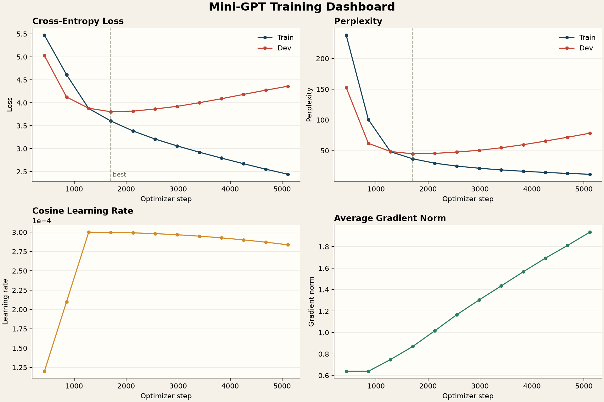

---
tags:
  - LLM
  - 训练
  - 困惑度
  - AdamW
  - Early-Stopping
  - PyTorch
aliases:
  - Task2训练调优
  - miniGPT困惑度
---

# Task 2.5：训练、评估与困惑度调优

> [!summary]
> 语言模型训练把长 token 流切成 `(input, shifted target)` 窗口，用 CrossEntropy 学习 next-token prediction。AdamW、warmup/cosine 和梯度裁剪负责优化稳定性，dev loss、PPL 与 early stopping 负责泛化；调参前必须先看 train/dev 差距判断欠拟合还是过拟合。

返回总览：[[Task2-miniGPT学习索引]]；模型结构见 [[Task2-04-miniGPT模型构建与生成]]。

## 1. Next-token Dataset

给定：

$$
[t_0,t_1,t_2,t_3,t_4]
$$

当 `block_size=4`：

$$
x=[t_0,t_1,t_2,t_3]
$$

$$
y=[t_1,t_2,t_3,t_4]
$$

每个位置都用左侧上下文预测下一个 token。

代码：

```python
start = index * stride
input_ids = token_ids[start : start + block_size]
target_ids = token_ids[start + 1 : start + 1 + block_size]
```

## 2. `block_size` 与 `stride`

| 参数 | 含义 |
|---|---|
| `block_size=T` | 每条样本的上下文 token 数 |
| `stride=S` | 相邻窗口起点移动距离 |

Dataset 长度：

$$
\left\lfloor\frac{N-T-1}{S}\right\rfloor+1
$$

当前训练和验证都使用 `block_size=64`、`stride=8`。重叠窗口能从小语料构造更多训练样本，但相邻样本高度相关，训练时间也更长。

不能组成完整 `T+1` token 的尾部会被丢弃，因此 batch 中所有样本 shape 一致。若想保留尾部，必须额外 padding 并在 loss 中使用 `ignore_index`，不能直接混入短 Tensor。

## 3. DataLoader、Batch 与 Shuffle

单条 `x/y` 是 `[T]`，DataLoader 自动堆叠：

$$
x,y\in\mathbb Z^{B\times T}
$$

`for batch in dataloader` 会遍历当前 Dataset 的全部窗口。

| 配置 | 含义 |
|---|---|
| `shuffle=True` | 每个 epoch 打乱索引顺序，数据仍全部遍历 |
| `shuffle=False` | 保持固定顺序，常用于验证 |
| `drop_last=False` | 最后不足 batch size 的 batch 仍保留 |

固定 `batch_size=8` 不代表最后一个 batch 必须有 8 条。若样本总数不能被 8 整除，最后一个 batch 会更小。

> [!note] 现代 LLM 是否也用 batch
> 会。大模型训练通常把 token 组织成 batch，再叠加数据并行、模型并行、序列并行和梯度累积。超大预训练更常用“训练了多少 token/optimizer steps”描述进度，而不是只看 epoch。

## 4. Cross-Entropy 的输入

模型输出：

$$
Z\in\mathbb R^{B\times T\times V}
$$

整数标签：

$$
Y\in\mathbb Z^{B\times T}
$$

展平：

$$
[B,T,V]\rightarrow[BT,V]
$$

$$
[B,T]\rightarrow[BT]
$$

```python
loss = F.cross_entropy(
    logits.reshape(-1, logits.size(-1)),
    targets.reshape(-1),
)
```

目标 ID 不需要 one-hot。PyTorch 根据整数 ID 直接选择正确类别的 log-probability。

每个位置的损失：

$$
\ell_{b,t}
=-\log\frac{e^{z_{b,t,y_{b,t}}}}
{\sum_{v=1}^{V}e^{z_{b,t,v}}}
$$

`CrossEntropyLoss` 内部已包含 log-softmax，输入必须是原始 logits，不要先手动 softmax。

## 5. 一个 Batch 的训练顺序

```python
optimizer.zero_grad()
loss = compute_next_token_loss(model, x, y)
loss.backward()
grad_norm = clip_grad_norm_(model.parameters(), max_norm=1.0)
optimizer.step()
scheduler.step()
```

顺序含义：

1. 清除上一个 batch 的梯度。
2. 前向并构造计算图。
3. 反向传播得到所有参数梯度。
4. 必要时统一缩放梯度。
5. 优化器更新参数。
6. 调度器更新下一步学习率。

## 6. Epoch loss 为什么按 token 汇总

CrossEntropy 默认返回当前 batch token 的平均 loss。最后一个 batch 可能更小，所以不能让每个 batch 拥有相同权重：

```python
total_loss += loss.item() * input_ids.numel()
total_tokens += input_ids.numel()
epoch_loss = total_loss / total_tokens
```

这样每个 token 权重相同。只看总 loss 也能观察同一次固定实验的趋势，但数值随数据量、batch size 和窗口数量变化，不能用于公平对比。

## 7. AdamW 与 Weight Decay

AdamW 更新可直观写成：

$$
\theta_{t+1}
=\theta_t
-\eta\frac{\hat m_t}{\sqrt{\hat v_t}+\epsilon}
-\eta\lambda\theta_t
$$

最后一项让权重持续向 0 收缩，抑制过大的参数。对普通 SGD，它与 L2 正则联系紧密；对 Adam 这类自适应优化器，AdamW 的解耦 decay 与把 $\lambda\lVert\theta\rVert_2^2$ 直接加进 loss 不完全等价。

当前正式源码对全部参数使用同一 weight decay。调参阶段试过“不衰减 LayerNorm 和 bias”的参数分组，这是现代 Transformer 常见技巧，但后来已回滚。

## 8. 梯度裁剪与 Grad Norm

所有参数梯度的全局 L2 norm：

$$
\lVert g\rVert_2
=\sqrt{\sum_i\lVert g_i\rVert_2^2}
$$

若超过阈值 $c$：

$$
g_i\leftarrow g_i\frac{c}{\lVert g\rVert_2}
$$

所有梯度乘同一比例，因此方向不变，只限制单步总幅度。

`clip_grad_norm_` 返回裁剪前 norm。推荐记录：

- 每步或每 epoch 平均的全局 norm；
- 最大 norm；
- 超过阈值的步数比例；
- 深入排查时的逐层 norm。

当前 `training_history` 保存每个 epoch 的平均裁剪前全局 norm。

> [!warning] 裁剪不是越频繁越好
> 偶尔拦住 spike 很正常；若几乎每一步都远超阈值，优先检查学习率、初始化、数据异常和 loss scale，而不是只把阈值调得更小。

## 9. 5% Warmup + Cosine

总 optimizer steps：

$$
S=\text{epochs}\times|\text{train loader}|
$$

Warmup steps：

$$
S_w\approx0.05S
$$

前 5% 线性提高学习率，之后 cosine 衰减到最小值：

$$
\eta_s=\eta_{min}
+\frac12(\eta_{max}-\eta_{min})
\left(1+\cos\frac{\pi(s-S_w)}{S-S_w}\right)
$$

职责：

| 机制 | 解决的问题 |
|---|---|
| Warmup | 随机初始化阶段避免更新过猛 |
| Cosine | 后期用更小步长精调 |
| Gradient clipping | 限制偶发异常梯度 |

本次加入 warmup 后 PPL 没明显改善并不意外。Warmup 更像稳定器，不保证改变最终泛化上限。

## 10. Evaluate、`no_grad` 与 `eval`

```python
@torch.no_grad()
def evaluate(...):
    model.eval()
```

| 操作 | 作用 |
|---|---|
| `torch.no_grad()` | 不建立 autograd 图，降低开销 |
| `model.eval()` | 关闭 Dropout，切换特殊层的评估行为 |

即使 `compute_next_token_loss` 本身没有 `no_grad`，它在被 `evaluate` 调用时仍继承 no-grad 上下文，loss 不会加入计算图。

训练前要重新 `model.train()`，否则 Dropout 会一直关闭。

## 11. 困惑度 PPL

总负对数似然：

$$
\operatorname{NLL}
=-\sum_{n=1}^{N}\log p(y_n|y_{<n})
$$

平均 loss：

$$
\bar L=\frac{\operatorname{NLL}}{N}
$$

困惑度：

$$
\operatorname{PPL}=e^{\bar L}
$$

直觉上，它是模型每一步面对的“有效候选数量”。越低越好，但只能在同一 tokenizer、数据和评估协议下比较。

### 为什么按模型上下文切窗

Dev 文本可能比 `block_size` 长。评测按上下文分块累加 NLL，避免：

- 输入超过训练长度；
- causal mask shape 错误；
- RoPE 位置越界；
- 在未训练的长位置区域评估失真。

当前自检最多取 4096 token，并按 `model.block_size` 非重叠切窗。

## 12. Early Stopping

状态：

| 字段 | 含义 |
|---|---|
| `best_dev_loss` | 历史最低验证 loss |
| `best_epoch` | 最佳轮次 |
| `stale_epochs` | 连续未改善轮数 |

验证改善时保存 `best.pt` 并清零 stale；超过 patience 后停止。

Early stopping 与 scheduler 不冲突：scheduler 决定每一步学习率，early stopping 决定是否还值得继续训练。

当前最佳 metadata 中 `epoch=3` 使用零起始计数，表示第 4 个 epoch。

## 13. TrainingHistory 中的 step

`train_one_epoch` 返回该轮 batch 数，训练结束后对每轮 batch 数做累加，得到每个 epoch 结束时的 optimizer global step：

```text
426, 852, 1278, ...
```

当前 batch loss 没有记录；如果需要细粒度曲线，应在每个 batch 保存：

```python
history.batch_loss.append(loss.detach().item())
history.batch_steps.append(global_step)
```

Epoch 曲线更平滑、文件更小；batch 曲线更适合排查 spike。

## 14. Checkpoint 与断点续训

当前保存：

| 文件 | 内容 |
|---|---|
| `best.pt` | 最佳模型 state dict |
| `model_config.json` | 模型结构 |
| `tokenizer.json` | 匹配词表 |
| `best_validation_metric.json` | 最佳 epoch/dev 指标 |
| `training_history.json` | 曲线数据 |

当前 checkpoint 没有 optimizer、scheduler 和 global step，因此适合评估，不支持精确断点续训。完整训练 checkpoint 应保存：

```python
{
    "model": model.state_dict(),
    "optimizer": optimizer.state_dict(),
    "scheduler": scheduler.state_dict(),
    "epoch": epoch,
    "global_step": global_step,
}
```

没有 scheduler state 时重新初始化，会让学习率轨迹从头开始，不能视为无损恢复。

## 15. 当前曲线：欠拟合还是过拟合



关键数据：

| 阶段 | Train PPL | Dev PPL |
|---|---:|---:|
| 第 1 轮 | `238.00` | `152.54` |
| 最佳附近 | 持续下降 | `44.91` 左右 |
| 最后一轮 | `11.50` | `78.30` |

诊断：

$$
\text{Train 持续变好，Dev 先好后坏}\Rightarrow\text{过拟合}
$$

如果是欠拟合，通常 train/dev 都高且同步下降或停滞。当前继续增加 epoch 只会进一步记忆训练集。

## 16. 调参过程使用过的技巧

| 技巧 | 目标 | 结果或代价 |
|---|---|---|
| 5% warmup | 稳定训练初期 | 单独加入后改善不明显，属于正常结果 |
| Cosine decay | 后期小步精调 | 保留在当前流程 |
| Gradient clipping | 防止 loss spike | 阈值 `1.0` |
| Early stopping | 防止 dev 指标继续恶化 | 最终通过评测的关键 |
| 小 stride | 增加小语料窗口数量 | 重复度与训练时间上升 |
| 增大 block size | 学习更长上下文 | Attention 成本约按 $T^2$ 增长 |
| 增大层数/FFN | 缓解欠拟合 | 小数据更易过拟合，实验已回滚 |
| Weight tying | 减少输入/输出层参数 | 实验已回滚 |
| `std=0.02` 初始化 | 控制初始 logits/激活尺度 | 实验已回滚 |
| Norm/bias 不 decay | 避免衰减尺度和平移参数 | 实验已回滚 |
| 缩小 BPE 词表 | 减少参数、提高 token 频次 | 序列更长，效果依赖语料 |
| TinyStories 子集 | 增加数据量和叙事规律 | 训练更久，最终正式结果仍用唐诗 |

> [!important] 当前源码与实验技巧要区分
> 后期尝试过更大 block/model、weight tying、自定义初始化和参数分组，但按要求已回滚。它们应作为消融实验记录，不应误写成当前正式模型结构。

## 17. 为什么缩小词表可能帮助小语料

Embedding 与 LM head 的参数量约为：

$$
VD+DV=2VD
$$

减小 $V$ 可以：

- 减少输入/输出层参数；
- 增加每种 token 的平均出现频率；
- 减少稀有类别；
- 降低 softmax 分类难度。

但它不是普遍“防过拟合公式”。词表过小会把文本切得更碎，使 $T$ 增长，Attention 计算更贵，也可能损失常见长片段表示。

## 18. 换 TinyStories 是否一定更好

更多、更规律的数据通常有助于泛化，但必须重新配套：

- 用目标训练语料重新训练 tokenizer；
- 重新选择 vocab、block size 和模型容量；
- 重新设置训练 token budget；
- 使用 TinyStories 自己的 dev 和阈值。

PPL 与 tokenizer/数据绑定。唐诗 PPL 45 和 TinyStories PPL 45 不可直接横向比较；Task 2 对 TinyStories 的要求还是更严格的 `< 10`。

## 19. 实验管理原则

一次只改变少数变量，每次实验独立保存：

```text
runs/
  poetry-v400-b64-l2/
  poetry-v384-b64-l2-tied/
  poetry-v400-b128-l4/
  tinystories-v2000-b128-l4/
```

每个目录包含：

- tokenizer；
- model config；
- best checkpoint；
- optimizer/scheduler state；
- training history；
- eval result；
- 生成样例；
- 改动说明与随机种子。

否则模型、tokenizer 和 config 很容易混用，也无法判断 PPL 变化来自哪个变量。

## 20. MPS

检查 Apple Silicon 加速：

```python
torch.backends.mps.is_built()
torch.backends.mps.is_available()
```

前者表示 PyTorch 构建包含 MPS，后者表示当前环境能实际使用。设备选择后，模型、输入、标签和新建的 mask Tensor 必须位于同一设备。

## 21. 快速诊断表

| 现象 | 优先检查 |
|---|---|
| Train/dev loss 都高 | 学习率、训练步数、模型容量、数据质量 |
| Train 低、dev 高 | 过拟合、数据不足、切分差异 |
| Loss 抖动/spike | LR、warmup、梯度 norm、异常 batch |
| 正式 PPL 与本地 dev 差异大 | tokenizer、切窗、`eval()`、checkpoint 配套 |
| Cache 自检失败 | RoPE offset、拼接维、Dropout、mask |
| 模型加载 shape mismatch | vocab/config/checkpoint 不属于同一实验 |
| PPL 变成极大值 | 平均 NLL、目标错位、softmax/CE 使用错误 |

## 22. 自测

1. 为什么 target 不需要 one-hot？
2. `shuffle=True` 会不会漏掉训练样本？
3. 为什么最后一个 batch 可能小于配置的 batch size？
4. `evaluate` 的 no-grad 能否覆盖内部 loss 函数？
5. Warmup 与 gradient clipping 分别解决什么问题？
6. Train PPL 降而 dev PPL 升说明什么？
7. 为什么 PPL 不能跨 tokenizer 直接比较？
8. 为什么当前 `best.pt` 不能精确恢复训练？

> [!answer]- 答案
> 1. CrossEntropy 用整数 ID 直接索引正确类别的 log-probability。
> 2. 不会，只改变访问顺序；除非另有 sampler/drop_last 等配置。
> 3. Dataset 样本数不一定能被 batch size 整除，且 `drop_last=False`。
> 4. 能，no-grad 是动态上下文，嵌套调用继承。
> 5. Warmup 防止初始学习率过猛；裁剪限制单次异常梯度更新。
> 6. 过拟合，应保存最佳轮次并考虑更多数据/正则化。
> 7. token 划分、预测步数和类别空间都不同，平均 NLL 尺度改变。
> 8. 它只有模型参数，没有 optimizer、scheduler 和 global step。
