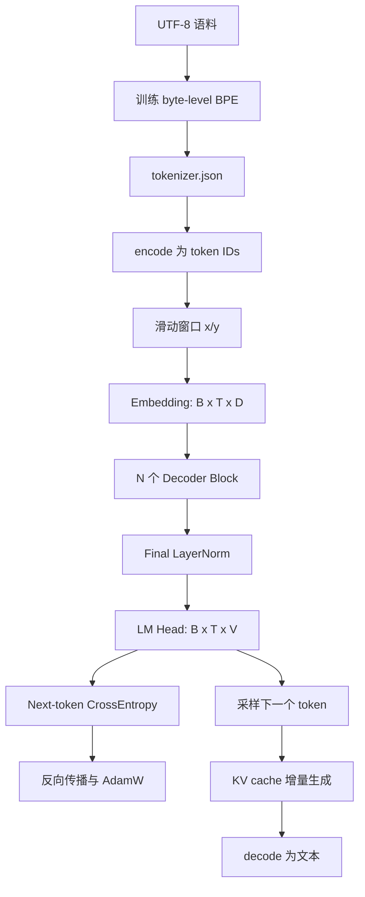

---
tags:
  - LLM
  - GPT
  - PyTorch
  - 工程实践
aliases:
  - Task2 miniGPT
  - 从零实现miniGPT
---

# Task 2：从零实现 mini-GPT

> [!summary] 学习目标
> 从 UTF-8 文本开始，亲手实现 BPE、RoPE、causal self-attention、KV cache、decoder-only mini-GPT、next-token 训练和困惑度评估，最终打通“语料 → 模型 → 生成 → 自检”的完整语言模型链路。

项目代码：[xiezhx9/llm-beginner/task-2-mini-gpt](https://github.com/xiezhx9/llm-beginner/tree/master/task-2-mini-gpt)

## 1. 专题导航

1. [[Task2-01-Byte-Level-BPE分词器]]：文本如何变成 token ID，以及 tokenizer 与 Embedding 的分工。
2. [[Task2-02-RoPE旋转位置编码]]：如何用二维旋转把相对位置信息写进 Q/K。
3. [[Task2-03-Causal-Attention与KV-Cache]]：因果遮罩、多头注意力、增量解码和 cache 等价性。
4. [[Task2-04-miniGPT模型构建与生成]]：Decoder Block、FFN、残差、LM head 和采样生成。
5. [[Task2-05-训练评估与困惑度调优]]：Dataset、CrossEntropy、AdamW、warmup、早停、PPL 与调参复盘。

前置笔记：[[Chapter7-网络优化与正则化]]、[[Chapter8-注意力机制与Transformer]]

## 2. 最终结果

当前正式实验使用唐诗数据集：

| 项目 | 结果 | 通过标准 |
|---|---:|---:|
| Tokenizer roundtrip | 通过 | 原文无损还原 |
| KV cache 最大 logits 误差 | `2.86e-6` | `< 1e-4` |
| Dev perplexity | `45.16` | `< 50` |
| 最佳 checkpoint dev loss | `3.8046` | 越低越好 |
| 最佳 checkpoint dev PPL | `44.91` | 越低越好 |

> [!important] 如何读这次训练
> Train PPL 从 `238.00` 持续降到 `11.50`，dev PPL 在第 4 轮附近达到最佳后反弹到 `78.30`。模型已经能拟合训练集，主要问题是小语料过拟合，而不是没学会；early stopping 保存最佳轮次是最终通过评测的关键。

## 3. 完整数据流

主要形状：

$$
[B,T]\rightarrow[B,T,D]\rightarrow[B,T,D]\rightarrow[B,T,V]
$$

| 符号 | 含义 |
|---|---|
| $B$ | batch size |
| $T$ | 上下文 token 数 |
| $D$ | hidden / embedding dimension |
| $V$ | tokenizer 词表大小 |
| $H$ | attention head 数 |
| $d_h$ | 每头维度，$D/H$ |

## 4. 文件职责

| 文件 | 职责 |
|---|---|
| `src/tokenizer.py` | BPE 训练、编码、解码和持久化 |
| `src/train_tokenizer.py` | tokenizer 的一次性训练流程 |
| `src/rope.py` | RoPE 频率表与二维旋转 |
| `src/attention.py` | causal attention、多头拆分与 KV cache |
| `src/model.py` | FFN、Decoder Block、MiniGPT 和 generate |
| `src/train.py` | Dataset、loss、训练、验证、早停和曲线 |
| `eval/run.py` | tokenizer、cache、PPL 三项自检 |

## 5. 当前模型配置

| 参数 | 数值 |
|---|---:|
| `vocab_size` | `400` |
| `block_size` | `64` |
| `num_layers` | `2` |
| `num_heads` | `4` |
| `embed_dim` | `128` |
| `head_dim` | `32` |
| `ffn_multiplier` | `2` |
| `dropout` | `0.2` |
| `rope_base` | `10000` |

## 6. 一句话抓住各模块

| 模块 | 核心作用 |
|---|---|
| BPE | 在固定 byte 覆盖能力上学习高频子词，缩短序列 |
| Embedding | 把离散 token ID 变成可训练稠密向量 |
| RoPE | 通过旋转 Q/K，让点积依赖 token 相对位置 |
| Causal mask | 禁止当前位置看到未来 token |
| Multi-head attention | 在多个特征子空间中聚合历史 token 信息 |
| FFN | 对每个 token 独立进行更宽的非线性特征变换 |
| Residual + LayerNorm | 保持信息/梯度通路并稳定子层输入尺度 |
| LM head | 把隐藏向量映射成词表上每个 token 的 logits |
| CrossEntropy | 奖励正确 next token，训练整条模型链路 |
| KV cache | 保存历史 K/V，避免生成时重复计算 |
| PPL | 用平均负对数似然衡量 next-token 预测难度 |

## 7. 最终心智模型

> [!summary]
> BPE 先确定模型使用的离散语言单位；Embedding 和 Transformer 再从随机参数出发，通过 next-token loss 学习语义和依赖关系。RoPE 决定注意力如何感知位置，causal mask 保证训练目标与生成一致，KV cache 让逐 token 推理复用历史计算。训练时看 train/dev 曲线诊断优化与泛化，评估时用同一 tokenizer 和切窗协议计算 PPL。
