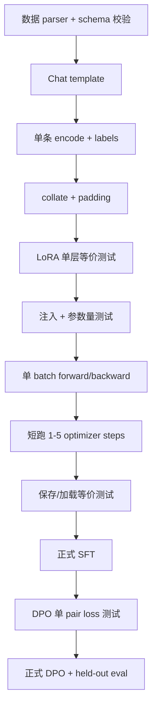

---
tags:
  - LLM
  - Fine-Tuning
  - Debugging
  - PyTorch
  - Training
aliases:
  - 微调训练排错
  - 后训练工程技巧
---

# Task 3.4：训练工程与故障排查

> [!summary]
> 微调最难的部分通常不是写出一行 loss，而是保证数据、模板、mask、梯度累积、checkpoint 继承和评估口径彼此一致。排查顺序应从数据与单 batch 开始，再看梯度、优化器和指标，最后才调超参数。

返回总览：[[Task3-SFT-DPO学习索引]]

## 1. 推荐实现与验证顺序



不要一上来就跑数小时训练。每增加一层复杂度，都先构造最小冒烟测试。

## 2. 单条样本必须检查什么

建议打印或断言：

```python
assert input_ids.ndim == 1
assert input_ids.shape == attention_mask.shape == labels.shape
assert (labels != -100).any()
assert attention_mask.dtype in (torch.bool, torch.long)
```

人工 decode 三种视图：

1. 完整 `input_ids`；
2. `labels != -100` 的有效回答；
3. 被截断前后的末尾 token。

对 DPO 再检查：

- chosen/rejected prompt 完全相同；
- labels 只覆盖各自回答；
- 两边都有有效 token；
- end marker 的保留策略一致；
- `max_length` 截断后 prompt 与答案预算符合预期。

## 3. 常见故障速查

| 症状 | 高概率原因 | 首先检查 |
|---|---|---|
| SFT loss 一直 `NaN` | 整个 batch labels 全为 `-100` | 每条样本有效 label 数、截断位置 |
| `gather` 越界 | labels 中有 `-100` 或超词表 ID | `clamp_min(0)` 后再 mask，检查 tokenizer |
| loss 不下降 | optimizer 没拿到 LoRA 参数 | `requires_grad`、可训练参数数量、grad norm |
| 注入后输出立刻变化 | B 没有零初始化 | 注入前后 logits 最大误差 |
| adapter 无法加载 | base/rank/target/module name 不一致 | metadata 和 state dict keys |
| DPO 极慢 | 四次前向、序列过长、CPU | `max_length`、dtype、reference no-grad |
| DPO margin 越来越差 | 数据方向反了、policy/ref 起点不同、LR 过大 | chosen/rejected 样例、初始化等价性 |
| eval 每次不同 | 忘记 `model.eval()` 或仍采样 | dropout、temperature、seed |
| 显存/内存比较不可信 | 同进程顺序运行导致峰值残留 | 独立 spawn 子进程 |
| 工具格式正确但不会调用 | 只学会模板，参数语义不足 | 工具名/参数/执行成功分项指标 |

## 4. `NaN` 的传播

只要总 loss 是 `NaN`：

$$
\frac{\partial NaN}{\partial\theta}=NaN.
$$

optimizer 更新后，参数或 AdamW 动量可能变成 NaN；之后即使数据恢复正常，训练通常也无法自行恢复。

处理原则：

```python
if not torch.isfinite(loss):
    optimizer.zero_grad(set_to_none=True)
    raise RuntimeError("non-finite loss")
```

不要简单 `continue` 后假装训练正常。应保存触发问题的 sample ID、有效 token 数和截断信息。

## 5. 梯度累积的正确边界

设期望累积 $K$ 次。每个完整 accumulation window：

```python
(loss / K).backward()
```

最后只有 $R$ 次：

```python
(loss / R).backward()
```

更新顺序：

```python
clip_grad_norm_(trainable_params, max_norm)
optimizer.step()
scheduler.step()
optimizer.zero_grad()
```

### 5.1 为什么不是每个 micro-batch 都 `zero_grad`

每次都清零会丢掉前面 micro-batch 的梯度，梯度累积退化成普通小 batch。只能在一个 accumulation window 开始前或 optimizer step 后清零。

### 5.2 Grad norm 记录什么

- 裁剪前全局 norm；
- 平均/最大 norm；
- 超阈值比例；
- 出现非有限值的 step；
- 深入排查时记录逐层 norm。

`clip_grad_norm_` 会返回裁剪前 norm。若几乎每步都被大幅裁剪，应检查学习率、数据和 loss scale，而不是只降低阈值。

## 6. Scheduler 与 Warmup

Task 3 SFT 使用 warmup + cosine：

$$
total\_steps
=epochs\times\left\lceil
\frac{|dataloader|}{gradient\_accumulation\_steps}
\right\rceil.
$$

Scheduler 必须按 optimizer step 更新，不是按 micro-batch 更新。

Warmup 的作用是让随机 batch、LoRA 初始梯度和 AdamW 动量统计平稳启动；它不保证最终 loss 更低。后续 cosine 用更小学习率精调。

当前 DPO 实现没有 scheduler。这不一定使短实验无效，但必须在报告中记录，正式扩大训练时应考虑：

- 加入与 optimizer steps 对齐的 warmup/cosine；
- 或明确使用 constant LR 作为实验设计；
- 不要配置了 `warmup_ratio` 却没有实际调用 scheduler。

## 7. Device 与 dtype

### 7.1 CPU 上 FP32 可能比 BF16 更快

如果 CPU/框架没有高效 BF16 kernel，BF16 会发生模拟或类型转换，反而更慢。本项目本地 CPU 使用 FP32；这不能推广到支持 Tensor Core 的 CUDA GPU。

### 7.2 RTX 4060 与 BF16

RTX 4060 架构支持 BF16 运算，但是否真正可用还取决于 CUDA、PyTorch、driver 和具体算子。应以运行时检查和小型 benchmark 为准，而不是只看显卡型号。

### 7.3 MPS

MPS 能否使用取决于算子支持、统一内存和当前 PyTorch 版本。若一个后训练流程在 MPS 上反复遇到 unsupported op 或内存问题，CPU 虽慢但更可预测；不要在同一实验中混用设备后直接比较时间。

## 8. 为什么 DPO 比 SFT 更耗时

SFT 通常一次模型前向 + 一次反向；朴素 DPO 是 policy/ref × chosen/rejected 四次前向，再对 policy 反向。

Transformer attention 近似成本：

$$
O(BT^2D).
$$

所以增大 `max_length` 不只是线性增加保存 token，还可能让 attention 成本近似平方上升。`batch_size` 增大也不是“单纯加速”，它会：

- 提高吞吐但增加内存；
- 改变有效 batch 和优化噪声；
- 在超出设备容量后直接 OOM；
- 若 step 数固定，增加每次看到的数据量；若 epoch 固定，减少 step 数。

## 9. 内存测量技巧

S1 使用独立 `spawn` 子进程运行 LoRA 和全量微调：

- 两者都从同一 base 重新加载；
- 避免前一次峰值污染后一次；
- CUDA 使用 `max_memory_allocated`；
- CPU 使用进程 peak resident set；
- CPU RAM 与 GPU VRAM 必须分开表述。

> [!warning]
> Python 进程的峰值内存会受到模型加载、allocator 缓存、操作系统页缓存影响。比较时需要相同环境、相同顺序策略和独立进程，不能只看一次活动监视器截图。

## 10. Checkpoint 生命周期

建议目录：

```text
models/base-model/       # 基座，不进 Git
ckpt/sft/                # 普通 SFT adapter
ckpt/dpo/                # 从 SFT 继续训练的 DPO adapter
ckpt/plugin-sft/         # 独立工具调用 SFT adapter
reports/                 # 指标与曲线
```

每个 adapter metadata 应记录：

- base model ID/version；
- target modules；
- rank/alpha/dropout；
- tokenizer/template 版本；
- 训练配置和数据指纹；
- 父 checkpoint；
- commit hash。

当前最小实现只记录 LoRA 重建参数，足以加载，但还不够完成严格实验追踪。

## 11. `model.train()`、`eval()` 与 no-grad

| 操作 | 作用 |
|---|---|
| `model.train()` | 开启 Dropout 等训练行为 |
| `model.eval()` | 关闭 Dropout，切换特殊层评估行为 |
| `torch.no_grad()` | 不记录 autograd 图 |
| `torch.inference_mode()` | 更强的只读推理优化 |

冻结 reference 参数不等于自动 `eval()`；`eval()` 也不等于关闭梯度。DPO reference 通常两者都要做。

## 12. 评估隔离与公平对比

### 12.1 固定除目标变量外的一切

消融实验必须固定：

- base 与 tokenizer；
- train/eval 数据；
- seed；
- optimizer steps/token budget；
- max length；
- batch/accumulation；
- 解码策略；
- 评估脚本。

### 12.2 Train/Eval DataLoader

- train：通常 `shuffle=True`；
- eval：`shuffle=False`，便于确定性复现；
- shuffle 只改变遍历顺序，不会每轮生成新数据；
- held-out 数据不能参与训练或调参决策泄漏。

### 12.3 Loss 按有效 token 汇总

不同 batch 的有效 assistant token 数不同，应：

$$
L_{eval}
=\frac{\sum_b L_bN_b}{\sum_bN_b},
$$

其中 $N_b$ 是当前 batch 的有效 label 数。直接平均 batch loss 会让短 batch 和长 batch 权重相同。

## 13. 微调方法扩展地图

| 方法 | 更新内容 | 特点 |
|---|---|---|
| Full FT | 全部参数 | 容量最大，显存/存储成本高 |
| LoRA | 低秩 A/B | 简洁、易保存和切换 |
| QLoRA | 量化 base + LoRA | 进一步降低显存，注意量化误差与 kernel 支持 |
| Adapter layer | 插入瓶颈模块 | 模块化，但增加推理结构 |
| Prefix/Prompt tuning | 可训练虚拟 token | 参数更少，复杂任务容量可能受限 |
| BitFit | 主要训练 bias | 极省参数，适应能力有限 |

这些是参数更新策略；它们都可以与 SFT 等目标组合，部分也可用于偏好优化。

## 14. 推荐排错顺序

1. Decode 原始样本，确认内容和角色。
2. Decode 有效 labels，确认只剩目标回答。
3. 检查有效 token 数与截断。
4. 在单 batch 上运行 forward，确认 loss 有限。
5. backward 后检查 LoRA grad 非零且 base grad 为 None。
6. 做 1 个 optimizer step，确认 A/B 变化。
7. 保存、重新加载，比较 logits 最大误差。
8. 过拟合 5-20 条样本，验证链路确实能学习。
9. 再扩大数据并启用正式评估。

## 15. 自测

1. 冻结 reference 参数后为什么还要 `eval()`？
2. 最后一个 accumulation window 不足时，固定除以配置值有什么后果？
3. 为什么 `max_length` 对 DPO 时间可能呈超线性影响？
4. 为什么 S1 要在独立子进程中比较内存？
5. 验证 loss 为什么按有效 token 加权而不是平均 batch loss？

> [!answer]- 参考答案
> 1. 冻结只控制梯度，`eval()` 还会关闭 dropout，保证 reference 基线确定。
> 2. 最后一次梯度被额外缩小，等效学习率不一致。
> 3. 自注意力包含 $T\times T$ score，序列增长会带来近似平方成本。
> 4. 避免前一模型、allocator 缓存和峰值统计污染后一实验。
> 5. 每个 batch 的有效回答 token 数不同，token 加权才能让每个监督 token 权重一致。
