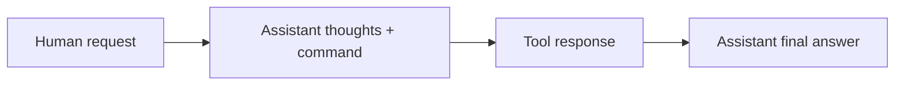

---
tags:
  - LLM
  - Ablation
  - Evaluation
  - LoRA
  - DPO
  - Tool-Calling
aliases:
  - Task3扩展实验
  - S1-S5实验复盘
---

# Task 3.5：S1-S5 实验复盘

> [!summary]
> 五个扩展目标分别回答五类问题：LoRA 是否真的省资源、rank 是否值得增大、SFT 是否遗忘知识、DPO 是否增强偏好、工具调用是否只学到格式。实验价值不在“全部通过”，而在学会为每个结论选择正确对照和指标。

返回总览：[[Task3-SFT-DPO学习索引]]

## 1. 五个 Goal 的关系

| Goal | 研究对象 | 核心问题 | 主要指标 |
|---|---|---|---|
| S1 | 全量 SFT vs LoRA SFT | 参数高效微调实际节省多少资源 | 参数、RAM、时间、eval loss、产物大小 |
| S2 | LoRA rank 消融 | 更高 rank 是否带来更好质量 | 参数量、adapter 大小、eval loss |
| S3 | Base vs SFT | 微调是否破坏通用知识 | 固定 C-Eval accuracy delta |
| S4 | SFT vs DPO | 偏好优化是否让 chosen 更占优 | win rate、reward margin 分布 |
| S5 | Plugin SFT | 模型是否学会工具协议和参数 | 格式、精确匹配、可执行性 |

## 2. S1：全量微调 vs LoRA

### 2.1 目的

验证 LoRA 的真实收益，而不是只比较理论参数量。必须同时观察：

- trainable parameters；
- 峰值内存；
- wall time；
- adapter/full checkpoint 大小；
- 同一 held-out 集上的 loss。

### 2.2 步骤与控制变量

1. 固定 base、数据、seed、长度、batch、accumulation、epoch 和 LR。
2. LoRA 只训练 `q_proj/v_proj` 的 A/B。
3. Full FT 让全部参数可训练。
4. 两组在独立 spawn 子进程运行。
5. 用同一 eval set 按有效 token 加权计算 loss。

### 2.3 实机结果

| 指标 | LoRA | Full FT |
|---|---:|---:|
| 可训练参数 | 540,672 | 494,032,768 |
| 占比 | 0.109% | 100% |
| 峰值 CPU RAM | 3.31 GB | 10.78 GB |
| 训练时间 | 68.95 s | 130.20 s |
| Eval loss | **1.1015** | 2.3385 |
| 产物 | 约 2.2 MB | 约 1.98 GB |

### 2.4 可以得出的结论

- LoRA 显著降低可训练参数、RAM 和产物大小；
- LoRA 只快 1.89 倍，因为 frozen base 仍参与计算；
- 在当前统一 `2e-4` LR 下 LoRA 更稳定。

### 2.5 不能过度推断

不能说“LoRA 永远比 Full FT 质量好”。`2e-4` 适合 LoRA，但对全量微调偏大。公平研究有两种口径：

1. **控制变量实验**：两组使用完全相同 LR；
2. **最佳实践实验**：分别搜索各自最优 LR，再比较最佳质量与成本。

两者回答的问题不同，不能混在一张表中下结论。

### 2.6 需要继续讨论

- GPU 上 LoRA 的速度和显存收益是否相同？
- 加入 optimizer state、activation checkpointing 后差距怎样？
- 相同 wall-clock 而不是相同 step 时，谁的质量更好？
- Full FT 使用 `1e-5/2e-5/5e-5` 后结果是否反转？

## 3. S2：LoRA Rank 消融

### 3.1 目的

研究低秩容量 $r$ 的成本与收益：

$$
N_{LoRA}=r(d_{in}+d_{out}).
$$

### 3.2 实验设计

仅修改 `r = 4 / 8 / 16 / 32`，其余训练设置固定，并让每个 rank 从同一 base 在独立进程开始。

### 3.3 结果

| Rank | 参数 | Adapter | Eval loss |
|---:|---:|---:|---:|
| 4 | 270,336 | 1.1 MB | **1.1012** |
| 8 | 540,672 | 2.1 MB | 1.1014 |
| 16 | 1,081,344 | 4.2 MB | 1.1039 |
| 32 | 2,162,688 | 8.3 MB | 1.1016 |

### 3.4 结论

- 参数量和文件大小随 rank 近似线性增长；
- 四组 loss 差异小于 `0.003`；
- 当前预算下 `r=4` 性价比最高；
- rank 更大没有自动改善质量，可能只是提供未被小数据利用的容量。

### 3.5 隐藏控制变量：`alpha/r`

本实验固定 `alpha=16`：

| rank | alpha/r |
|---:|---:|
| 4 | 4 |
| 8 | 2 |
| 16 | 1 |
| 32 | 0.5 |

所以实验同时改变了 rank 容量和增量缩放。要单独研究容量，可增加 `alpha=2r` 的对照，让 `alpha/r=2` 固定。

### 3.6 需要继续讨论

- rank 对更大数据、更多 target modules 是否更敏感？
- 应固定 alpha，还是固定 alpha/r？
- rank 对不同层是否应该一致？
- 能否通过奇异值或梯度谱选择自适应 rank？

## 4. S3：灾难性遗忘

### 4.1 目的

SFT 让模型适应对话数据时，是否损伤 base 的通用知识：

$$
\Delta Acc=Acc_{SFT}-Acc_{Base}.
$$

### 4.2 实验设计

- 固定 8 个 C-Eval 学科；
- 每个学科 10 题，共 80 题；
- base/SFT 使用同一 tokenizer、prompt、greedy generation 和答案提取；
- 只比较模型差异。

### 4.3 结果

```text
Base: 30/80 = 37.5%
SFT:  34/80 = 42.5%
Delta: +5 percentage points
```

### 4.4 正确结论

当前固定子集没有观察到 SFT 导致通用知识下降的证据。不能说 SFT 提升了全部知识能力，也不能证明没有灾难性遗忘：

- 每科 10 题，一题就是 10 个百分点；
- 总差异只有 4 题；
- 生成格式和答案抽取也会带来噪声；
- 单 seed 无法估计训练随机性。

### 4.5 评测样本应该多大

样本量取决于希望分辨多小的准确率变化。准确率 $p$ 在 $n$ 道独立题目上的标准误差近似为：

$$
SE=\sqrt{\frac{p(1-p)}{n}}.
$$

95% 置信区间近似为：

$$
p\pm1.96SE.
$$

在最保守的 $p\approx0.5$ 情况下，如果希望误差不超过 $E$，样本量近似为：

$$
n\approx\frac{1.96^2\times0.25}{E^2}.
$$

| 期望误差 | 大约需要的题数 |
|---:|---:|
| $\pm10\%$ | 96 |
| $\pm5\%$ | 384 |
| $\pm3\%$ | 1,068 |
| $\pm2\%$ | 2,401 |
| $\pm1\%$ | 9,604 |

当前 80 题的单模型准确率误差约为 $\pm10$ 个百分点，而观察到的变化只有
`+5pp`，所以它适合作为冒烟评测，不能支撑“SFT 将通用能力提高 5%”的结论。

对本项目可采用以下规模：

| 评测等级 | 样本规模 | 可支持的结论 |
|---|---:|---|
| 快速冒烟 | 80～200 | 检查是否发生非常严重的能力崩塌 |
| 基础可信 | 500～1,000 | 判断明显遗忘，并做简单类别分析 |
| 较严谨 | 1,500～3,000 | 更可靠地判断约 3～5pp 的变化 |
| 正式研究 | 数千至数万 | 细分类别、置信区间和多模型比较 |

若保守地把两组准确率当作独立比例，要较有把握地检测约 `5pp` 的差异，通常需要
约 1,500 道题。实际 S3 让 Base 和 SFT 回答同一批题，属于配对评测；利用逐题变化
可以提高统计效率，但必须保存每道题的结果。

逐题结果应分成四类：

| Base | SFT | 含义 |
|---|---|---|
| 对 | 对 | 能力保持 |
| 错 | 错 | 两者都不会 |
| 错 | 对 | SFT 改善 |
| 对 | 错 | 可能发生遗忘 |

设：

$$
n_{01}=\text{Base 错、SFT 对},
\qquad
n_{10}=\text{Base 对、SFT 错},
$$

则：

$$
\Delta Acc=\frac{n_{01}-n_{10}}{n}.
$$

同样是净增加 4 题，`6 道改善、2 道退步` 和 `20 道改善、16 道退步` 的稳定性
完全不同。应使用 McNemar 检验或配对 bootstrap 为 $\Delta Acc$ 计算置信区间。

下一轮 S3 建议至少使用 500～1,000 道固定 held-out 题目，每个重要类别约 100 题；
Base/SFT 使用相同题目、prompt 和解码方式，同时报告改善数、退步数、95% 置信区间
和多个训练 seed。当前 80 题只能支持“没有观察到明显灾难性遗忘”。

### 4.6 需要继续讨论

- 扩大 C-Eval、MMLU、推理和生成基准后是否仍不下降？
- 遗忘来自数据分布、学习率、训练步数还是 target modules？
- 混入 replay 数据或 KL 约束能否减轻遗忘？
- LoRA 是否一定比 Full FT 更少遗忘？需要直接实验，不能只凭参数少推断。

## 5. S4：SFT 与 DPO 偏好差异

### 5.1 目的

检查 DPO 是否让 policy 相对于 SFT reference 更偏向 chosen：

$$
m=\beta[(\log\pi_c-\log\pi_r)-(\log\pi_{ref,c}-\log\pi_{ref,r})].
$$

### 5.2 实验设计

- held-out preference pairs：64；
- SFT baseline 以自己作为 reference；
- DPO policy 与同一 SFT reference 比较；
- deterministic、no-grad；
- 同时报告 win rate、mean/median/range。

### 5.3 结果

| 指标 | SFT baseline | DPO |
|---|---:|---:|
| Win rate | 50.00% | 54.69% |
| 胜/负/平 | 0/0/64 | 35/29/0 |
| Mean margin | 0 | 0.000536 |
| Median margin | 0 | 0.002895 |
| Range | 0 | -0.1254 到 0.1485 |

### 5.4 正确结论

DPO 带来方向正确但较弱的 chosen 偏好提升。平均 margin 非常接近零，且 29 对仍为负，因此不能说模型已稳定掌握偏好。

### 5.5 为什么不能只看 mean margin

少数大正值可能拉高均值。应同时看正 margin 样本比例、median、分位数/直方图、类别 win rate、多 seed 置信区间和真实生成的人评/judge。

### 5.6 需要继续讨论

- 偏好对质量和难度是否均衡？
- `beta`、LR、长度归一化如何影响结果？
- DPO 是否改善了回答质量，还是只改变措辞概率？
- 通用能力、安全和多样性是否回归？

## 6. S5：工具调用 SFT

### 6.1 目的

验证模型能否学习：

```text
<|Commands|>: ToolName(arguments)<eoc>
```

工具调用能力至少分为：何时调用工具、选对工具、生成合法参数、真实执行成功、使用结果生成正确回答。

### 6.2 数据流



训练复用 assistant-only SFT；工具响应作为 user/context 输入，不产生 assistant loss。

### 6.3 评估技巧：Teacher Forcing History

多轮工具评估时，第一轮生成错误会污染后续上下文。本项目每轮只评价当前命令，然后把数据集中的 gold 工具轨迹加入历史，再评估下一轮。这样测的是每一轮局部工具能力，而不是端到端误差传播。

### 6.4 结果

```text
Held-out records: 10
Tool-call turns: 20
Format valid: 20/20 = 100%
Exact command match: 1/20 = 5%
```

### 6.5 正确结论

模型稳定学会了命令边界、工具名称和结束标记，但参数文本控制较弱。5% exact match 不等于 95% 都不能执行，因为语义相近的搜索词也可能有效；反过来，100% 格式正确也不等于调用正确。

### 6.6 业界如何分层评测工具能力

业界通常不会把“输出格式可解析”直接视为工具能力通过，而是逐层评测：

| 层级 | 评测内容 | 典型指标 |
|---|---|---|
| 1. 协议格式 | JSON、ChatML、命令边界和结束符能否解析 | Format valid rate |
| 2. 调用决策 | 该不该调用工具，是否在无关问题上滥用工具 | Relevance / no-call accuracy |
| 3. 工具与参数 | 工具名、必需参数、类型、枚举和额外参数 | AST/schema accuracy |
| 4. 执行结果 | 调用能否执行，并产生正确返回值 | Execution success rate |
| 5. 多步任务 | 顺序/并行调用、依赖传递、错误恢复和状态维护 | Multi-turn task success |
| 6. 最终任务 | 最终数据库状态、回答质量和业务规则是否正确 | End-to-end success |

#### AST/Schema 评测

不要只比较命令字符串，而应先解析成结构：

```text
get_weather(city="上海")
```

然后分别检查函数名、必需参数、参数类型、枚举范围以及多次调用是否完整。这样可以按
规则归一化语义等价参数，避免把所有文本差异都机械地判错。

[BFCL](https://gorilla.cs.berkeley.edu/blogs/8_berkeley_function_calling_leaderboard.html)
同时使用 AST 和可执行评测，并覆盖单调用、多调用、并行调用及 relevance detection。

#### 可执行与端到端评测

将解析后的命令送进 mock 或沙箱执行器：

```python
result = tool_registry[name](**arguments)
```

依次检查能否通过 schema、能否执行、返回值是否正确，以及模型是否根据工具结果生成
正确回答。对于订票、退款等任务，还应比较任务结束后的数据库状态，而不是只检查 API
是否被调用。

[τ-bench](https://openreview.net/pdf?id=roNSXZpUDN) 通过最终数据库目标状态评估多轮
工具代理，并用 `pass^k` 衡量多次运行的可靠性；
[ToolBench](https://github.com/openbmb/toolbench) 则关注有限调用预算内是否完成用户指令。

#### 局部评测与闭环评测必须同时存在

本项目的 teacher-forcing history 能隔离并诊断每一轮工具选择，但不会暴露前一步错误
对后续步骤的传播。完整评测还要增加闭环模式：模型读取自己的调用和真实工具返回，
自主完成后续调用与最终回答。

### 6.7 当前 S5 的验收结论

```text
协议学习：通过（格式 100% 可解析）
工具语义：尚未通过验证（严格命令匹配仅 5%）
端到端任务：尚未评测
```

`5% exact match` 可能低估语义等价调用的能力，但 `100% format valid` 又明显不足以
证明工具选择和参数正确。因此当前结果只能说明模型学会了协议外壳，不能宣称已经具备
可靠的工具调用能力。

### 6.8 下一轮应补充的指标

- 工具名准确率；
- 参数 JSON/schema 合法率；
- 必需参数召回率、类型和枚举正确率；
- 不需要工具时的拒绝调用准确率；
- mock/真实工具执行成功率；
- 多步调用顺序和依赖传递正确率；
- 最终回答是否忠实引用工具结果；
- 不使用 teacher-forcing history 的端到端成功率；
- 多次运行的稳定性、延迟和调用成本。

业界没有统一的“达到多少就算通过”。门槛取决于业务风险，但格式正确率只能作为
前置检查，最终端到端任务成功率和错误调用安全性才是核心指标。

## 7. 五个实验共同教训

| 指标 | 能回答 | 不能回答 |
|---|---|---|
| Eval loss | 对 held-out token 的拟合 | 人类整体偏好、安全性 |
| PPL/loss | token prediction 难度 | 工具是否可执行 |
| Reward margin | 相对 reference 的偏好变化 | 绝对回答质量 |
| C-Eval accuracy | 固定选择题知识 | 全部通用能力 |
| Format valid | 输出是否可解析 | 参数语义是否正确 |

小实验同样要遵守科学方法：先写研究问题，再选指标；固定对照变量；分离 train/eval；记录原始计数；诚实报告噪声和局限；失败结果也要保留。

## 8. 推荐的下一轮实验

1. Full FT 单独搜索更合理 LR，区分“统一配置”与“各自最优”。
2. Rank 消融增加固定 `alpha/r` 对照和多个 seed。
3. S3 扩大知识/推理基准，报告置信区间。
4. S4 增加 preference 类别分层与人工生成比较。
5. S5 接入 mock executor，评估参数 schema、执行成功和最终回答。

## 9. 自测

1. S1 为什么不能用共同 `2e-4` LR 证明 LoRA 永远优于 Full FT？
	1. Full FT 通常需要更低 LR，共同配置是控制变量实验，不是各自最佳配置比较。
2. S2 固定 alpha 时，为什么不算纯粹只改变 rank？
	1. 缩放比例是 alpha / rank ，固定alpha 改变rank 参数的缩放比例改变了
3. S3 提升 5 个百分点，为什么仍不能说 SFT 提升通用能力？
	1. 样本数量偏少
4. S4 mean margin 为正，为什么还要看 win rate 和分布？
	1. 单样本极端margin可能影响mean， 分布更好说明多样本情况
5. S5 format valid 100%，为什么工具能力仍未完全通过？
	1. 只说明解析成功，正确性无法保证

> [!answer]- 参考答案
> 1. Full FT 通常需要更低 LR，共同配置是控制变量实验，不是各自最佳配置比较。
> 2. `alpha/r` 同时变化，更新缩放也变了。
> 3. 只有 80 题、单 seed，差 4 题可能来自抽样和生成噪声。
> 4. 少数极端 margin 可以拉高均值，分布能显示改善是否普遍。
> 5. 格式只证明可解析，还未证明工具选择、参数语义、执行和最终答案正确。
