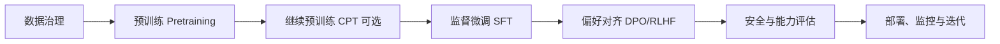
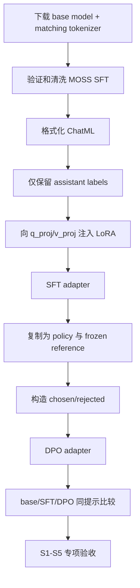

---
tags:
  - LLM
  - Post-Training
  - SFT
  - DPO
  - LoRA
  - 工程实践
aliases:
  - Task3 SFT DPO
  - 大模型后训练学习索引
---

# Task 3：SFT、DPO 与大模型后训练

> [!summary] 学习目标
> 从一个已经预训练好的 Qwen2.5-0.5B 出发，手写 LoRA，构造 assistant-only SFT 数据，完成监督微调；再以 SFT 模型为起点，用 chosen/rejected 偏好对执行 DPO。最后从资源、LoRA rank、灾难性遗忘、偏好提升和工具调用五个角度验收后训练效果。

项目代码：[xiezhx9/llm-beginner/task-3-sft-dpo](https://github.com/xiezhx9/llm-beginner/tree/master/task-3-sft-dpo)

前置笔记：[[Task2-miniGPT学习索引]]、[[Chapter7-网络优化与正则化]]、[[Chapter8-注意力机制与Transformer]]

## 1. 专题导航

1. [[Task3-01-LoRA与Adapter生命周期]]：低秩更新、注入、初始化、保存、恢复与合并。
2. [[Task3-02-SFT数据与Assistant-Only-Loss]]：ChatML、label masking、padding、梯度累积和 SFT 数据流。
3. [[Task3-03-DPO偏好优化]]：chosen/rejected、序列 log-probability、reference model、DPO loss 和 reward margin。
4. [[Task3-04-训练工程与故障排查]]：配置、显存/内存、NaN、截断、scheduler、checkpoint 和评估隔离。
5. [[Task3-05-S1-S5实验复盘]]：五个扩展目标的目的、控制变量、结果、局限和后续问题。

## 2. 微调在模型生命周期中的位置

大模型的完整生命周期可以粗略拆成：

| 阶段 | 训练数据 | 主要目标 | 常见风险 |
|---|---|---|---|
| 预训练 | 大规模无标注文本 | 学会语言、知识和 next-token prediction | 成本极高、数据污染 |
| 继续预训练 CPT | 特定领域原始文本 | 补充领域语言和知识 | 通用能力遗忘、领域过拟合 |
| SFT | `prompt -> 标准回答` | 学会指令格式、任务行为和回答风格 | 标签污染、只记模板、灾难性遗忘 |
| 偏好对齐 | `prompt, chosen, rejected` 或 reward 数据 | 让输出更符合人类偏好与安全要求 | reward hacking、偏好数据偏差 |
| 评估与部署 | held-out 基准、红队集、真实流量 | 验证能力、安全、稳定性与成本 | 只看单一 loss、离线线上不一致 |

> [!important] LoRA 不是一个新的训练阶段
> LoRA 是“如何更新参数”的参数高效微调方法。它可以用于 SFT、DPO，甚至继续预训练。SFT/DPO 描述训练目标，LoRA/全量微调描述参数更新范围，两组概念不要混为一谈。

## 3. Task 3 实际走过的周期

本项目没有重新预训练模型，而是走了一个缩小版后训练周期：

### 3.1 阶段一：准备基座与数据契约

- 基座模型和 tokenizer 必须来自同一个 checkpoint。
- 先固定 train/eval 子集、随机种子和数据模板，再开始调参。
- 明确特殊 token、`pad_token_id`、最大长度和角色顺序。
- 对原始 MOSS、偏好数据和 plugin 数据分别做 schema 校验。

### 3.2 阶段二：SFT

1. 将多轮消息渲染成 ChatML。
2. tokenizer 输出 `input_ids` 与 `attention_mask`。
3. labels 初始复制 token ID，再把 system/user/padding 置为 `-100`。
4. 冻结基础模型，向目标 Linear 注入 LoRA。
5. 通过 causal LM CrossEntropy 只学习 assistant token。
6. 保存 adapter 权重和重建所需 metadata。

### 3.3 阶段三：DPO

1. 从同一个 SFT adapter 构造 policy 和 reference。
2. 冻结 reference；policy 的 LoRA 继续训练。
3. 对 chosen/rejected 分别计算 policy/ref 的回答序列 log-probability。
4. 计算相对 reference 的偏好差值并最小化 DPO loss。
5. 记录 reward margin，而不只记录 loss。

### 3.4 阶段四：评估与诊断

- **能力变化**：base/SFT/DPO 在同一提示上的生成对比。
- **资源成本**：全量微调与 LoRA 的内存、耗时、产物大小。
- **容量选择**：不同 LoRA rank 的参数量和验证 loss。
- **知识保持**：base 与 SFT 在固定 C-Eval 子集的差异。
- **偏好强度**：DPO chosen win rate 与 reward margin。
- **结构化能力**：工具调用格式有效率、参数精确率和可执行率。

## 4. 最终结果

| 项目 | 结果 | 应如何解读 |
|---|---:|---|
| LoRA 可训练参数 | `540,672 / 494,573,440 = 0.109%` | 参数高效，不代表前向/反向成本也缩小同样倍数 |
| SFT masking | ignore ratio `46.7%` | system/user 未参与 loss，assistant token 有监督 |
| S1 LoRA / 全量峰值 RAM | `3.31 / 10.78 GB` | LoRA 明显节省训练状态和 checkpoint |
| S2 最佳 rank | `r=4` | 只对当前小数据和训练预算成立 |
| S3 Base / SFT C-Eval | `37.5% / 42.5%` | 当前 80 题没有观察到遗忘证据 |
| S4 DPO chosen win rate | `54.69%` | 方向略有改善，但偏好信号很弱 |
| S5 工具格式 / 精确匹配 | `100% / 5%` | 学会协议边界，不等于学会正确参数 |

## 5. 后训练最重要的心智模型

### 5.1 SFT 学“应该怎么答”

SFT 仍然是 next-token CrossEntropy。区别只是训练文本被组织成对话，并且通常只让 assistant 回答区域产生损失：

$$
\mathcal L_{SFT}
=-\frac{1}{N_{valid}}
\sum_{b,t:m_{b,t}=1}
\log \pi_\theta(y_{b,t}\mid y_{b,<t}).
$$

### 5.2 DPO 学“两个答案更偏好哪一个”

DPO 不要求显式训练 reward model。它比较 policy 相对 reference 对 chosen/rejected 的偏好变化：

$$
z=\beta\left[
(\log\pi_\theta(y_c|x)-\log\pi_{ref}(y_c|x))
-(\log\pi_\theta(y_r|x)-\log\pi_{ref}(y_r|x))
\right],
$$

$$
\mathcal L_{DPO}=-\log\sigma(z).
$$

### 5.3 Adapter 不是独立模型

恢复一个 LoRA 模型至少需要：

$$
\boxed{\text{base checkpoint}+\text{LoRA architecture metadata}+\text{LoRA weights}}
$$

只有空模型和 adapter 权重不够；必须先用同一 base 构造同名模块、注入相同 rank/target，再加载 A/B。

## 6. 微调实验必须记录的事项

### 6.1 可复现配置

- base model 与 tokenizer 的精确版本或 commit；
- 数据来源、清洗规则、train/eval 切分和样本数量；
- chat template、特殊 token、`max_length`、截断方向；
- LoRA 的 target modules、rank、alpha、dropout、bias 策略；
- batch size、梯度累积、有效 batch、epoch/step/token 数；
- optimizer、学习率、scheduler、warmup、weight decay、grad clipping；
- dtype、device、框架版本、seed；
- checkpoint 继承关系：base → SFT → DPO。

### 6.2 训练过程指标

- train/eval loss 必须按有效 token 加权；
- 学习率、grad norm、有效 token 数、吞吐、峰值内存；
- DPO 额外记录 reward margin、chosen win rate；
- 生成任务额外保留固定 prompt 的可比较输出。

### 6.3 评估原则

> [!warning]
> 训练 loss 下降只说明模型更会拟合当前目标，不自动等于回答更好、知识更多、更安全或更会用工具。

- 调参与最终报告必须使用 held-out 数据；
- 比较实验固定除目标变量外的其他配置；
- 生成评估固定 tokenizer、模板、解码策略和随机种子；
- 小样本差异要报告题数/对数，不能只报百分比；
- 格式正确、语义正确、工具可执行应分成不同指标。

## 7. 一句话总结

> [!summary]
> 后训练不是把一个 loss 跑低，而是先用 SFT 建立任务行为，再用偏好优化调整回答排序，同时持续监控通用能力、格式能力、资源成本和数据偏差；LoRA 让参数更新更便宜，但不能替代严格的数据、评估和实验控制。
