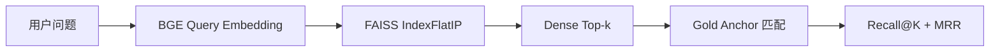

---
tags:
  - LLM
  - RAG
  - FAISS
  - Retrieval
  - Evaluation
aliases:
  - Task4 RAG 检索评估
  - Recall MRR
---

# Task 4.2：FAISS 检索与 RAG 评估

> [!summary]
> Recall@K 和 MRR 是 RAG 检索子系统的核心指标：前者检查正确证据能否进入前 K 条候选，后者检查第一条正确证据排得多靠前。它们不能单独代表完整 RAG 性能，还需与答案正确性、忠实性、相关性和系统成本一起解读。

返回总览：[[Task4-RAG学习索引]]

## 1. 当前检索数据流



当前基线索引使用 `IndexFlatIP`。文档与查询向量都经过 L2 归一化，因此 FAISS 返回的内积分数等于余弦相似度：

$$
score(q,d)=q^Td=\cos(q,d).
$$

该 score 是向量几何相似度，不是概率，不要将它解读为“答案正确率”。

## 2. Gold Item 的作用

一条 gold 评测数据包含：

```json
{
  "id": "nndl-fnn-basic",
  "question": "前馈神经网络的基本特点是什么？",
  "answer": "前馈神经网络的信息从输入到输出单向传播……",
  "source_file": "原始章节路径",
  "gold_anchors": [
    "信息沿着网络从输入到输出单向传播",
    "不存在反馈连接"
  ]
}
```

- `question` 传给 Retriever。
- `gold_anchors` 是从原文中抽取的证据片段，多个 anchor 为“或”关系。
- `answer` 不参与基础检索评测，它属于后续生成答案评测的参考信息。
- `source_file` 只用于追踪来源，当前系统只能索引 PDF。

PDF 可能在证据中插入换行或空格，因此 anchor 和 Chunk 在匹配前都要去除空白：

```python
normalized = re.sub(r"\s+", "", text)
```

## 3. `first_matching_rank`

`first_matching_rank(results, anchors)` 按召回顺序查找第一个包含任意 gold anchor 的 Chunk，返回从 1 开始的排名；完全未命中时返回 `None`。

```text
第 1 条：无关
第 2 条：无关
第 3 条：包含“不存在反馈连接”

first_matching_rank = 3
```

必须先遍历 `results`，再遍历 `anchors`。如果先遍历 anchor，返回的可能是 anchor 序号，而不是检索结果排名。空 anchor 也必须过滤，因为空字符串会被所有文本包含。

## 4. Recall@K

Recall@K 检查前 K 条检索结果中是否至少有一条标准证据：

$$
hit_i@K=
\begin{cases}
1,&rank_i\le K\\
0,&rank_i>K\text{ 或未命中}
\end{cases}
$$

$$
Recall@K=\frac{1}{N}\sum_{i=1}^{N}hit_i@K.
$$

在当前每题只要找回一条证据就算命中的口径下，这个指标也可理解为 Hit Rate@K。

若某题首次命中 `rank=3`：

```text
Recall@1  未命中
Recall@3  命中
Recall@5  命中
Recall@10 命中
```

## 5. MRR

MRR 是 Mean Reciprocal Rank，即所有问题的“首条正确证据排名的倒数”平均值：

$$
RR_i=
\begin{cases}
1/rank_i,&\text{命中}\\
0,&\text{未命中}
\end{cases}
$$

$$
MRR=\frac{1}{N}\sum_{i=1}^{N}RR_i.
$$

排名越靠前，贡献越大：

```text
rank=1  -> RR=1
rank=2  -> RR=0.5
rank=10 -> RR=0.1
未命中   -> RR=0
```

## 6. 具体汇总例子

假设三道题的首次命中排名为：

```text
问题 1：rank=1
问题 2：rank=4
问题 3：rank=None
```

得到：

$$
Recall@1=Recall@3=\frac13,
$$

$$
Recall@5=Recall@10=\frac23,
$$

$$
MRR=\frac{1+\frac14+0}{3}\approx0.417.
$$

每道题只需要检索一次 `max(K)`。Top-1、Top-3 和 Top-5 都是 Top-10 的前缀，不应为每个 K 重复运行 BGE 与 FAISS。

## 7. 它们只评估检索子系统

```text
用户问题
→ Retriever
→ Reranker
→ Context
→ LLM
→ 最终答案
```

Recall@K 和 MRR 不能直接回答：

- LLM 是否正确理解了证据；
- 答案是否真正回应了用户问题；
- 答案中是否包含检索上下文无法支持的断言；
- 模型是否绕过检索，仅凭预训练记忆回答。

可能出现：

```text
正确证据排第 1，但 LLM 解读错误 → 检索指标高，最终答案差
未召回正确证据，但 LLM 凭记忆答对 → 答案看似正确，RAG 未被证明有效
```

## 8. 完整 RAG 评估层次

| 阶段 | 常见指标 | 回答的问题 |
|---|---|---|
| 检索 | Recall@K、MRR、Precision@K、nDCG | 是否找到证据，排名是否靠前 |
| 上下文 | Context Recall、Context Precision | 证据是否完整，是否混入无关内容 |
| 生成 | Answer Correctness | 最终答案是否正确 |
| 忠实性 | Faithfulness | 答案的断言是否都能被证据支持 |
| 相关性 | Answer Relevancy | 答案是否真正回应问题 |
| 系统 | 延迟、吞吐、Token 数、资源成本 | 是否适合实际部署 |

## 9. Task 4 的指标分工

| 目标 | 对象 | 主要指标 |
|---|---|---|
| M3 | Dense Retrieval | Recall@1/3/5/10、MRR |
| S2 | 有/无 Reranker | Recall、MRR、延迟 |
| M4 | 端到端 RAG | 非空 answer、非空 sources、人工证据检查 |
| S4 | 生成评测 | Faithfulness、Answer Relevancy |

对指标组合的常见诊断：

- Recall@10 低：正确证据没进入候选，Reranker 无法补救。
- Recall@10 高、MRR 低：能找到，但排序靠后，适合加 Reranker。
- Recall/MRR 高、Faithfulness 低：检索正常，生成器没有严格依据上下文。
- Faithfulness 高、Answer Relevancy 低：答案可被证据支持，但可能偏离问题或包含过多无关内容。

## 10. 当前评测口径的局限

Gold anchor 子串匹配具有稳定、可复现、不依赖 judge LLM 的优点，但也存在限制：

- Chunk 语义正确但没有出现完整原文 anchor，仍会记为未命中。
- PDF 断词、特殊字符、公式抽取错位可能造成假阴性。
- 只判断“至少一个证据”，不衡量多证据问题的证据完整度。

因此当前 Recall/MRR 适合作为稳定基线，但不能替代后续的 Context Recall、Faithfulness 和人工失败样本检查。

## 11. 自测

1. 某题的正确证据首次出现在第 4 条，它对 Recall@1/3/5/10 和 RR 分别贡献什么？
	1.  Recall@5 @10 都按比例增加，RR 贡献了一个 1 / 4
2. 为什么评测 Top-1/3/5/10 时只需检索一次 Top-10？
	1. 只检索一次就包含 top 1-10的情况
3. Recall@10 高但 MRR 低时，为什么 Reranker 可能有帮助？
	1. 召回率高但是排名低，精排可以很好的优化这种情况
4. Recall@10 低时，为什么只加 Reranker 通常无法解决问题？
	1. rerank只能精排，如果召回率低，答案甚至没有出现在候选，即使rerank也无意义
5. 为什么最终答案正确，仍不能证明 RAG 检索有效？
	1. 模型可能凭预训练知识、猜测或题目线索答对，即使检索没有返回可靠证据。因此最终答案正确只能说明该次回答结果正确，不能单独证明 RAG 链路有效。还要核验实际送入 Prompt 的来源、证据覆盖、引用对应关系和答案忠实性，必要时比较有无检索的输出。

### 自测标准答案

> [!success]- 标准答案：1. 第 4 名命中的贡献
> 该题对 Recall@1、Recall@3、Recall@5、Recall@10 的命中指示分别为 `0、0、1、1`，对 RR 的贡献为 $1/4=0.25$。若总题数为 $N$，它对最终平均 Recall 的贡献还要除以 $N$，对 MRR 的贡献为 $0.25/N$。本项目的 Recall 使用“每题至少命中一个 anchor”的 Hit Rate 口径。

> [!success]- 标准答案：2. 同一排序的前缀可以复用
> 在同一次检索、同一候选排序下，Top-1/3/5 都是 Top-10 的前缀。检索一次 Top-10，找到首个匹配位置后与各个 K 比较即可，不必重复编码问题和查询索引。前提是候选来源、排序和过滤规则不随 K 改变；若每次重新配置近似搜索或重排流程，不能直接假定结果嵌套。

> [!success]- 标准答案：3. 高 Recall、低 MRR 表示排序仍可改进
> 正确证据大多已经进入前 10，但经常排在后面。Reranker 对每个 Query-Document 文本对做更细致的相关性判断，有机会把正确证据提前，从而提高首个命中排名的倒数和 MRR。但重排不是保证正确，每题仍需检查有无退步。

> [!success]- 标准答案：4. 重排不能创造候选
> Reranker 只看到召回阶段交给它的候选，正确证据若不在候选池内就无法被排回来，应先检查切分、Embedding、Query、候选数量或混合检索。不过，Recall@10 低不代表一定无法靠重排改善：如果召回了 20 条且正确证据在第 11-20 名，重排仍可把它提升进前 10。真正限制重排的是 Recall@candidate_k，而不总是 Recall@10。

> [!success]- 标准答案：5. 答对可能不依赖检索
> 模型可能凭预训练知识、猜测或题目线索答对，即使检索没有返回可靠证据。因此最终答案正确只能说明该次回答结果正确，不能单独证明 RAG 链路有效。还要核验实际送入 Prompt 的来源、证据覆盖、引用对应关系和答案忠实性，必要时比较有无检索的输出。
