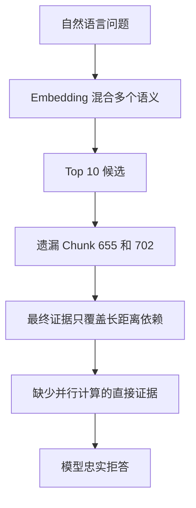
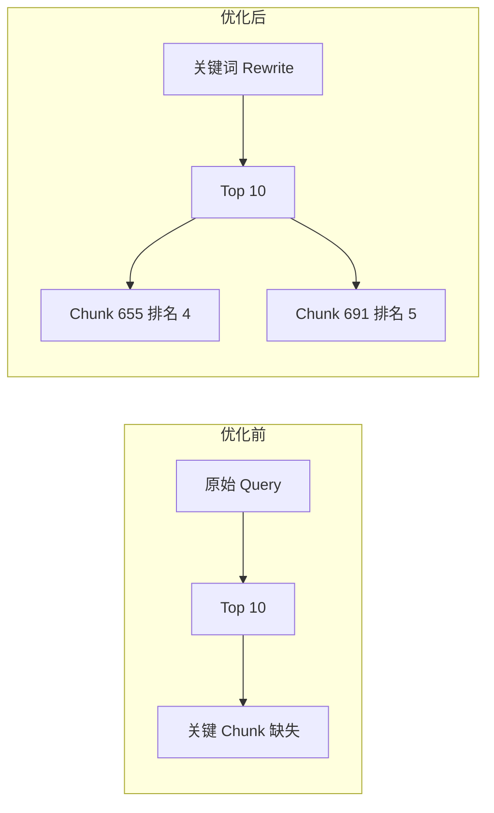
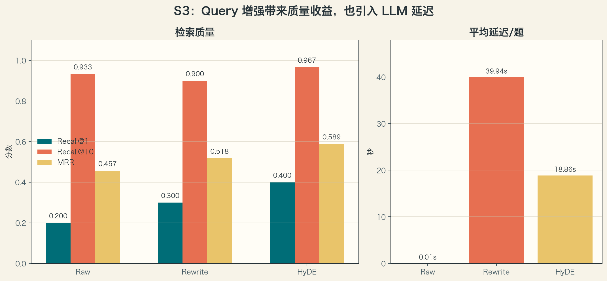

---
tags:
  - LLM
  - RAG
  - Query-Rewrite
  - HyDE
  - Prompt
aliases:
  - Task4 RAG 生成
  - Query 增强
---

# Task 4.4：RAG 生成与 Query 增强

> [!summary]
> RAG 的生成模型只能利用最终送入 Prompt 的证据。Query Rewrite 和 HyDE 的目标不是直接提高语言模型能力，而是改善查询表示，让真正有用的 Chunk 更容易进入候选集合。

返回总览：[[Task4-RAG学习索引]]

## 1. 优化前：原始 Query 直接检索

当前基础流程使用 BGE 编码原始问题，再经过 FAISS 召回、Reranker 精排和远端生成：


BGE 会在原问题前增加查询指令，然后提取 CLS 向量并做 L2 归一化。因为文档向量也经过 L2 归一化，所以 FAISS 的内积等价于余弦相似度：

$$
s(q,d_i)
=
\hat{\boldsymbol q}^{\mathsf T}\hat{\boldsymbol d}_i
=
\cos(\boldsymbol q,\boldsymbol d_i).
$$

### 1.1 早期 Baseline 暴露的问题

测试问题：

```text
Transformer 相比循环网络，为什么更容易并行建模序列中的长距离依赖？
```

原始查询同时包含“模型比较、并行、长距离依赖、原因解释”等多个意图，但教材中的关键 Chunk 使用的是“自注意力、顺序操作数、任意位置直接联系、信息传播路径”等表达。



这次早期失败来自关键证据没有进入最终上下文。后续重建索引和精排后，直接证据进入
Top 5，但 Spark 仍曾错误拒答；这进一步说明同一句“无法确定”可能来自检索失败，
也可能来自生成器误判，必须逐层检查 sources 才能归因。

## 2. 优化后：Query Rewrite

Query Rewrite 先让语言模型把自然语言问题改写成更接近教材措辞的检索短语：


强化后的真实改写结果：

```text
Transformer 循环网络 RNN 并行建模 长距离依赖
自注意力机制 并行计算 长程依赖 序列建模 注意力机制
```

它不回答问题，而是完成三件事：

1. 保留原始实体，如 `Transformer` 和循环网络。
2. 补充同义表达，如“长距离依赖”和“长程依赖”。
3. 补充机制词，如“自注意力机制”和“并行计算”。

## 3. 优化前后真实对照

下表比较的是同一个 BGE、同一个 FAISS 索引和相同 Top 10，只改变输入查询：

| 查询方式 | Chunk 655 排名 | Chunk 702 排名 | Top 10 中包含“并行”的 Chunk |
|---|---:|---:|---|
| 原始 Query | 未进入 | 未进入 | 无 |
| 第一次弱改写 | 未进入 | 未进入 | 无 |
| 强化后的关键词改写 | 4 | 未进入 | Chunk 655、691 |

其中 Chunk 655 包含自注意力与循环结构的直接比较，并说明任意位置直接交互、信息传播路径和顺序操作数。强化 Rewrite 把它从 Top 10 之外提升到第 4 名。



> [!important]
> 单题改善不能证明 Query Rewrite 整体有效。最终必须在全部 30 条 Gold QA 上固定索引和 Top-K，对比 Recall@K、MRR、延迟以及被改写损坏的问题。

## 4. Rewrite Prompt 的关键约束

一个有效的检索改写 Prompt 应明确要求：

- 保持原问题意图，不增加新的限制；
- 提取核心实体；
- 补充教材术语、同义词、中英文名称和缩写；
- 输出若干空格分隔的检索短语；
- 不回答问题，不输出分析过程；
- 模型返回空白时回退到清理后的原始 Query。

弱 Prompt 往往只会把原问题改写成另一句更通顺的问句。这样的改写可能提高语言质量，却未必改善向量召回。

## 5. Embedding 模型认为哪些文本相似

Embedding 模型判断“语义相似”的依据不是固定的语言学规则，而是训练目标规定哪些文本应该靠近。在 BGE 一类检索模型中，常见的正样本是 Query 与相关 Document，负样本是不相关或容易混淆的 Document。

常见的相似关系包括：

| 关系 | 示例 |
|---|---|
| 同义改写 | “什么是自注意力”与“解释 Self-Attention” |
| 问题与答案 | “RNN 为什么难以并行”与“RNN 必须沿时间步顺序计算” |
| 同一问题的不同答案 | 两段都解释自注意力如何建立全局联系 |
| 标题与正文 | “梯度消失问题”与解释梯度连乘变小的段落 |
| 摘要与原文 | 一段摘要与被其概括的长文档 |
| 关键词与相关段落 | “AdamW 权重衰减解耦”与 AdamW 更新公式的说明 |
| 同一主题或实体 | 两段文本都讨论 Transformer 的结构 |
| 蕴含关系 | “任意位置直接交互”与“缩短信息传播路径” |

> [!important]
> 两段文本不会因为“都是答案”就自动相似，它们还必须讨论相近的内容。Embedding 也可能只捕捉到主题，而没有准确处理否定、数字和事实方向。

例如下面两句话结论相反，但实体和关键词高度重叠，因此向量仍可能比较接近：

```text
吸烟会危害健康。
吸烟不会危害健康。
```

这也是 RAG 先用 Embedding 做高召回、再用 Cross-Encoder Reranker 做精确相关性判断的原因之一。

## 6. HyDE：从问题风格变成文档风格

HyDE（Hypothetical Document Embeddings）不生成关键词，而是先生成一段假想教材答案，再用这段文档的向量检索真实资料：


公式可写为：

$$
\hat d=\mathrm{LLM}(q),
\qquad
\boldsymbol z=E_d(\hat d),
\qquad
\mathrm{Retrieve}(q)
=
\mathrm{TopK}_i\cos(\boldsymbol z,E_d(d_i)).
$$

这里的假想文档可能包含事实错误，因此它只能用来产生检索向量，不能作为最终回答的证据。最终 Prompt 仍然只能包含从知识库召回的真实 Chunk。

### 6.1 为什么使用 Document Encoder 路径

Query Rewrite 的输出仍然是查询，应调用：

```python
embedder.encode_queries([rewritten_query])
```

HyDE 输出是教材段落风格，应调用：

```python
embedder.encode_documents([hypothetical_document])
```

如果把 HyDE 文本继续作为普通 Query 编码，BGE 会额外添加查询指令，破坏“让假想答案靠近真实文档”的实验意图。

### 6.2 HyDE 生效的核心原因

普通检索比较的是：

```text
短问题、疑问句、上下文较少
↕
长文档、陈述句、专业术语较多
```

两者虽然可能讨论同一主题，但存在 Query 与 Document 的表达分布差异。HyDE 先把短问题扩写成文档风格段落，再比较：

```text
假想教材段落
↕
真实教材段落
```

因此，HyDE 的核心作用有两点：

1. 缩小 Query 与 Document 在长度、语气和信息密度上的差异。
2. 通过 LLM 补充问题里没有直接出现的专业术语、相关实体和典型上下文。

假想文档不必完全正确。只要它补充出的术语和语义方向正确，就可能在向量空间中更靠近真实资料。

### 6.3 HyDE 为什么也可能失效

HyDE 并不保证提高召回。假想段落中的每一部分都会共同影响最终向量，如果生成内容过长、偏离问题或过度强调某个相关概念，检索方向也会随之偏移。

本次 Transformer 单题实验中，HyDE 生成了“RNN、LSTM、串行计算、梯度消失、自注意力、并行计算、位置编码”等内容。由于对 RNN 和梯度问题的描述较多，检索结果更靠近循环网络章节，关键 Chunk 655 和 702 仍未进入 Top 10。

常见改进方向包括：

- 让假想文档更短、更聚焦；
- 限制模型只讨论问题中的核心对比维度；
- 生成多个假想文档并融合向量或检索结果；
- 将 Raw Query 与 HyDE 结果做排序融合；
- 加入 BM25，弥补稠密向量对精确术语、数字和否定关系的不足。

## 7. 最终 S3 与 M4 结果

30 条 Gold QA 的完整 S3 对照：



| Query | Recall@1 | Recall@5 | Recall@10 | MRR | 平均延迟/题 |
|---|---:|---:|---:|---:|---:|
| Raw | 0.200 | 0.733 | 0.933 | 0.457 | 0.01s |
| Rewrite | 0.300 | 0.767 | 0.900 | 0.518 | 39.94s |
| HyDE | **0.400** | **0.900** | **0.967** | **0.589** | 18.86s |

Rewrite 改善 6 题、持平 22 题、损坏 2 题；HyDE 改善 15 题、持平 9 题、损坏
6 题。HyDE 总体最好但并非逐题稳定，生产系统可将 Raw 与 HyDE 结果融合，而不是
完全替换原始查询。

真实端到端验收固定使用 20 条召回候选、Reranker Top 5 和远端 OpenAI-compatible 生成接口：

| 项目 | 结果 |
|---|---:|
| 验收问题数 | 5 |
| 自动通过 | **5** |
| 自动通过率 | **1.000** |
| 总耗时 | 45.11 秒 |

更换生成器前，Transformer 问题的直接证据已经排在第 2 名，但 Spark 仍回答“根据
现有资料无法确定”。换成 DeepSeek 后，在检索结果不变的情况下正确回答并引用资料，
证明该失败属于生成阶段而不是检索阶段。

## 8. 自测

1. Query Rewrite 为什么不能只追求把句子写得更通顺？
	1. 更通顺只是人类更好理解，并没有改善语义向量
2. 为什么 Rewrite 应使用 Query Encoder 路径，而 HyDE 应使用 Document Encoder 路径？
	1. HyDE是假想知识类改写，Rewrite是核心内容提取
3. HyDE 生成的假想答案为什么不能直接作为最终证据？
	1. RAG的核心就是把索引库作为答案
4. 某一道题的 Recall 得到改善，为什么仍不能断言 Query Rewrite 整体有效？
	1. 一道题的样本太少了
5. 为什么主题相同但结论相反的两句话也可能有较高余弦相似度？
	1. 语义相近不代表结论一致，结论只是语义的一部分，主题可能蕴含较多语义
6. HyDE 的假想文档不完全正确时，为什么仍可能帮助检索？
	1. 不完全正确也可能包含核心信息的语义，增加余弦相似度

### 自测标准答案

> [!success]- 标准答案：1. Rewrite 优化的是检索表达，不是文笔
> 更通顺不代表更接近知识库中的证据。改写应保留实体、限定条件、否定关系和原始意图，并补充有用的术语或同义表达；如果美化语言时删掉关键条件，甚至改变问题含义，检索可能更差。应以固定题集上的检索表现而非句子流畅度评价。

> [!success]- 标准答案：2. 两条编码路径对应不同文本角色
> 在本项目的 BGE 用法中，Rewrite 仍是查询，因此走会添加检索 instruction 的 Query 编码入口；HyDE 输出的是假想知识段落，走不添加查询 instruction 的 Document 编码入口，以匹配知识库文档的编码方式。两条入口可以共享同一个模型，区别主要在输入处理，不是一定存在两套权重。该约定也不是所有 Embedding 模型的通用硬规则。

> [!success]- 标准答案：3. 假想答案没有外部证据资格
> HyDE 文本由模型生成，可能包含猜测或错误，作用只是引导检索。若直接当作最终证据，模型就可能用自己的猜测证明自己的猜测。最终回答应依据实际检索到的知识库内容并给出可核验来源；假想文本即使出现在调试记录中，也不能冒充真实资料。

> [!success]- 标准答案：4. 单个成功样例不能代表整体
> 一次改善可能是偶然，也可能伴随其他题退步。需要在同一题集、同一索引、相同候选规模等条件下做配对比较，汇总 Recall/MRR、改善/持平/退步数量、延迟和逐题失败原因。当前 30 题结果适合学习和初步判断，不能直接外推到全部真实查询。

> [!success]- 标准答案：5. 语义接近不等于逻辑一致
> Embedding 相似度通常反映整体主题与检索相关性，不是逻辑蕴含或真假判断。同一主题的相反结论往往共享实体、术语和大部分上下文，否定词带来的差异未必足以使两个向量远离。因此高余弦相似度不能证明两个陈述一致，仍需精排或生成阶段核验限定条件和否定关系。

> [!success]- 标准答案：6. 有用语义线索可能超过错误部分的影响
> 假想文档可能补齐问题缺少的术语、实体和解释式表达，缩小简短问题与教材段落之间的表达差异，从而使向量更靠近真实证据。它不需要逐字正确才有检索价值，但错误、过度展开或跑题也会把方向带偏。Embedding 不会保证自动过滤幻觉，所以仍需对照 Raw Query 并检查退步样本。
