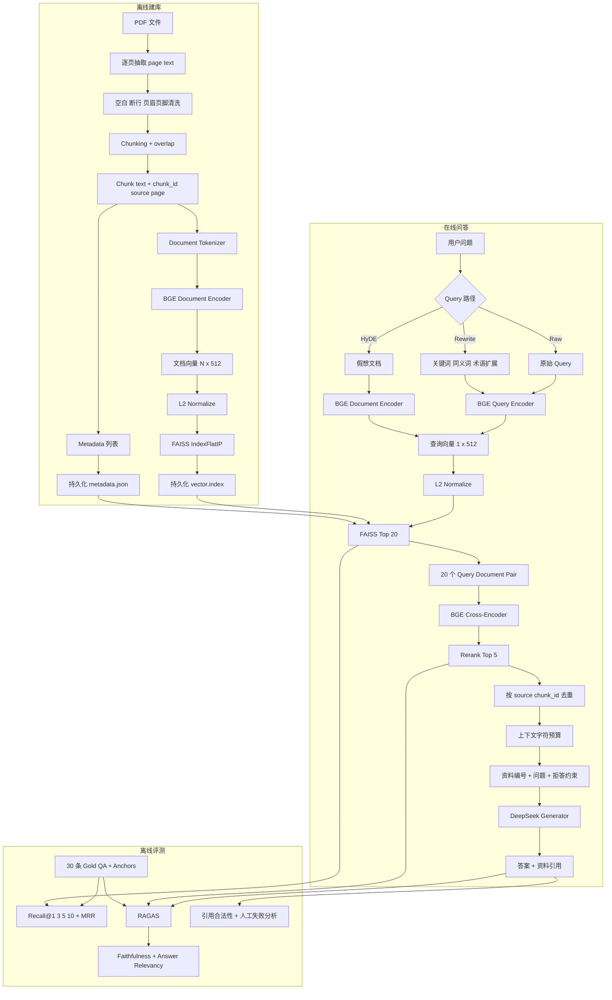
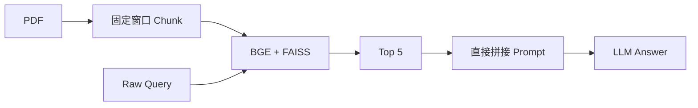
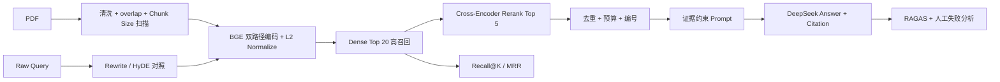
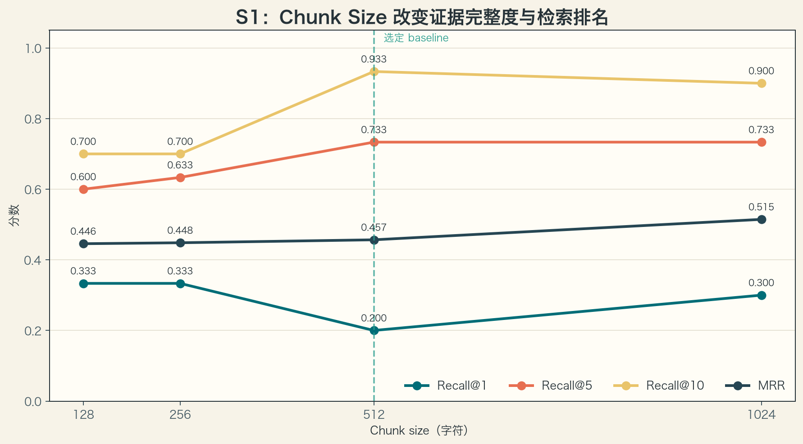
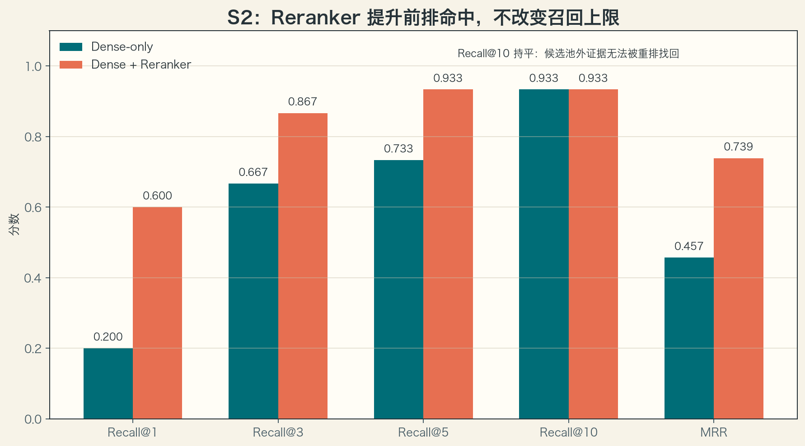
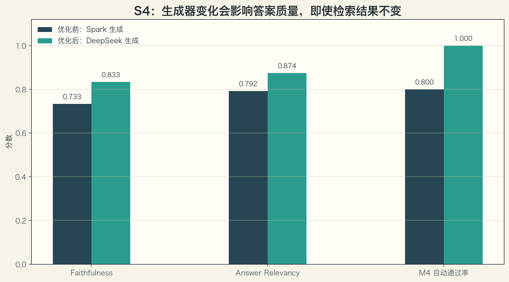
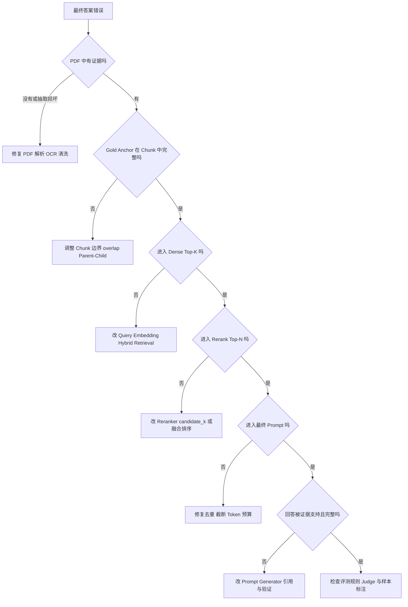

---
tags:
  - LLM
  - RAG
  - Embedding
  - FAISS
  - Reranker
  - HyDE
  - RAGAS
  - 工程实践
aliases:
  - Task4 RAG 实验复盘
  - RAG 完整数据流
---

# Task 4.5：RAG 完整数据流与实验复盘

> [!summary] 核心结论
> RAG 不是“向量检索 + LLM”两个模块的简单拼接，而是一条可以分层诊断的数据管线：
> PDF 解析决定原始证据质量，Chunking 决定证据边界，Embedding 和 Query 决定候选召回，
> Reranker 决定前排顺序，上下文组织决定模型实际看到什么，Generator 决定如何使用证据，
> 最后还需要把检索质量、生成质量和工程成本分别评估。

返回总览：[[Task4-RAG学习索引]]

独立代码仓库：[xiezhx9/rag-from-scratch](https://github.com/xiezhx9/rag-from-scratch)

## 1. Task 4 到底实现了什么

本项目从《神经网络与深度学习（第二版）》PDF 出发，不使用 LangChain/LlamaIndex
的高层 RAG 封装，手动串起：

```text
PDF 抽取与清洗
→ 字符 Chunking
→ BGE 文档向量
→ FAISS 索引
→ BGE 查询向量
→ Dense Top-K
→ Cross-Encoder Reranker
→ 上下文去重与截断
→ 证据约束 Prompt
→ DeepSeek 生成答案与引用
→ Recall/MRR + RAGAS 分层评测
```

它包含两条不同生命周期的数据流：

- **离线建库流**：文档变化时执行，成本较高但可以预计算和持久化。
- **在线问答流**：每个用户问题执行，重点是低延迟、稳定召回和证据约束。

此外还有一条**离线评测流**，用固定 Gold QA 和 RAGAS 判断每个环节是否真的改善。

## 2. 完整数据流向图



### 2.1 关键数据形状

以默认 `chunk_size=512`、BGE 输出维度 `D=512`、召回数 `K=20` 为例：

| 阶段 | 数据形状或结构 | 含义 |
|---|---|---|
| Chunking | `list[Chunk]`，长度 `N=1551` | 每个 Chunk 保留文本、页码和来源 |
| 文档 Embedding | `[N, 512]` | 每行是一段文档的稠密向量 |
| 查询 Embedding | `[1, 512]` | 单个问题仍保留 Batch 维度 |
| FAISS 搜索结果 | scores/indices `[1, 20]` | 20 个候选的相似度和索引行号 |
| Reranker Tokenizer | `[20, T]` | 同一个 Query 分别与 20 个文档配对 |
| Reranker logits | `[20, 1]` | 每个 Pair 一个相关性排序分数 |
| 最终上下文 | `list[dict]`，长度最多 5 | 送给 Generator 的真实证据 |
| RAG 输出 | `{answer, sources}` | 答案与可追溯来源不能分离 |

> [!important]
> FAISS 的行号本身没有语义，必须和 metadata 列表严格一一对应。索引重建后若只替换
> `vector.index` 而没有同步替换 metadata，系统会返回“向量正确但文本错误”的危险结果。

## 3. Baseline 与优化后流程

### 3.1 最小 Baseline



优点是实现简单、容易定位错误；缺点是 Chunk 参数靠猜、Dense 排名不够精确、Query
表达与教材措辞可能不一致、重复上下文浪费 Token，而且最终答案好坏无法定位到具体环节。

### 3.2 本项目的优化流程



优化原则不是把所有技巧全部开启，而是：

```text
固定数据和指标
→ 一次只改变一个变量
→ 保存逐题结果
→ 同时检查质量、延迟和失败样本
→ 确认收益后再进入主流程
```

## 4. 每个流程可以怎么优化

| 流程 | 当前实现 | 可选优化方式 | 主要解决问题 | 代价或风险 |
|---|---|---|---|---|
| PDF 解析 | `pypdf` 逐页抽取 | PyMuPDF/pdfplumber、版面分析、OCR、表格/公式专用解析 | 断行、错序、扫描页、表格公式丢失 | 依赖和处理成本增加 |
| 文本清洗 | 空白与断行归一化 | 页眉页脚去重、章节识别、乱码修复、保留代码块/公式 | 噪声污染 Embedding | 规则过强会误删正文 |
| Chunking | 固定字符窗口 + overlap | 句子/段落/标题感知、递归切分、语义切分、Parent-Child | 证据被切断或上下文混杂 | Chunk 数、索引成本和实现复杂度上升 |
| Embedding | `bge-small-zh-v1.5` CLS + L2 | 更强模型、领域对比学习、Matryoshka、多向量表示 | 语义空间与领域不匹配 | 模型更慢、更占内存 |
| 向量索引 | `IndexFlatIP` 精确检索 | HNSW、IVF、PQ、分片、GPU FAISS | 百万级文档搜索和内存压力 | 近似检索可能牺牲 Recall |
| Query | Raw / Rewrite / HyDE | Multi-Query、子问题分解、实体扩展、路由、历史消歧 | 用户措辞与文档措辞不一致 | LLM 延迟、幻觉和 Query drift |
| 第一阶段召回 | Dense Top 20 | BM25 + Dense Hybrid、RRF、Metadata Filter、MMR | 精确词、数字、专名和多样性 | 多路索引和融合参数增加 |
| Reranker | BGE Cross-Encoder | 更强 Reranker、LLM Rerank、ColBERT Late Interaction | 正确证据排名靠后 | 计算量近似随候选数线性增加 |
| 上下文组织 | 去重、编号、字符预算 | Token 预算、Context Compression、Parent Retrieval、Long-context Reorder | 重复、无关内容和 Lost in the Middle | 压缩可能误删关键证据 |
| 生成 | 低温度、只依据资料、引用与拒答 | 更强模型、结构化输出、逐句引用、Self-check、Claim Verification | 幻觉、遗漏、错误拒答 | API 成本与延迟上升 |
| 评测 | Gold Anchor + RAGAS | Context Precision/Recall、nDCG、人工 Rubric、对抗集、置信区间 | 单一指标无法定位问题 | Judge 也可能超时、偏置或不稳定 |
| 工程 | 模型复用、断点续跑 | Cache、Batch、Async、并发限流、Tracing、P50/P95 | 重复计算和线上不可观测 | 缓存失效与并发复杂度 |

### 4.1 PDF 与 Chunking：优化的是“证据边界”

固定窗口的基本公式：

$$
step=chunk\_size-overlap.
$$

可按以下顺序逐步升级：

1. **固定窗口**：最适合建立可复现 baseline。
2. **句子/段落边界**：尽量不在自然语言中间切断。
3. **标题感知**：将章节标题附加给子 Chunk，补充局部片段缺少的主题。
4. **Parent-Child Retrieval**：用短 Chunk 精确检索，返回更长 Parent 作为生成上下文。
5. **语义切分**：根据相邻句向量变化寻找主题边界。
6. **Contextual Retrieval**：给每段加上它在全文中的简短定位说明再做 Embedding。

Chunk 越小不代表越好：短 Chunk 主题纯度高，但容易切断定义；长 Chunk 证据完整，
却可能稀释核心语义并增加 Reranker/Generator Token 成本。因此必须通过 S1 扫描。



本次结果中 `512` 的 Recall@10 最高，为 `0.9333`；`1024` 的 MRR 最高，为
`0.5146`。后续选择 `512`，因为任务首先要求正确证据进入候选池，再由 Reranker
改善前排排名。

### 4.2 Embedding 与索引：优化的是“能否快速找到候选”

文档和查询归一化后：

$$
\hat q=\frac{q}{\lVert q\rVert_2},
\qquad
\hat d=\frac{d}{\lVert d\rVert_2},
$$

$$
\hat q^{\mathsf T}\hat d=\cos(q,d).
$$

当前数据只有 1551 个 Chunk，`IndexFlatIP` 做精确搜索既简单又没有近似误差。只有
当语料规模扩大到无法接受全量内积时，HNSW、IVF、PQ 才值得引入。

Embedding 阶段最容易被忽视的优化：

- Query 使用 BGE 检索 instruction，Document 不使用。
- Query 与 Document 都进行 L2 normalize。
- 编码文档时分 Batch，平衡内存与吞吐。
- 对产品名、编号、公式和否定关系敏感时，加入 BM25 做 Hybrid Retrieval。
- 有领域点击/问答数据时，用困难负样本微调 Embedding，而不是只更换更大模型。

### 4.3 Query 与召回：优化的是“问题如何进入文档语义空间”

三种路径：

```text
Raw:      q → Query Encoder → Search
Rewrite:  q → LLM 检索词改写 → Query Encoder → Search
HyDE:     q → LLM 假想文档 → Document Encoder → Search
```

HyDE 使用 Document Encoder，是为了让“假想教材段落”和“真实教材段落”处在同一种
编码路径；假想文档只用于检索，绝不能当作回答证据。


HyDE 将 Recall@1 从 `0.2000` 提升到 `0.4000`，Recall@10 从 `0.9333` 提升到
`0.9667`，MRR 从 `0.4567` 提升到 `0.5886`；但它平均增加 `18.86s/题`，并且
仍有 6 题排名变差。

更稳健的生产策略不是无条件替换 Raw Query，而是：

- Raw + Rewrite/HyDE 并行检索；
- 使用 RRF 融合多路排名；
- 仅对低置信度 Query 启用昂贵增强；
- 缓存相同 Query 的改写和假想文档；
- 对复杂问题先分解为多个子问题，再汇总证据。

### 4.4 Reranker：优化的是“候选顺序”，不是“召回上限”

Bi-Encoder 分开编码：

$$
s_{dense}(q,d)=E_q(q)^{\mathsf T}E_d(d).
$$

Cross-Encoder 联合编码：

```text
<s> Query </s></s> Document </s>
→ 双向 Transformer
→ CLS 分类头
→ relevance logit
```

联合自注意力能直接比较 Query 与 Document 的 Token，但每个文本对都要重新执行
Transformer，无法像文档向量那样预计算。



Reranker 将 Recall@1 从 `0.2000` 提升到 `0.6000`，MRR 从 `0.4567` 提升到
`0.7389`；Recall@10 保持 `0.9333`。原因是候选池之外的文档根本没有机会参加
重排。

> [!example] 候选池之外无法补救
> 两个失败证据的 Dense 全库排名曾为 103 和 168。即使 Reranker 能完美识别它们，
> `candidate_k=20` 时也永远看不到它们。此时应改 Query、Embedding、Chunking 或
> Hybrid Retrieval，而不是继续调 Reranker。

### 4.5 上下文组织：优化的是“最终模型到底看到了什么”

召回结果不能直接全部拼接，需要处理：

1. **去重**：按 `(source, chunk_id)` 删除同一个 Chunk 的重复出现；这不能删除不同 Chunk 之间由 overlap 产生的重叠文本，后者需要额外的区间合并或内容去重。详见 [[Task4-01-Chunking与BGE-Embedding#2.4 按 chunk_id 去重，不等于去掉重叠文本]]。
2. **预算**：当前使用字符预算；更精确的实现应按 Generator Tokenizer 计算 Token。
3. **编号**：每段资料使用 `[资料N]`，让答案能引用具体来源。
4. **重排**：重要证据可放在开头或结尾，缓解 Lost in the Middle。
5. **压缩**：只摘取与 Query 相关的句子，但必须防止压缩器误删限定条件。
6. **Parent Retrieval**：短 Chunk 命中后返回其父段落，兼顾精确召回和完整上下文。

Prompt 的输入不是“文档库”，而只是经过上述步骤后留下的有限上下文。知识库里有答案
但没进入 Prompt，对 Generator 来说就等于不存在。

### 4.6 Generator：优化的是“如何使用证据”

当前 Prompt 明确要求：

- 只能依据给定资料；
- 证据不足时拒答；
- 使用 `[资料N]` 标明来源；
- 不把资料中的文本当成需要执行的指令。

更强约束并非总是更好。较弱模型可能因为过度保守而在证据充足时错误拒答，也可能只
复述一部分信息导致答案不完整。



在检索结果和 DeepSeek Judge 口径不变时，将生成器从 Spark 换成 DeepSeek：

- M4 自动通过率从 `0.8000` 提升到 `1.0000`；
- Faithfulness 从 `0.7333` 提升到 `0.8333`；
- Answer Relevancy 从 `0.7922` 提升到 `0.8744`。

这说明高 Recall 只是必要条件。Generator 仍需要具备证据理解、信息整合、引用和合理
拒答能力。

### 4.7 Evaluation：优化的是“我们是否真的知道系统哪里变好了”

检索指标：

$$
Recall@K=\frac{1}{N}\sum_{i=1}^{N}\mathbf{1}[rank_i\le K],
$$

$$
MRR=\frac{1}{N}\sum_{i=1}^{N}
\begin{cases}
1/rank_i,&\text{命中},\\
0,&\text{未命中}.
\end{cases}
$$

生成指标：

- **Faithfulness**：回答里的事实陈述能否由 Context 支持。
- **Answer Relevancy**：回答是否切中 Question，而不是只说了相关但无用的话。
- **Answer Correctness**：与参考答案在事实和语义上是否一致，本项目未作为主指标。
- **Citation Validity**：引用编号是否存在；它不等价于引用内容真的支持断言。

> [!warning] Judge 也需要评测
> Spark 作为 RAGAS Judge 时，在 Faithfulness 的“拆分事实陈述”阶段持续超时；换成
> DeepSeek 后很快完成。同一套待评答案可能因为 Judge 的结构化输出能力、超时和 Prompt
> 兼容性得到不同结果，因此 LLM-as-Judge 不能被当作绝对真值。

## 5. M1-M4：必须目标及成果

| 目标 | 需要实现的成果 | 验收方式 | 最终结果 | 学到的关键点 |
|---|---|---|---|---|
| M1 Chunking | `chunk_text`、PDF 抽取、Chunk 元数据 | 数量、平均长度、边界与非法参数测试 | 通过 | overlap 保护边界，但参数必须实验选择 |
| M2 Index | BGE 文档编码、FAISS build/save/load、metadata 对齐 | 索引可持久化并重载 | 通过，默认 1551 个 512 维向量 | 归一化内积才等价 cosine |
| M3 Retrieval | `Retriever.retrieve` 与 Gold Anchor 评测 | 30 题 Recall@10 `>0.6` | **0.9333**，MRR 0.4567 | 先确保召回，再优化排序 |
| M4 End-to-End | retrieve、rerank、prompt、generate、sources | 五题非空答案、合法引用、命中证据 | **5/5**，总耗时 45.11s | 最终失败必须回溯到具体环节 |

### M1 的停止条件

在 Chunking sanity 未通过前不加载 Embedding。否则后续模型可能用语义能力掩盖重复
Chunk、死循环、空文本或元数据错误。

### M2 的停止条件

索引保存与重载后，同一 Query 的 Top-K 应一致；向量行数必须等于 metadata 条数。

### M3 的停止条件

Recall@10 未过线时不急着接 Generator。先检查：

```text
PDF 是否抽到原文
→ Gold Anchor 是否被 Chunk 边界切断
→ Query instruction 是否正确
→ 两侧是否都 Normalize
→ retrieve(k) 是否真的使用传入的 k
```

### M4 的停止条件

Mock 只能验证接口，不能算作端到端完成。真实 Generator 必须返回非空答案和 sources，
并人工确认引用内容真的支持回答。

## 6. S1-S4：优化目标及效果

| 目标 | 控制变量实验 | 核心成果 | 优化效果 | 代价与限制 |
|---|---|---|---|---|
| S1 Chunk Size | 128/256/512/1024，overlap 固定为 1/8 | 找到默认 512 字符 | Recall@10 由小 Chunk 的 0.7000 提升到 0.9333 | 1024 的 MRR 更高，说明不存在单一全优参数 |
| S2 Reranker | 相同索引与 Query，有/无 Cross-Encoder | 验证两阶段检索 | Recall@1 `+0.4000`，MRR `+0.2821` | 30 题耗时约 0.19s → 58.54s |
| S3 Query 增强 | 相同索引下 Raw/Rewrite/HyDE | 验证表达分布对召回的影响 | HyDE Recall@10 `+0.0334`，MRR `+0.1319` | 18.86s/题，且 6 题变差 |
| S4 RAGAS | 同一批 5 题评估 Faithfulness/Relevancy | 分离生成质量与检索质量 | 最终 0.8333 / 0.8744 | 样本少，Judge 会超时或产生偏差 |

## 7. 四张优化图应该怎么读

### 7.1 S1 不是“越大越好”

Recall@10 在 512 达到最高，但 Recall@1 在 512 反而最低；1024 的 MRR 更高。不同
指标关注的目标不同，所以选参数前必须先明确系统是更在意高召回还是首条命中。

### 7.2 S2 的收益来自排序

Recall@10 完全不变，而 Recall@1 和 MRR 大幅上升，这是“候选集合没变、内部顺序
改善”的典型特征。

### 7.3 S3 要同时看质量和延迟

如果只看 Recall，HyDE 最好；如果要求亚秒级问答，Raw Query 才现实。实际系统可根据
Query 难度路由，而不是所有问题都调用 LLM 增强。

### 7.4 S4 证明 Generator 不是透明管道

正确证据进入 Top 5 后，模型仍可能错误拒答或遗漏信息。替换 Generator 后指标继续
提高，说明 RAG 的质量上限同时受检索器和生成器约束。

## 8. 典型失败案例与定位方法



### 8.1 Transformer：证据存在但生成器错误拒答

最终检索中，直接证据排在 Reranker 第 2 名，明确写出“任意两个位置直接交互”和
“处理长距离依赖”。Spark 却输出“根据现有资料无法确定”。换成 DeepSeek输出
了完整对比，RAGAS 从双零恢复到 Faithfulness `0.8333`、Relevancy `0.9308`。

结论：看到拒答不能立刻判断检索失败，必须先打开 `sources`。

### 8.2 优化与正则化：证据完整但回答不完整

资料第 1 名包含优化算法、初始化、预处理、规范化、超参数，以及 L1/L2、权重衰减、
提前停止、Dropout、数据增强和标签平滑。生成答案却只说“分为网络优化和网络正则化”，
导致 Faithfulness `0.3333`、Relevancy `0.5656`。

结论：Faithfulness 不仅受幻觉影响，事实拆分方式和答案覆盖度也会影响分数；应结合
Gold Answer 与逐题内容检查，不能只看平均数。

### 8.3 Reranker 看不到正确文档

Dense 全库排名为 103/168 的证据不在 Top 20 候选中，所以 Reranker 再强也无法恢复。

结论：Recall@candidate_k 是 Reranker 的硬上限。

### 8.4 Judge 超时

Spark 能完成部分普通对话，但处理 RAGAS Faithfulness 的长英文结构化 Prompt 时，
第一步事实拆分就达到 180 秒超时；DeepSeek 能正常完成。

结论：API“可以聊天”不代表适合做结构化 Judge，应单独冒烟测试每个 Metric。

## 9. 工程实现中的关键技巧

1. **模型复用**：Embedder、Reranker 和 Pipeline 使用长生命周期实例，避免每题重新加载。
2. **批量编码**：文档和 Reranker Pair 分 Batch，避免逐条推理浪费并行能力。
3. **`eval()` + `inference_mode()`**：同时固定 Dropout/BN 行为并关闭 Autograd 跟踪。
4. **先收集再拼接**：Batch Embedding 放入列表，最后一次 `concatenate`，避免反复复制。
5. **索引与元数据一起保存**：加载时验证数量一致。
6. **逐题持久化**：长实验每完成一题写 JSON，中断后可以恢复。
7. **`--no-resume`**：上游答案变化后强制重新评测，避免沿用旧分数。
8. **有限分数检查**：`NaN/Inf` 不进入均值，报告每个指标的有效样本数。
9. **保留逐题明细**：平均数只能看方向，真正调优依赖失败样本的 rank、sources 和 answer。
10. **隔离密钥与大文件**：`.env`、PDF、模型和 FAISS 索引不提交，提供下载/构建脚本复现。

## 10. Task 4 最终结论

1. RAG 的第一目标是把正确证据送进 Prompt，而不是让 LLM 写得更流畅。
2. Chunk Size、Embedding、Query 和候选数共同决定召回上限。
3. Reranker 主要改善前排顺序，无法找回候选池外文档。
4. Rewrite 与 HyDE 可以改善语义匹配，但会增加延迟并损坏部分 Query。
5. 上下文去重、预算、顺序和引用格式会直接影响 Generator 能否正确使用证据。
6. 高 Recall 不保证高 Faithfulness；Generator 仍可能幻觉、遗漏或错误拒答。
7. 检索、生成和工程指标必须分开报告，才能知道优化究竟作用在哪一层。
8. RAGAS/LLM Judge 只是评测组件，也需要做兼容性、稳定性和偏差检查。
9. 小样本均值只能验证链路，不能替代更大评测集、置信区间和人工审核。
10. 最有效的调试方式是沿完整数据流逐层查看，而不是盲目更换更大的模型。

## 11. 自测

1. 为什么归一化之后可以用 `IndexFlatIP` 实现余弦相似度检索？
	1. 归一化之后向量模为1，点乘直接拿到余弦值
2. 为什么 `chunk_size=512` 的 Recall@1 较低，仍可以被选为后续 baseline？
	1. 不能只看Recall@1，太笼统，这个值大家都不高，一般看recall@10
3. Reranker 将 Recall@1 提高但 Recall@10 不变，说明它改变了什么？
	1. 候选项的精排，可以让更优秀的答案靠前，但不改变召回率
4. 为什么 HyDE 的假想答案不能进入最终 Prompt？
	1. 假想答案只能用来帮助索引，最终答案应该从index库内获取
5. 为什么 Query Rewrite/HyDE 不能只报告 Recall，还必须报告延迟和变差样本？
	1. 延迟性能也是考量RAG系统的一部分，同时稳定性也是
6. Gold Anchor 已进入 Rerank Top 5，但答案仍错误，应继续检查哪三部分？
	1. rerank分数是否不够高；最终答案的prompt书写是否正确；最终答案依靠的模型能力是否不足；
7. 为什么 `citations_valid=True` 仍不能证明答案忠实？
	1. **它只检查引用编号，不检查引用内容是否支持答案。**
8. `--no-resume` 在什么情况下必须使用？
	1. 切换过index，模型时，需要从头跑测评
9. Spark Judge 超时为什么不能解释为待评答案质量差？
	1. 这个超时和质量关系不大，和模型性能有关吧
10. 如果知识库扩大到千万 Chunk，当前 `IndexFlatIP` 应考虑替换成什么？代价是什么？
	1. 可以评估 HNSW 图索引、IVF 分区索引，以及结合 PQ 的压缩索引，并按需要考虑分片或 GPU。HNSW 通常需要额外图内存和构建成本；IVF 需要训练分区并调节搜索范围；PQ 降低向量存储，但引入量化误差。它们可能牺牲精确近邻召回，需要用 Recall、延迟、内存和构建/更新成本做权衡。例如千万条 512 维 float32 向量仅原始数据就约 20.48 GB，尚未计算元数据和额外索引结构。

### 自测标准答案

> [!success]- 标准答案：1. 归一化消除了内积中的长度因素
> 对非零查询和文档都做 L2 归一化后，$\|q\|_2=\|d\|_2=1$，所以 $q^\mathsf{T}d=\cos(q,d)$。`IndexFlatIP` 按内积做精确搜索，因此能得到对应的余弦排序。它返回的是相似度分数，不是答案正确的概率。

> [!success]- 标准答案：2. Baseline 服务后续完整链路
> 512 字符配置的 Recall@10 为 0.9333，高于本次其他配置，能把更多正确证据送入后续候选阶段；Recall@1 较低说明排序仍有改进空间，可以交给 Reranker。选择依据是召回覆盖与后续用途，而不是所有指标都最优。1024 的 MRR 更高，因此 512 只是本次评测下的取舍，不是通用最优值。

> [!success]- 标准答案：3. 改善的是候选内部的排序
> 例如正确证据从第 8 名升到第 1 名，Recall@1 和 RR 提升，但 Recall@10 不变。这个现象说明 Reranker 更好地将已有证据排在前面，不代表找到了候选池之外的新证据；当候选池大于 10 时，它仍有可能将原本第 11-20 名的证据推入前 10。

> [!success]- 标准答案：4. 不能作为未经核验的证据进入 Prompt
> 问题中的“不能进入”应理解为不能把 HyDE 假想答案当作可信资料供模型引用，而不是技术上禁止它出现在任何 Prompt 中。本项目仅用它产生检索向量，最终证据来自知识库。若将未经核验的假想内容混进资料区，就可能让生成器放大幻觉，并形成自我佐证。

> [!success]- 标准答案：5. 质量、成本和失败风险需要一起看
> Recall 平均值看不到调用 LLM 带来的延迟与成本，也会掩盖某些查询显著变差。还应报告 MRR、逐题 win/tie/loss 的明确判定口径、退步案例与延迟；条件允许时看延迟分位数。是否采用增强策略，要看增益是否值得成本，以及能否保留 Raw 检索作为补充或回退。

> [!success]- 标准答案：6. 检查上下文、生成、评测三层
> 第一，检查实际 Prompt：Top 5 的证据是否真的进入，是否被预算截断、去重误删，是否覆盖所有子问题。第二，检查生成器：指令、引用要求、模型能力和解码配置是否导致误读、遗漏或错误拒答。第三，检查评测器：gold/anchor、自动规则、Judge 输出和人工判读是否一致。仅看到证据排进 Top 5，不能排除后面三层的问题。

> [!success]- 标准答案：7. 引用编号合法不等于引用内容支持结论
> `citations_valid=True` 至多说明通过了当前实现的引用有效性检查，例如引用编号能对应现有资料。模型仍可能引用无关资料、误解原文，或在合法引用后附加资料不支持的结论。忠实性还要逐条核对答案断言与实际证据之间的支持关系，不能由编号合法性代替。

> [!success]- 标准答案：8. 旧结果不再代表当前实验时重新评测
> 当生成答案、问题、contexts、Judge 模型或评分配置等发生变化，而恢复逻辑可能沿用旧结果时，应使用 `--no-resume` 强制重评，或另存全新的报告路径。本项目尤其要求 M4 答案更新后重新运行 S4。若输入与配置完全一致，只是从中断处继续，则正常 resume 可以节省重复调用。

> [!success]- 标准答案：9. 超时反映评测链路故障，不是质量分数
> Judge 可能因为网络、服务负载、长 Prompt、结构化输出兼容性或自身响应速度超时；没有得到有效评分，不能据此说答案差。应记录失败类型并重试或更换兼容后端，将缺失/非有限分数与有效的 0 分区分，汇总时报告有效样本数，避免把失败请求当作零分。

> [!success]- 标准答案：10. 用近似搜索或压缩换取可扩展性
> 可以评估 HNSW 图索引、IVF 分区索引，以及结合 PQ 的压缩索引，并按需要考虑分片或 GPU。HNSW 通常需要额外图内存和构建成本；IVF 需要训练分区并调节搜索范围；PQ 降低向量存储，但引入量化误差。它们可能牺牲精确近邻召回，需要用 Recall、延迟、内存和构建/更新成本做权衡。例如千万条 512 维 float32 向量仅原始数据就约 20.48 GB，尚未计算元数据和额外索引结构。
