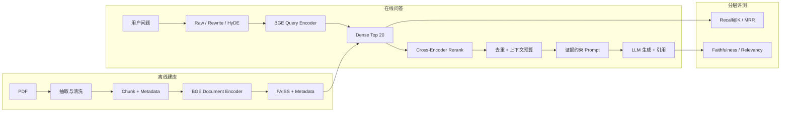

---
tags:
  - LLM
  - RAG
  - Embedding
  - FAISS
  - 工程实践
aliases:
  - Task4 RAG
  - RAG 学习索引
---

# Task 4：RAG 检索增强生成

> [!summary] 学习目标
> 从 PDF 知识库出发，完成文本抽取与切块、BGE 向量化、FAISS 召回、Reranker 精排和生成模型回答，并将检索质量与生成质量分开评估。

独立代码仓库：[xiezhx9/rag-from-scratch](https://github.com/xiezhx9/rag-from-scratch)

前置笔记：[[Chapter8-注意力机制与Transformer]]

## 1. RAG 数据流

RAG 不是重新训练大模型，而是在生成前先查找外部证据，再让生成模型依据证据回答。

## 2. 专题导航

1. [[Task4-01-Chunking与BGE-Embedding]]：PDF 字符切块、BGE Encoder、CLS 向量、批量推理与 Autograd 开关。
2. [[Task4-02-FAISS检索与RAG评估]]：FAISS 召回、Gold Anchor、Recall@K、MRR 和完整 RAG 评估分层。
3. [[Task4-03-Reranker与Tokenizer模板]]：Tokenizer 模板分层、XLM-RoBERTa 文本对格式、Chat Template 与 Reranker 实现要点。
4. [[Task4-04-RAG生成与Query增强]]：证据约束生成、优化前后流程、Query Rewrite 真实对照与 HyDE 原理。
5. [[Task4-05-完整数据流与实验复盘]]：离线/在线完整数据流、各环节优化地图、M1-M4/S1-S4 成果和真实实验图。

## 3. 最终成果

- M1-M4 与 S1-S4 全部完成，测试结果为 `30 passed, 1 skipped`。
- `chunk_size=512` 的 Dense Recall@10 为 `0.9333`，超过任务要求的 `0.6`。
- Reranker 将 Recall@1 从 `0.2000` 提升到 `0.6000`，MRR 从 `0.4567` 提升到 `0.7389`。
- HyDE 的 Recall@10 为 `0.9667`、MRR 为 `0.5886`，但平均增加 `18.86s/题`。
- M4 五题端到端自动验收最终为 `5/5`。
- S4 五题平均 Faithfulness 为 `0.8333`，Answer Relevancy 为 `0.8744`。
- Spark 在生成与 RAGAS 结构化评测上出现拒答/超时；改用 DeepSeek 后链路稳定，说明 Generator 和 Judge 都属于必须评估的系统组件。
