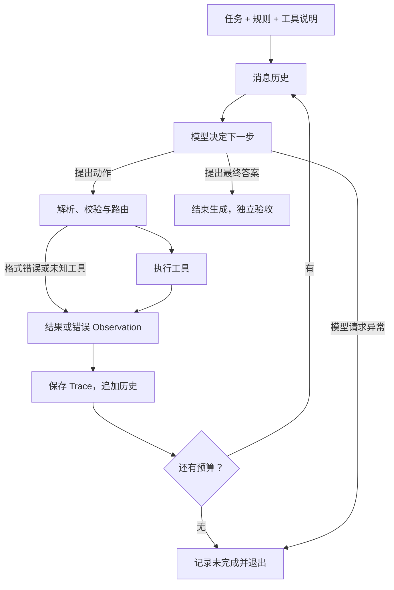

# Task 5.1：ReAct 循环与消息协议

> [!summary] 必须掌握
> 模型根据当前上下文提出动作，程序执行动作并把真实结果加入历史，模型据此决定下一步。这个反馈闭环就是本项目的核心；独立规划器、长期记忆和多 Agent 都是可选扩展。

返回总览：[[Task5-Tool-Agent学习索引]]

## 1. Reason、Act、Observe 如何配合

| 环节 | 谁负责 | 要发生什么 |
|---|---|---|
| Reason | 模型 | 根据任务、已知证据和错误决定下一步 |
| Act | 模型提出，程序执行 | 生成工具名和参数，再调用真实函数 |
| Observe | 程序回填，模型读取 | 将结果或错误加入下一轮上下文 |
| Finish | 模型提出完成，外部验收 | 生成最终答案，再检查任务是否满足 |

[ReAct 原论文](https://arxiv.org/abs/2210.03629) 将推理与行动交替组织。代码中的循环负责连接模型与环境，主要推理能力来自模型。

`parse_thought` 没有在 Python 中执行另一套推理算法，但原始回复会回到历史，后续 Action 也可能依赖前面生成的 Thought。复习时应关注动作、证据和依赖关系；长篇 Thought 不能替代正确性验证。

## 2. 把一次完整运行走通



以“查询某人的出生年份，并计算到 2026 年的年龄”为例：

```text
模型：调用 wiki 查询出生年份
程序：执行查询，返回 1947
模型：调用 calculator，参数为 2026 - 1947
程序：返回 79
模型：回答出生于 1947 年，2026 年生日后 79 岁
```

关键是 `查询结果 1947 → 下一次调用的参数`。如果模型一次性编出动作和 Observation，工具并未执行；如果工具返回后没有加入历史，下一轮也无法根据它调整行为。

## 3. 消息历史就是本轮可用信息

手写文本协议的最小示例：

```python
messages = [
    {"role": "system", "content": "工具说明、调用规则与回答格式"},
    {"role": "user", "content": "计算 6 * 7"},
    {
        "role": "assistant",
        "content": 'Thought: 需要计算。\nAction: calculator\nAction Input: {"expression":"6 * 7"}',
    },
    {"role": "user", "content": "Observation: 42"},
]
```

最后一条由程序在真实执行后添加。下一次模型请求带上这段历史，模型才知道计算已完成。

Trace 用于调试和评测；messages 用于模型决策。两者可以包含相似内容，但只写入 Trace 而不回填 messages，模型看不到新增信息。

## 4. 文本 ReAct 与原生工具调用

| 项目 | 文本协议 | 原生 tool calls |
|---|---|---|
| 工具定义 | 拼进 prompt | 通过请求的 `tools` 字段提供 |
| 调用意图 | `Action / Action Input` 标签 | 结构化工具调用字段 |
| 工具结果 | 本项目用 user 消息中的 Observation | tool 消息，通过调用 ID 对应请求 |
| 应用的职责 | 解析、执行、回填、控制循环 | 执行、校验、回填、控制循环 |

原生协议的结果消息可以是：

```json
{"role": "tool", "tool_call_id": "call_1", "content": "42"}
```

必须先有对应的 assistant 工具调用。调用 ID 能区分同一工具的多次调用；常见兼容接口的 arguments 仍需从 JSON 字符串解析。

ReAct 描述如何反复决策并利用反馈，原生 tool calls 描述消息如何编码，两者可以结合。原生调用时 `content=null`、`tool_calls` 非空可以是正常响应；没有公开 Thought 也不能据此认定没有推理。协议示例可查 [DeepSeek Tool Calls](https://api-docs.deepseek.com/guides/tool_calls/)。

## 5. 三个值得记住的工程边界

**停机声明需要验收。** 当前程序解析到非空 Final Answer 就返回；prompt 中“必须先用工具”的要求没有变成程序强制条件。因此 `trace.success=True` 只说明获得最终回答，任务是否通过应另行判断。

**预算要覆盖收尾。** 当前 `max_steps` 限制模型决策轮。假设预算为 8，第 8 轮才拿到工具结果，就没有第 9 轮生成答案的机会。更好的设计可分别限制动作次数、请求次数和总耗时，并预留收尾机会。

**请求重试与行为恢复发生在不同层。** 请求重试通常重发同一请求；行为恢复是模型看到错误 Observation 后改参数、换工具或重试。当前工具/解析异常会回填，模型请求异常则会离开循环。`steps` 不含最终回答轮，也不包含所有内部重试，不能直接当作 API 请求数。

## 6. 自测

1. 为什么写一个模型调用循环就能形成基础 Agent？独立 planner 是否必需？
	1. 模型选择动作，程序执行，再把观察交回模型，形成动态闭环。planner 可帮助复杂任务管理进度，但不是基础 ReAct 的必要模块。
2. 工具结果只写入 Trace，没有加入 messages，会怎样？
	1. 没法传递给模型
3. 原生 tool calls 和 ReAct 有什么关系？应用还需要执行工具吗？
	1. tool calls是帮助tool注册的原生接口，不是一个层级的概念；agent来执行工具
4. 程序不分析 Thought，是否意味着 Thought 对后续输出完全无影响？
	1. Thought作为后续token的输出
5. 为什么 Final Answer、工具返回成功、任务通过是三件不同的事？
	1. Final Answer可能由模型直接回答；工具返回成功不代表结果和工具选择符合预期；
6. 请求重试和错误后的重新决策有什么区别？步骤预算为何要留出收尾机会？
	1. 前者没有提哦那个observation，后者会提供失败的observation；最后一次工具返回后还需要模型汇总答案，预算设计必须考虑这一步。

### 自测标准答案

> [!success]- 标准答案：1. 环境反馈驱动下一步
> 模型选择动作，程序执行，再把观察交回模型，形成动态闭环。planner 可帮助复杂任务管理进度，但不是基础 ReAct 的必要模块。

> [!success]- 标准答案：2. 模型得不到新增证据
> Trace 是外部记录；模型只能根据实际请求中的上下文决策。需要把结果与对应调用正确加入下一轮历史。

> [!success]- 标准答案：3. 模式与协议可以组合
> 原生协议编码调用意图和结果，ReAct 组织决策与反馈。应用仍要校验、执行工具、关联结果和控制终止。

> [!success]- 标准答案：4. 仍可能有影响
> 原始回复回填历史，后续 token 也以先前 token 为条件。应通过后续动作是否正确依赖证据来评价，而不是根据 Thought 长度判断。

> [!success]- 标准答案：5. 三种不同的完成条件
> Final Answer 是模型的结束声明；工具成功只说明一次局部执行；任务通过还需要最终答案、必要证据及任务约束满足。

> [!success]- 标准答案：6. 一个恢复请求，一个调整行为
> 请求重试未必产生新决策；观察错误后的重新决策会改变行动。最后一次工具返回后还需要模型汇总答案，预算设计必须考虑这一步。

> [!note]- 上一轮自测作答（原文保留）
> 以下保留当时的题目与个人作答，新一轮复习请使用上面的归纳题和标准答案。
>
> 1. 模型输出 Action 文本后，谁真正执行 calculator？
> 	1. agent去执行
> 2. parse_thought 只存日志，是否意味着 Thought 对后续行为完全无影响？
> 	1. thought是模型内行为，可以用来帮助agent理解；也是后续token的输入
> 3. 原生 tool calls 与 ReAct 是否互斥？
> 	1. 并不互斥，只是tool的传递从prompt内换了接口
> 4. 为什么工具正常返回并不代表当前任务已完成？
> 	1. 工具的选择以及结果可能并非想要的
> 5. max_steps=8，第 8 轮才得到最后一个工具结果，当前实现会怎样？
> 	1. 终止，输出结果失败
> 6. 为什么 len(steps) 不能直接当作模型 API 调用次数？
> 	1. 没有记录final answer的次数
> 7. 模型 API 超时重试和 S4 的恢复动作有什么不同？
> 	1. API 重试一般只是重复传输同一请求；S4 要求模型接收到错误 Observation 后产生后续动作。
> 8. “调用工具前禁止 Final Answer”写进 prompt 后，程序是否已经强制保证？
> 	1. 没有保证，只是文字解析
