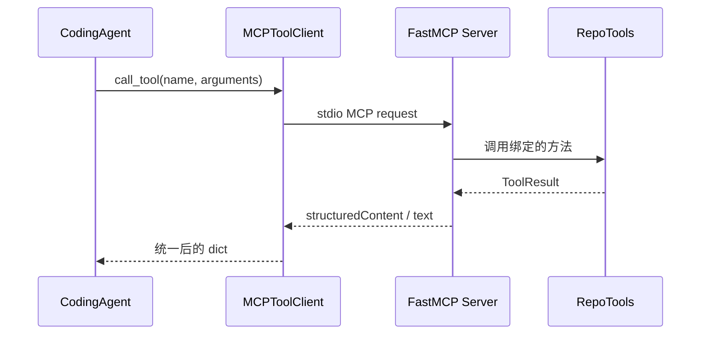

# Task 6.1：MCP 工具与安全执行

> [!summary] 必须掌握
> MCP 标准化“有哪些工具、参数是什么、如何调用”，但不会自动保证工具安全。真正的边界由 RepoTools、文件系统校验、子进程配置、写入白名单和独立验收共同落实。

返回总览：[[Task6-Coding-Agent学习索引]]

## 1. MCP 在项目中的位置



MCP Server 通过 `FastMCP` 注册真实 Python 方法；Client 使用 `AsyncExitStack` 管理 stdio 进程、读写流和 `ClientSession` 生命周期。初始化后才能 `list_tools()` 或 `call_tool()`。

异步接口主要因为进程和流 I/O 需要等待。当前主循环大多顺序 `await`，因此它不会自动让单条工具链并行变快；价值是等待时不阻塞事件循环，也方便未来并发多个独立调用。

## 2. 七个仓库工具

| 工具 | 作用 | 关键约束 |
|---|---|---|
| `read_file` | 读取 UTF-8 文件 | 仓库内路径、最大读取 128,000 Bytes |
| `write_file` | 替换完整文件 | 只写允许源码，拒绝测试和仓库外路径 |
| `run_tests` | 运行全部或指定 pytest | 固定解释器、`cwd`、超时、输出上限 |
| `git_diff` | 读取当前工作区 Patch | 不使用外部 diff、只读 |
| `git_apply` | 校验并应用 Unified Diff | 先验证目标文件，再 `git apply --check` |
| `list_files` | 单层列出目录 | 忽略元数据、缓存、符号链接，限制条数 |
| `search_text` | 字面量文本搜索 | 返回 `file:line:text`，限制文件大小和匹配数 |

前五个是原任务要求的核心工具；后两个是为了在陌生仓库中先发现文件再读取，避免模型猜路径。

工具 Schema 使用 JSON Schema：

```json
{
  "type": "object",
  "properties": {
    "query": {"type": "string"},
    "path": {"type": "string", "default": "."}
  },
  "required": ["query"],
  "additionalProperties": false
}
```

`parameters` 是整个参数对象的 Schema，多参数放在 `properties`，不是把参数写成列表。Schema 帮助模型构造调用，但真正的参数、路径和权限检查仍在执行器中完成。

## 3. `resolve_path` 为什么是安全核心

实现流程：

```text
拒绝绝对路径
→ 拼到 repo root
→ Path.resolve() 消除 .. 并解析符号链接
→ 检查真实路径仍位于 root 下
→ 拒绝路径中出现 .git
```

不能只做字符串前缀判断。例如：

```text
repo/data/../../secret.txt
repo/link -> /Users/xue/.ssh
```

表面上以仓库路径开头，但解析后的真实位置可能已经越界。`is_relative_to(root)` 检查的是规整后的路径。

`.git` 单独禁用，是因为它包含仓库配置、引用和对象；允许模型直接修改会绕过普通源码审计，甚至破坏历史。

## 4. 两种写权限模式

### 固定练习白名单

`allow_repo_writes=False` 时，只有 `editable_files` 中列出的文件可写。例如 toy task 只允许 `calculator.py`。

### 真实仓库源码模式

`allow_repo_writes=True` 时，不等于任意写入。目标仍必须：

- 是仓库内已存在的普通文件；
- 不是符号链接；
- 已被 Git 跟踪；
- 不在 `test/tests/testing` 目录；
- 文件名不是 `conftest.py`、`test_*.py`、`*_test.py` 等测试模式。

保护测试很重要：否则 Agent 可以删除断言或降低测试强度来制造“通过”。

## 5. 为什么 `git_apply` 需要两层校验

第一层从 Patch 的 `+++`、`---`、rename/copy 和 `diff --git` 行提取所有新旧路径，检查：

- 没有绝对路径或 `..` 逃逸；
- 所有文件都属于允许范围；
- rename/copy 的来源和目标都安全；
- 真实仓库模式下仍满足受保护与 Git 跟踪规则。

第二层执行：

```text
git apply --check -
→ 成功后 git apply -
```

第一层检查权限，第二层检查 Patch 是否能应用。两者职责不同，不能互相替代。

## 6. 子进程为什么这样执行

`run_tests` 和 Git 命令采用：

- 参数列表而不是拼接 Shell 字符串；
- `shell=False`；
- `cwd=repo_root`；
- 固定超时；
- 捕获 stdout/stderr；
- 返回退出码、耗时、超时和截断标志。

测试失败的 `returncode != 0` 是 Agent 可利用的 Observation，不应让 MCP Server 崩溃。超时则是不同类型的失败，需要标记 `timed_out=true`。

输出超过 12,000 字符时，当前实现保留头尾并插入截断标记。这样能看到首个错误和末尾汇总，但被省略的中间内容仍可能包含关键证据。

## 7. `ToolResult` 为什么需要结构化

典型结果：

```json
{
  "ok": true,
  "output": "2 failed, 3 passed",
  "error": null,
  "returncode": 1,
  "timed_out": false,
  "duration_seconds": 0.42,
  "truncated": false
}
```

这里 `ok=true` 表示命令成功启动并得到结果；`returncode=1` 表示测试没有通过。两者不矛盾。

需要区分：

| 状态 | 后续策略 |
|---|---|
| 工具执行异常 | 检查参数、权限或服务状态 |
| 测试断言失败 | 阅读失败并修改源码 |
| 超时 | 缩小测试范围或调整受控超时 |
| 空输出且退出码 0 | 可能是正常沉默，结合命令语义判断 |
| 输出截断 | 缩小范围或读取更具体的文件/测试 |

## 8. MCP 没有解决什么

- MCP 不是操作系统沙箱；`subprocess + cwd + timeout` 只适合可信教学代码。
- MCP 不会自动阻止 Prompt Injection；工具输出仍是不可信数据。
- MCP 不会自动定义业务权限；服务端必须按任务传入可编辑文件。
- MCP 不会自动验证修复；测试和 Evaluator 才负责验收。
- MCP 不会自动并行；顺序 `await` 仍然是串行执行。

## 9. 当前验证证据

2026-09-17 的本地验收：

- stdio Server 正常初始化；
- Client 能列出 7 个工具；
- 独立探针读取内容与磁盘一致；
- 全量离线回归 `96 passed`。

## 10. 自测

1. 为什么只拒绝包含 `..` 的原始字符串仍不够？
2. `ToolResult.ok=true`、`returncode=1` 表示什么？
3. `git apply --check` 为什么不能替代文件白名单？
4. `allow_repo_writes=True` 是否意味着任意仓库文件可写？
5. 为什么当前异步实现不一定比同步实现更快？
6. 如何证明 timeout 和输出上限真的生效？

### 自测标准答案

> [!success]- 标准答案：1. 还存在绝对路径和符号链接逃逸
> 安全检查应对拼接后的真实路径执行 `resolve()`，再确认它仍位于仓库根目录；只检查原始文本会漏掉符号链接等情况。

> [!success]- 标准答案：2. 命令执行成功，但测试结果失败
> `ok` 表示工具调用链路正常；退出码表达被执行程序的结果。Agent 应读取失败输出继续修复，而不是把它当成 MCP 异常。

> [!success]- 标准答案：3. 能应用不代表有权限
> `git apply --check` 只验证 Patch 与当前文件是否匹配，不会判断目标是不是测试、`.git`、仓库外文件或未授权源码。

> [!success]- 标准答案：4. 仍然受保护
> 只能修改仓库内、非符号链接、Git 已跟踪且不属于测试规则的现有源码文件。

> [!success]- 标准答案：5. `await` 不等于并行
> 异步允许等待时让出事件循环；如果每一步都依赖上一步并按顺序等待，没有其他任务可调度，单条链路不会因此自动缩短。

> [!success]- 标准答案：6. 做边界黑盒测试
> 构造低于、等于和超过输出上限的命令，检查内容与 `truncated`；运行明显超过超时阈值的可控命令，检查终止时间和 `timed_out`，不能只检查配置字段存在。
