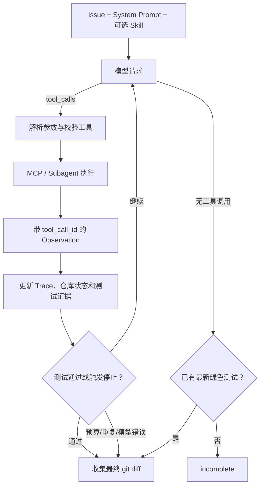
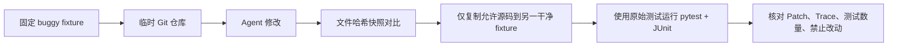

# Task 6.2：Coding Agent 循环与可验证完成

> [!summary] 必须掌握
> Coding Agent 的核心不是一次生成 Patch，而是维护“模型决策—工具执行—仓库状态—测试证据”的循环。成功必须由最后一次修改后的真实测试证明，Final Answer 只是模型的结束声明。

返回总览：[[Task6-Coding-Agent学习索引]]

## 1. 主循环怎样运行



每次模型返回原生 `tool_calls`。程序先把 Assistant 消息加入历史，再逐个执行工具，并用：

```json
{
  "role": "tool",
  "tool_call_id": "call_xxx",
  "content": "{...ToolResult...}"
}
```

回填结果。调用 ID 将多个调用和多个 Observation 正确配对。

## 2. ReAct 思想仍然存在

Task6 不再要求模型输出文本形式的：

```text
Thought → Action → Observation
```

但行为仍然是：

```text
根据当前上下文决定动作
→ 执行动作
→ 读取真实结果
→ 根据结果决定下一步
```

因此原生 Function Calling 改变的是协议表示，ReAct 的反馈闭环仍然存在。项目只保存简短可见决策摘要，不要求或依赖模型隐藏思维链。

## 3. `run`、`arun` 与异步边界

- `run()` 是同步 Evaluator 的入口；
- `run()` 内部用 `asyncio.run()` 调用 `arun()`；
- `arun()` 持有 MCP 异步会话并维护整个消息历史；
- `call_model()` 使用 `AsyncOpenAI` 请求兼容端点。

同步入口方便测试框架使用，异步内部适合网络与 stdio I/O。当前同一任务的步骤具有依赖关系，因此主要还是串行循环。

## 4. 模型请求错误怎样处理

程序只对可能是瞬时问题的错误重试：

- 连接失败；
- 请求超时；
- Rate Limit；
- HTTP 408、409、429；
- HTTP 5xx。

认证失败、参数错误等非瞬时问题不会盲目重试。重试采用有限次数和短暂指数退避。

模型返回既没有文本也没有 Tool Call 时，也会有限重试；耗尽后记录 `model_error`。如果此前已经取得最后一次写入后的绿色测试，即使最终总结请求失败，Agent 仍可按 `tests_passed` 完成，因为可执行证据比总结文字更重要。

## 5. 本地模型工具格式恢复

部分 Qwen/vLLM 组合虽然声明支持 OpenAI Tool Calling，仍可能把调用写进普通文本：

````text
<tool_call>{...}</tool_call>
<tools>{...}</tools>
<read_file>{...}</read_file>
```json
{...}
```
````

恢复器会尝试解析这些常见格式，但只接受当前 `tools` 列表中已经授权的工具名。恢复出来的调用 ID 由工具名和参数稳定哈希生成。

这是协议兼容层，不应变成任意文本执行器：未知标签和非法 JSON 仍然保留为普通输出或错误。

## 6. 测试证据为什么会失效

假设运行顺序是：

```text
run_tests 通过
→ write_file 修改代码
→ Final Answer
```

第一次测试只证明修改前的状态。写入后，程序立即将 `tests_passed=False`，只有再次执行测试并通过，才能恢复为真。

这条规则是 Coding Agent 与普通问答 Agent 的关键区别：结论必须绑定仓库状态。

Subagent 的测试证据也有边界：

- 强制委托条件下，`delegate_test_runner` 可承担初始与最终测试；
- 条件委托只用于复杂失败诊断，最终验证仍要求主 Agent 直接 `run_tests`；
- 委托返回摘要但没有结构化测试证据时，不得视为测试完成。

## 7. 重复行为不是只看工具名

当前实现构造两类哈希：

```text
action_hash = hash(工具名 + 标准化参数)
repo_state_hash = hash(当前 git diff)
repeat_key = (repo_state_hash, action_hash)
```

同一仓库状态下重复相同动作达到阈值，才判定为无进展重复。写入成功后 Patch 改变，仓库状态哈希随之更新，新的相同动作不会和旧状态简单混在一起。

这比只比较连续工具名更合理：同一个 `run_tests` 在修改前后各执行一次是必要流程，不应算重复。

达到阈值后，最后一步标记：

```text
recovery_strategy = stop_repeated_action
stop_reason = repeated_action
```

S1 中 `mean-edge` 和 `profile-sync` 的失败都集中在这个停止原因，说明模型反复读取错误路径或没有根据 Observation 调整策略。

## 8. Trace 保存什么

每个 `TraceStep` 可保存：

- `step_id`；
- `tool_call_id`；
- 工具名和参数；
- Observation；
- `error_type`；
- `recovery_strategy`；
- 本轮 Usage；
- 是否来自 Subagent。

完整 Trace 还保存：

- 最终 Patch；
- `tests_passed`；
- `final_answer`；
- `stop_reason`；
- 总 Token；
- 命中的 Skills；
- Subagent 运行记录。

常见停止原因：

| stop_reason | 含义 |
|---|---|
| `tests_passed` | 当前仓库状态存在真实绿色测试证据 |
| `incomplete` | 模型停止调用工具，但任务没有测试通过 |
| `max_steps` | 模型决策轮预算耗尽 |
| `max_tool_calls` | 工具调用预算耗尽 |
| `repeated_action` | 同状态下重复相同动作，无进展 |
| `model_error` | 模型请求失败或持续空响应 |

## 9. 独立 Evaluator 如何防止“自报成功”

本地练习的验收流程：



通过条件不只是一项：

```text
pass = 独立测试通过
       AND Patch 非空
       AND Trace 合法
       AND 没有禁止文件变化
```

Evaluator 还要求：

- Trace 中的 Patch 与独立验证副本的真实 Patch 一致；
- 每步有 Tool Call 和 Observation；
- 每步有调用 ID；
- 最后一次写入之后出现测试证据；
- `tests_passed=true` 时停止原因必须是 `tests_passed`；
- 通过测试数量必须等于任务预期，跳过或空测试不算绿色。

## 10. 两个真实本地结果

| 任务 | 结果 | 步数 | Token | 修改文件 |
|---|---:|---:|---:|---|
| `toy-add-001` | 通过 | 4 | 8,055 | `calculator.py` |
| `profile-sync-complex-005` | 通过 | 7 | 15,876 | `normalization.py`、`profile_store.py` |

两者均满足：独立测试通过、Trace 合法、无禁止改动、Patch 与真实状态一致。

## 11. 仍可改进的地方

- 当前对超长历史没有正式 Compaction，S4 已出现数十万输入 Token。
- `_needs_followup_tool_call` 依据最后一个 ToolResult 判断是否强制继续，未来可把“测试已通过”与普通命令退出码 0 区分得更显式。
- 重复检测使用完整 Patch 哈希，未来可增加任务进度、测试失败集合和已读证据的结构化状态。
- `write_file` 替换整个文件，长文件更适合使用安全 Patch 或局部编辑工具。

## 12. 自测

1. 原生 Tool Calling 为什么没有消除 ReAct 循环？
	1. Tool Calling依然遵循thought action observation模式，tool需要agent去执行，结果需要返回给模型
2. 为什么 Final Answer 不等于修复成功？
	1. 可能超时或者轮次到上限，成功需要当前代码上的真实测试、非空 Patch、Trace 合法和无禁止修改。
3. 写入代码后为什么必须让旧测试证据失效？
	1. 写入代码后可能改变功能
4. 为什么 `(repo_state_hash, action_hash)` 比只看工具名更合理？
	1. 修改前后分别运行测试是合理行为；只有仓库状态未变且动作参数相同，才更可能是无进展重复。
5. 模型总结请求失败，但最新测试已经通过，应如何判定？
	1. 保留模型错误信息，但任务可以按 `tests_passed` 完成；总结文字不是代码正确性的必要证据。
6. 独立 Evaluator 为什么重新创建干净 Fixture？
	1. 防止模型修改非白名单文件假装成功

### 自测标准答案

> [!success]- 标准答案：1. 协议变化，反馈机制不变
> Tool Call 结构化了 Action，但程序仍要执行动作、回填 Observation，并让模型基于新状态继续决策。

> [!success]- 标准答案：2. 它只是模型声明
> 模型可能提前停止、误读测试或凭空声称完成。成功需要当前代码上的真实测试、非空 Patch、Trace 合法和无禁止修改。

> [!success]- 标准答案：3. 测试结论绑定代码版本
> 修改前通过不能证明修改后仍通过；只有最后一次变更后的测试才能作为当前状态证据。

> [!success]- 标准答案：4. 相同动作在不同状态下可能必要
> 修改前后分别运行测试是合理行为；只有仓库状态未变且动作参数相同，才更可能是无进展重复。

> [!success]- 标准答案：5. 可执行证据优先
> 保留模型错误信息，但任务可以按 `tests_passed` 完成；总结文字不是代码正确性的必要证据。

> [!success]- 标准答案：6. 防止污染和篡改验收
> 只把允许修改的源码复制进包含原始测试的新仓库，可避免 Agent 修改测试、配置或残留文件来影响结果。
