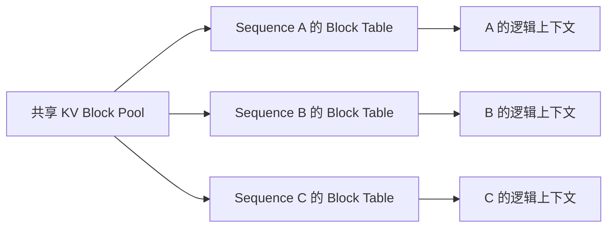
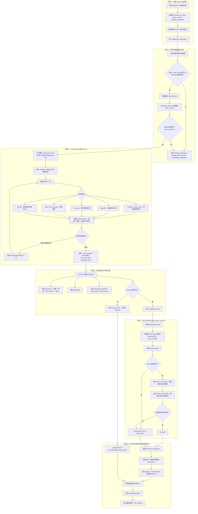

# Task 6.4：S1–S4 实验与 SWE-bench 复盘

> [!summary] 必须掌握
> 实验不是把不同配置各跑一次，而是固定任务、模型、预算和验收方式，只改变目标变量。报告要保存逐样本 Trace，并区分模型失败、Agent 行为失败、基础设施失败和官方验收失败。

返回总览：[[Task6-Coding-Agent学习索引]]

## 1. 四个实验分别回答什么

| 实验 | 研究问题 | 主要指标 |
|---|---|---|
| S1 | FP16 与 AWQ INT4 在同一 Coding Agent 上怎样权衡质量、时延和显存？ | 成功率、Token、时延、模型显存、KV Cache |
| S2 | Subagent 是否提高成功率或降低主 Agent 负担？ | 成功率、总 Token、时延、委托次数、主/子步数 |
| S3 | 按需加载 Skill 是否改善任务表现？ | 成功率、Match Rate、Token、时延、工具错误 |
| S4 | Agent 能否在真实历史仓库上产生通过官方测试的 Patch？ | 候选生成率、官方 resolved、总体 Resolve Rate |

四个实验不是同一张排行榜：

- S1 使用自部署 Qwen2.5-Coder-7B；
- 保存的 S2、S3、S4 使用 `deepseek-v4-flash` 远程 API；
- 任务和实验变量也不同。

因此只能分别回答各自问题，不能根据这些报告比较 Qwen 和 DeepSeek。

## 2. S1：FP16 与 AWQ INT4

### 2.1 实验目标与控制变量

同一个 Qwen2.5-Coder-7B-Instruct，在同一块 RTX 3090 24 GiB、同一 vLLM 0.18.0、同一任务和 Agent 预算下，依次启动：

- FP16；
- AWQ INT4，使用 `awq_marlin` Kernel。

固定项：

| 控制项 | 值 |
|---|---|
| 唯一任务 | 5 个本地 Buggy Repo |
| 每个条件重复 | 3 次 |
| 总运行 | 30 次 |
| Temperature | 0.0 |
| `max_steps` | 20 |
| `max_tool_calls` | 24 |
| `max_model_len` | 8192 |
| `max_num_seqs` | 1 |
| `gpu_memory_utilization` | 0.90 |

Tokenizer 在两个条件下保持相同。量化针对神经网络权重，Tokenizer 仍执行相同 BPE/词表映射；Embedding、LM Head 是否量化由具体量化配置决定，不能把 Tokenizer 叫作 INT4。

### 2.2 总体结果

| 指标 | AWQ INT4 | FP16 | FP16 - AWQ |
|---|---:|---:|---:|
| 尝试数 | 15 | 15 | 0 |
| 成功数 | 6 | 9 | +3 |
| 成功率 | 40% | 60% | +20 pp |
| 平均耗时 | 6.259 s | 7.767 s | +1.508 s |
| 平均总 Token | 4,018.2 | 3,536.867 | -481.333 |
| 平均主 Agent Steps | 4.2 | 3.8 | -0.4 |
| `repeated_action` | 9 | 6 | -3 |
| 基础设施失败 | 0 | 0 | 0 |

逐题结果：

| 任务 | AWQ | FP16 | 观察 |
|---|---:|---:|---|
| `toy-add-001` | 3/3 | 3/3 | 两者稳定通过 |
| `mean-edge-002` | 0/3 | 0/3 | 都陷入重复行为 |
| `checkout-multifile-003` | 0/3 | 3/3 | 全部质量差异来自该多文件题 |
| `inventory-state-004` | 3/3 | 3/3 | 两者稳定通过 |
| `profile-sync-complex-005` | 0/3 | 0/3 | 都陷入重复行为 |

FP16 的 +20 pp 不能解释为稳定的一般能力优势，因为只有 5 个唯一任务，且差异完全来自一道题。Temperature 为 0 时三轮逐题结果完全一致，重复次数验证了本次轨迹稳定，却没有增加独立样本量。

### 2.3 显存结果怎样解读

| 指标 | AWQ INT4 | FP16 |
|---|---:|---:|
| 模型加载显存 | 5.2 GiB | 14.25 GiB |
| 可用 KV Cache | 15.65 GiB | 6.6 GiB |
| Engine Init | 9.42 s | 8.47 s |
| `nvidia-smi` 总占用 | 21,993 MiB | 21,841 MiB |

AWQ 权重显存节省：

$$
\frac{14.25-5.2}{14.25}\approx 63.5\%.
$$

总显存占用却几乎相同，因为 vLLM 设置了 90% GPU Memory Utilization，会把量化节省的空间分配给 KV Cache。AWQ 的 KV Cache 容量约为 FP16 的 2.37 倍。

因此应分别报告：

- 模型权重占用；
- KV Cache 容量；
- 总进程显存。

只截一张 `nvidia-smi` 图会错误得出“量化没有节省显存”。

### 2.4 多用户怎样共享 KV Cache 显存

不同用户或并发请求确实需要各自的**逻辑 KV Cache**，因为每条 Sequence 的历史 Token 不同。推理框架不会为每个用户预先划一块固定的大显存，而是把预留空间切成固定大小的物理 Block：



每条 Sequence 保存自己的 Block Table，Attention Kernel 只读取该 Sequence 映射到的 KV Block。不同用户可以共享同一个物理显存池，但不会混用逻辑上下文。

第 $i$ 条活跃 Sequence 的 KV Cache 大小近似为：

$$
M_{KV,i}\approx 2\times L\times T_i\times H_{kv}\times D_h\times S,
$$

其中：

- $2$ 表示 Key 和 Value；
- $L$ 是 Transformer 层数；
- $T_i$ 是该 Sequence 当前缓存的 Token 数；
- $H_{kv}$ 是 KV Head 数；
- $D_h$ 是每个 Head 的维度；
- $S$ 是每个缓存元素的字节数。

所有活跃请求必须共同满足：

$$
\sum_i M_{KV,i}\le M_{KV,pool}.
$$

因此可服务的并发数不是固定值：上下文越短，可同时容纳的请求越多；上下文和输出越长，每条请求占用的 Block 越多。

vLLM 的 Continuous Batching 会把多个活跃 Sequence 的“下一个 Token”动态组成 Batch。某条请求完成后，它的 Block 被释放回池中，供新请求复用。S1 中的 `15.65 GiB` 是 AWQ 条件下**预留的共享 KV Block Pool 容量**，不是一个用户实际占用了 15.65 GiB。

多数 OpenAI-compatible API 在请求之间是无状态的。请求结束后 KV Block 可以释放；下一轮聊天由客户端重新发送 Messages，服务端重新 Prefill。若相同 Token 前缀命中 Prefix Cache，后端可以共享只读前缀 Block，再为差异部分分配新 Block。Prefix Cache 是计算复用，不是用户会话数据库，也不能替代上下文长度管理。

AWQ 默认没有改变公式中的 $S$，因为 KV Cache 仍通常使用 FP16/BF16。要减少每个 Token 的缓存占用，需要后端额外支持 FP8/INT8 KV Cache；降低 `max_model_len`、`max_num_seqs` 或并发量则是减少所需 Block 数量。

### 2.5 S1 的正确结论

- 本轮 FP16 成功率更高，优势来自一个多文件任务；
- AWQ 模型权重更小、平均端到端耗时更低，并释放更多 KV Cache 空间；
- 两者的失败主要暴露路径发现和重复行为问题；
- 下一轮应增加新的跨文件和错误恢复任务，而不是继续重复同样 5 题。

## 3. S2：单 Agent 与 Subagent

### 3.1 三个条件

| 条件 | 行为 |
|---|---|
| Baseline | 主 Agent 直接运行测试和修改 |
| Forced Subagent | 初始测试与最终测试都必须委托 |
| Conditional Subagent | 先直接测试，只在复杂失败后允许委托 |

实验使用 5 个本地任务，每个条件 1 次；三个条件顺序随机化。模型为 `deepseek-v4-flash`，Temperature 为 0。

### 3.2 结果

| 指标 | Baseline | 强制委托 | 条件委托 |
|---|---:|---:|---:|
| 成功率 | 5/5 | 5/5 | 5/5 |
| 平均耗时 | 9.906 s | 18.645 s | 7.021 s |
| 平均总 Token | 11,281.2 | 18,874.0 | 10,152.4 |
| 平均主 Agent Steps | 7.0 | 5.6 | 5.8 |
| 平均 Subagent Steps | 0 | 4.2 | 0 |
| 平均委托次数 | 0 | 2.0 | 0 |

强制委托相对 Baseline：

- 成功率没有变化；
- Token 增加 7,592.8，约 67.3%；
- 时延增加 8.739 秒，约 88.2%；
- 主 Agent 步数减少，但总系统工作量上升。

条件委托组没有真正调用 Subagent。因此它更快、更省 Token 只说明另一轮轨迹不同，不能归因于 Subagent。

### 3.3 实验改进

- 增加失败日志更长、跨模块更多的任务；
- 预先定义“复杂到值得委托”的规则；
- 同时记录主上下文长度与系统总 Token；
- 比较失败分类，而不只看已经封顶的 100% 成功率；
- 每个条件增加多轮和更多唯一任务。

## 4. S3：纯 Prompt 与 Skill

### 4.1 实验目标

固定 Agent、模型、任务和预算，只改变是否根据 Issue 匹配并注入 Skill 正文。

### 4.2 结果

| 指标 | Baseline | Skills | 差值 |
|---|---:|---:|---:|
| 成功率 | 5/5 | 5/5 | 0 |
| 平均耗时 | 6.791 s | 7.058 s | +0.267 s |
| 平均总 Token | 9,540 | 10,499 | +959 |
| 平均 Steps | 5.8 | 6.0 | +0.2 |
| 平均工具错误 | 0 | 0.4 | +0.4 |
| Skill Match Rate | 0 | 80% | +80 pp |

四个任务命中 `test-runner`，一个没有命中。Skill 条件没有提高已经是 100% 的成功率，平均 Token 反而增加约 10.1%。

### 4.3 正确解释

不能说“Skill 没用”，只能说：

- 当前 5 个简单任务无法体现成功率收益；
- Match 成功不等于 Skill 被正确利用；
- 注入正文有固定 Token 成本；
- 当前 `test-runner` Skill 可能对简单、失败位置明确的题目过重。

下一次应设计需要稳定流程知识的任务，并增加指标：流程遵守率、关键步骤遗漏率、首次修复成功率和长任务上下文占用。

## 5. S4：SWE-bench Lite 官方验收

### 5.1 为什么不能直接在当前仓库测试

SWE-bench 每个实例指定：

- GitHub 仓库；
- 精确 `base_commit`；
- Problem Statement；
- 官方 FAIL_TO_PASS 与 PASS_TO_PASS 测试。

候选 Patch 必须建立在精确历史状态上。使用仓库最新版本、脏工作区或错误 Commit，即使本地看似修复，也不能作为正式结果。

### 5.2 从 Issue 到官方 Resolved 的完整链路



这条链路有三个不能混淆的判定层：

1. `local_tests_passed` 是 Agent 工作目录中的本地反馈；
2. `candidate_generated` 只说明形成了非空 Patch；
3. `official_resolved` 才表示 Patch 在官方 Docker 环境同时通过 FAIL_TO_PASS 与 PASS_TO_PASS。

因此：

```text
Agent 自报成功 ≠ 本地测试通过 ≠ 生成候选 ≠ 官方 Resolved
```

输入文件只向 Agent 暴露：

```text
instance_id / repo / base_commit / problem_statement
```

不泄漏参考 Patch 或官方测试答案。

候选生成阶段会：

1. 使用 `git cat-file` 确认 Commit 存在；
2. 使用 `git rev-list --objects --missing=print` 拒绝对象不完整的部分克隆；
3. 创建临时 detached checkout；
4. 再次验证 `HEAD == base_commit`；
5. 保存逐题 Trace、Patch 和 Predictions。

### 5.3 总体结果

| 指标 | 结果 |
|---|---:|
| 分配实例 | 3 |
| 生成非空候选 | 1 |
| 官方提交 | 1 |
| 官方评测完成 | 1 |
| 官方 Resolved | 1 |
| 总体 Resolve Rate | 1/3 = 33.33% |

逐题：

| 实例 | Patch | Token | 停止原因 | 官方状态 |
|---|---:|---:|---|---|
| `astropy__astropy-12907` | 506 Bytes | 298,485 | `incomplete` | `resolved` |
| `astropy__astropy-14182` | 0 | 457,856 | `max_tool_calls` | `not_submitted_empty_patch` |
| `astropy__astropy-14365` | 0 | 427,809 | `max_tool_calls` | `not_submitted_empty_patch` |

三题共约 1,184,150 Token。两个失败实例比成功实例消耗更多，主要瓶颈是预算内没有形成 Patch，而不是非空 Patch 的官方质量。

### 5.4 成功 Patch 修了什么

Astropy 的 `_cstack(left, right)` 在右侧已经是复合模型矩阵时，旧代码错误写入全 1：

```diff
- cright[-right.shape[0]:, -right.shape[1]:] = 1
+ cright[-right.shape[0]:, -right.shape[1]:] = right
```

全 1 会丢失真实可分离关系，让独立输入输出看起来全部耦合。复制 `right` 才能保留嵌套复合模型的矩阵结构。

官方 Docker 结果：

- Patch 成功应用；
- 2 个 FAIL_TO_PASS 全部通过；
- 13 个 PASS_TO_PASS 全部通过；
- `resolved=true`。

### 5.5 为什么本地失败但官方通过

该实例保存了：

```text
local_tests_passed = false
stop_reason = incomplete
official_resolved = true
```

本地 Astropy 环境缺少 `hypothesis`，pytest 在加载 `conftest.py` 时终止，因此 Agent 没有本地绿色测试证据。官方 Docker 具备完整依赖，最终目标测试和回归测试均通过。

这属于“本地验证基础设施不足”，不等于 Patch 错误；但它说明 Agent 当时是在缺少本地测试反馈的条件下提交，风险更高。

### 5.6 为什么不是 100%

官方 Harness 的 `results.json` 只包含真正提交的一个候选，因此它内部显示 1/1。完整实验还分配了两个没有生成 Patch 的实例。

报告合并器会：

- 按 `instance_id` 回填官方状态；
- 把空 Patch 记为 `not_submitted_empty_patch`；
- 保留原始 3 题作为 `score_denominator`；
- 计算 `overall_resolve_rate=1/3`。

候选通过率 1/1 可以描述 Patch 质量；总体成功率必须写 1/3。

## 6. 统一的失败分类

| 分类 | 示例 | 是否计模型质量失败 |
|---|---|---|
| 基础设施失败 | API 不可达、仓库对象缺失、Harness 崩溃 | 应单列，不直接记为模型零分 |
| Agent 行为失败 | 重复错误路径、预算耗尽、空 Patch | 是，属于端到端系统失败 |
| 本地验证不足 | 缺测试依赖 | 单列；最终以官方 Harness 为准 |
| 候选不正确 | Patch 可应用但 FAIL_TO_PASS 失败 | 是 |
| 回归失败 | 修好目标但 PASS_TO_PASS 失败 | 是 |
| 未提交 | 空 Patch | 在完整任务分母中记失败 |

只有把这些分开，优化时才知道应该修部署、搜索策略、工具预算还是代码质量。

## 7. 下一轮最值得做什么

1. 为 S4 增加依赖预检，减少“有 Patch 但本地无法测试”；
2. 增加按路径和行范围读取，避免一次把大文件全部塞进上下文；
3. 对长 Trace 做 Compaction，保留 Issue、假设、关键代码、Patch 和最新测试；
4. 将工具预算分为定位、修改和验证阶段；
5. 对 Patch 长期为空、重复搜索和同类错误建立提前停机或策略切换；
6. 将 SWE-bench 固定样本扩到 20–50 题，再报告置信区间和每次成功成本；
7. 为 S2/S3 增加真正能触发 Skill/Subagent 优势的复杂任务。

## 8. 自测

1. S1 为什么固定 Tokenizer？Tokenizer 会被 AWQ 量化吗？
2. 为什么三轮完全一致仍不能把 S1 当作 15 个独立任务？
3. 为什么 `nvidia-smi` 总占用接近不能证明量化无效？
4. 多用户为什么需要多套逻辑 KV Cache，却可以共享一个物理显存池？
5. 强制 Subagent 主 Agent 步数更少，为什么总成本反而更高？
6. Skill Match Rate 80% 能证明 Skill 有效吗？
7. S4 中 `local_tests_passed=false` 与 `official_resolved=true` 为什么能同时成立？
8. 1/1 和 1/3 分别回答什么问题？
9. S4 当前最主要的系统瓶颈是什么？

### 自测标准答案

> [!success]- 标准答案：1. 隔离量化变量
> 两个条件必须接收相同 Token ID 和 Chat Template。Tokenizer 是离散切词与映射规则，通常没有 FP16/INT4 权重；量化针对模型权重，Embedding、LM Head 和 KV Cache是否量化要看单独配置。

> [!success]- 标准答案：2. 重复运行不增加题目多样性
> 仍然只有 5 个唯一任务，三轮只观察同题轨迹稳定性。Temperature 为 0 时结果完全一致，更不能当成 15 个独立质量样本。

> [!success]- 标准答案：3. vLLM 会重新分配节省空间
> AWQ 模型权重只占 5.2 GiB，但 90% 显存利用率让更多空间进入 KV Cache，所以总占用仍接近。应分别看模型加载显存、KV Cache 和总占用。

> [!success]- 标准答案：4. 逻辑隔离，物理分页
> 每条 Sequence 有独立 Block Table，Attention 只读取它映射到的 Block；底层 Block 来自共享池，按上下文长度动态分配，请求结束后归还，因此不需要按用户预留固定大块显存。

> [!success]- 标准答案：5. 子代理也在调用模型
> 主 Agent 步数下降只表示工作被转移。总成本还包括子代理输入输出、工具循环、委托和结果汇总，本轮总 Token 增加约 67.3%。

> [!success]- 标准答案：6. 不能
> Match Rate 只证明路由器选中了 Skill，不证明模型使用了内容或任务因此改善。本轮成功率不变且 Token 增加，需要更难任务和流程指标。

> [!success]- 标准答案：7. 两种证据来自不同环境
> 本地缺少 `hypothesis`，没有取得绿色测试；官方 Docker 环境依赖完整，Patch 最终通过目标和回归测试。正式成绩以官方 Harness 为准，同时保留本地基础设施问题。

> [!success]- 标准答案：8. 候选质量与端到端成绩
> 1/1 表示唯一提交候选通过；1/3 表示全部三个分配实例中成功一个。完整实验和简历应使用 1/3。

> [!success]- 标准答案：9. 候选生成和上下文效率
> 两个失败实例在 24 次工具调用与四十多万 Token 后仍为空 Patch。应优先改善仓库发现、上下文压缩、无进展检测和阶段预算，而不是只优化已生成 Patch 的官方通过率。
