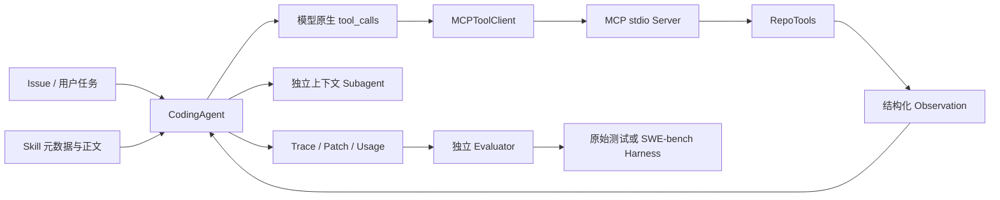

# Task 6：Coding Agent 学习索引

> [!summary] 学习目标
> 能解释模型如何通过 MCP 操作代码仓库，能把工具、Skill、Subagent 分成不同能力层，能用独立测试而不是模型自述验收修复，并能正确解读量化、Skill、Subagent 与 SWE-bench 实验。

## 1. 四篇主笔记

| 阅读顺序 | 核心问题 |
|---|---|
| [[Task6-01-MCP工具与安全执行]] | 仓库工具怎样通过 MCP 暴露？路径、写入、命令和 Patch 如何限制？ |
| [[Task6-02-Coding-Agent循环与可验证完成]] | 原生 Tool Calling 如何形成 Agent 循环？Trace、重试、重复检测和独立验收怎样配合？ |
| [[Task6-03-Skills-Subagents与上下文工程]] | Tool、Skill、Subagent 各解决什么问题？为什么能力增强也可能增加成本？ |
| [[Task6-04-S1-S4实验与SWE-bench复盘]] | 如何公平比较量化、委托与 Skill？SWE-bench 的总体 `1/3` 应怎样理解？ |

第一轮按顺序阅读。复习时优先掌握数据流、安全边界和验收方法，不必背具体临时路径、Commit 或每次调用耗时。

## 2. 项目主线

项目不是“让模型生成一段代码”这么简单，而是在模型外构建一个受约束的运行时：

1. 给模型有限、结构化的仓库工具；
2. 执行工具并把结果用调用 ID 回填；
3. 在写入后使旧测试证据失效；
4. 检测预算耗尽、请求异常和无进展重复；
5. 保存 Patch、Trace、Token 与停止原因；
6. 在干净副本或官方容器中独立验收。

## 3. 与 Task5 的关系

| Task5 Tool Agent | Task6 Coding Agent |
|---|---|
| 文本 ReAct 与基础工具循环 | 原生 Tool Calling 与 MCP stdio |
| calculator、wiki、file search | 代码读取、写入、测试、Git Patch、仓库发现 |
| 关注答案与工具选择 | 关注仓库状态、Patch、测试和回归 |
| 错误 Observation 后恢复 | 模型请求重试、工具错误恢复、重复行为停机 |
| 单 Agent 为主 | 增加 Skill 与独立上下文 Subagent |
| 自定义题集 | 固定 Fixture 与 SWE-bench 官方 Harness |

Task5 学到的是“模型—工具—观察”的反馈闭环；Task6 增加了真实代码修改的副作用、安全边界和可执行验收。

## 4. 当前实现与证据

| 范围 | 当前证据 |
|---|---|
| RepoTools / MCP | 7 个工具可枚举，stdio 握手和真实 `read_file` 探针通过 |
| SkillLoader | 扫描 3 个 Skill，元数据、匹配、按需加载和未知名称拒绝通过 |
| Agent 闭环 | `toy-add-001` 保存的报告通过；4 步、8,055 Token、仅修改 `calculator.py` |
| 多文件修复 | `profile-sync-complex-005` 保存的报告通过；7 步、15,876 Token、仅修改两个允许文件 |
| 离线回归 | 2026-09-17：`96 passed` |
| S1 量化 | Qwen2.5-Coder-7B：AWQ 6/15，FP16 9/15；仅 5 个唯一任务 |
| S2 Subagent | 三组均 5/5；强制委托 Token +67.3%、时延 +88.2% |
| S3 Skill | 两组均 5/5；Skill Match Rate 80%，Token 约 +10% |
| S4 SWE-bench | 3 题生成 1 个候选；官方 resolved 1 个，总体 1/3 |

> [!warning] 实验模型边界
> S1 使用同一块 RTX 3090 上自部署的 Qwen2.5-Coder-7B FP16/AWQ；当前保存的 S2、S3、S4 报告使用 `deepseek-v4-flash` 远程 API。它们回答不同问题，不能横向比较后归因于量化或同一个模型。

## 5. 项目入口

- [独立代码仓库](https://github.com/xiezhx9/coding-agent-from-scratch)
- [Task5 Tool Agent 学习索引](../Task5-Tool-Agent/Task5-Tool-Agent学习索引.md)
- 项目内 `README.md`：任务合同、运行命令与验收要求
- 项目内 `eval/results/`：S1–S4 原始报告
- 项目内 `eval/results/m4/`：本地练习的 Patch、Trace 与独立验收结果

## 6. 复习顺序

1. 先手画主循环，说明每一轮谁生成调用、谁执行、谁保存状态；
2. 再讲 RepoTools 的路径、写保护、命令执行与 Patch 校验；
3. 接着比较 Tool、Skill、Subagent；
4. 最后用 S1–S4 练习实验归因和结果边界。

## 7. 自测

1. Task6 相比 Task5 新增的核心困难是什么？
2. 为什么 Agent 报告 `tests_passed=true` 仍不能直接作为验收结果？
3. Tool、Skill、Subagent 分别处于什么层？
4. 为什么 S1 与 S2/S3/S4 不能直接做横向模型结论？

### 自测标准答案

> [!success]- 标准答案：1. 副作用、状态和可执行验收
> 修改代码会改变外部状态，需要限制路径与权限，并保证测试证据对应最后一次修改。真实仓库还涉及目录发现、跨文件定位、依赖、Git Base Commit 和回归测试。

> [!success]- 标准答案：2. 自述不是外部证据
> 模型可能误读输出、引用旧测试或直接声称成功。Evaluator 要在干净副本中复制允许修改的源码，使用原始测试重新运行，并核对 Patch、Trace 和禁止改动。

> [!success]- 标准答案：3. 执行、过程知识与上下文隔离
> Tool 提供原子动作；Skill 按需注入完成某类任务的流程知识；Subagent 用独立消息历史和工具子集完成一个子任务，再把摘要交回主 Agent。

> [!success]- 标准答案：4. 模型与实验变量不同
> S1 使用自部署 Qwen 比较 FP16/AWQ；其余保存报告使用 DeepSeek API。任务、服务与模型不同，只能分别解释每个实验，不能把差异归因于同一变量。
